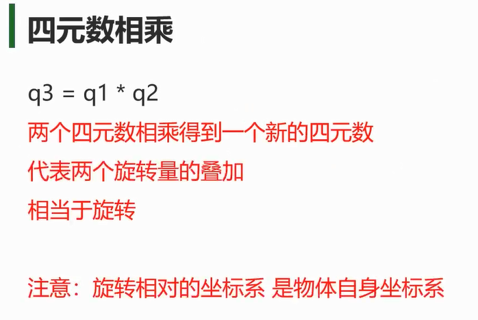
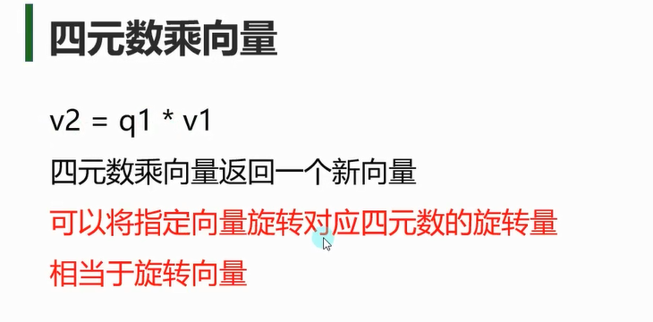
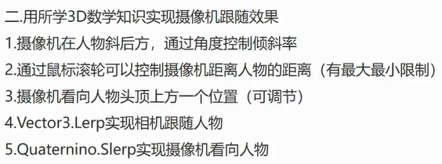
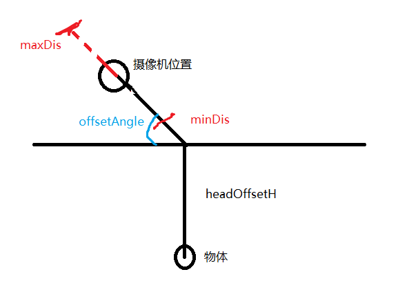

# 四元数相乘


```cs
//通过轴角对API传入要转的轴和角度
//绕着y轴转20度
Quaternion q = Quaternion.AngleAxis(20, Vector3.up);
//乘上这个脚本挂载的立方体当前旋转四元数 让这个脚本挂载的立方体绕着y轴转20度
this.transform.rotation *= q;
//注意1：用四元数旋转完可能和Inspector窗口上的旋转对不上 不用管它
//注意2：旋转相对的坐标系 是物体自身坐标系 
```


# 四元数乘以向量

注意一定是 `向量 = 四元数 * 向量` 不是 ~~`向量 = 向量 * 四元数`~~

```cs
void Start()
{
    // 定义一个向量
    Vector3 vector = new Vector3(1, 0, 0);

    // 定义一个四元数表示45度绕Y轴的旋转
    Quaternion rotation = Quaternion.Euler(0, 45, 0);

    // 使用四元数旋转向量
    Vector3 rotatedVector = rotation * vector;

    // 打印结果
    Debug.Log("Original Vector: " + vector);
    Debug.Log("Rotated Vector: " + rotatedVector);
}
```

# 练习
## 模拟飞机发射不同类型子弹的方法：单发，双发，扇形，环形

```cs
//声明发射类型枚举
public enum E_FireType
{
    //单发
    One,
    //双发
    Two,
    //扇形
    Three,
    //环形
    Round
}

public class Airplane : MonoBehaviour
{
    //声明发射类型变量 
    private E_FireType nowType = E_FireType.One;

    //子弹
    public GameObject bullet;

    public int roundNum = 4;

    void Update()
    {
        //Update内添加按按键切换发射类型逻辑
        if (Input.GetKeyDown(KeyCode.Alpha1))
        {
            nowType = E_FireType.One;
        }
        else if (Input.GetKeyDown(KeyCode.Alpha2))
        {
            nowType = E_FireType.Two;
        }
        else if (Input.GetKeyDown(KeyCode.Alpha3))
        {
            nowType = E_FireType.Three;
        }
        else if (Input.GetKeyDown(KeyCode.Alpha4))
        {
            nowType = E_FireType.Round;
        }

        //Update内添加按按键发射子弹逻辑
        if (Input.GetKeyDown(KeyCode.Space))
        {
            Fire();
        }
    }

    //开火方法
    private void Fire()
    {
        switch (nowType)
        {
            case E_FireType.One:
                Instantiate(bullet, this.transform.position, this.transform.rotation);
                break;
            case E_FireType.Two:
                Instantiate(bullet, this.transform.position - this.transform.right * 0.5f, this.transform.rotation);
                Instantiate(bullet, this.transform.position + this.transform.right * 0.5f, this.transform.rotation);
                break;
            case E_FireType.Three:
                Instantiate(bullet, this.transform.position, this.transform.rotation);
                //左边的子弹朝飞机自己左侧旋转20度再发射——知识点 四元数*四元数=一个新的四元数 相当于是旋转量的叠加
                Instantiate(bullet, this.transform.position, this.transform.rotation * Quaternion.AngleAxis(-20, Vector3.up));
                //右边的子弹朝飞机自己右侧旋转20度再发射——知识点 四元数*四元数=一个新的四元数 相当于是旋转量的叠加
                Instantiate(bullet, this.transform.position, this.transform.rotation * Quaternion.AngleAxis(20, Vector3.up));
                break;
            case E_FireType.Round:
                float angle = 360 / roundNum;
                for (int i = 0; i < roundNum; i++)
                    //角度是当前偏移度数乘飞机自己的旋转
                    Instantiate(bullet, this.transform.position, this.transform.rotation * Quaternion.AngleAxis(i * angle, Vector3.up));
                break;
        }
    }
}

#endregion

```

将此脚本制作成预制体，并拖到飞机的bullet
```cs
//子弹一直往前飞，五秒后销毁
public class Bullet : MonoBehaviour
{
    public float moveSpeed = 10;
    
    void Start()
    {
        Destroy(this.gameObject, 5);
    }
    
    void Update()
    {
        this.transform.Translate(Vector3.forward * moveSpeed * Time.deltaTime);
    }
}
```

# 摄像机跟随




```cs
//这个脚本要挂载到摄像机上
public class CameraMove : MonoBehaviour
{
    //目标对象
    public Transform target;

    //相对头顶的偏移位置 看向头顶多高的位置
    public float headOffsetH = 1;

    //摄像机倾斜的角度
    public float offsetAngle = 45;

    //摄像机离观测点的距离
    public float cameraDis = 5;

    //摄像机离观测点的距离必须是3和10之间
    public float minDis = 3;
    public float maxDis = 10;

    //鼠标中间滚动控制的移动速度
    public float roundSpeed = 1;

    //看向对象时 四元数 旋转的速度
    public float lookAtSpeed = 2;

    //跟随对象移动的 速度
    public float moveSpeed = 2;

    //当前摄像机应该在的位置
    Vector3 nowPos;

    //头顶一个在的位置
    Vector3 headPos;

    //头顶位置指向摄像机的方向向量
    private Vector3 nowDir;

    
    void Update()
    {
        //实现了鼠标中键 滚动 来改变摄像机远近
        cameraDis += Input.GetAxis("Mouse ScrollWheel") * roundSpeed;

        //取最大值和最小值之间的数
        cameraDis = Mathf.Clamp(cameraDis, minDis, maxDis);

        //向头顶偏移位置
        headPos = target.position + target.up * headOffsetH;

        //用要倾斜的角度和轴算出要旋转的四元数 乘上当前向后的向量 就能得到摄像机偏移角度后往后方偏移位置
        //通俗理解 nowDir就是头顶位置指向摄像机的方向向量
        nowDir = Quaternion.AngleAxis(offsetAngle, target.right) * -target.forward;

        //用头顶位置加上要偏移的角度乘摄像机离观测点的距离 就是当前摄像机应该在的位置
        nowPos = headPos + nowDir * cameraDis;

        //直接把算出来的位置 进行赋值
        //this.transform.position = nowPos;

        //通过插值运算缓慢移动相机位置
        this.transform.position = Vector3.Lerp(this.transform.position, nowPos, Time.deltaTime * moveSpeed);

        //这里是通过插值运算来缓动看向物体
        //摄像机要看的是nowDir的反向向量 所以通过LookRotation算出旋转成的四元数 传入当做插值函数的终点
        this.transform.rotation = Quaternion.Slerp(this.transform.rotation, Quaternion.LookRotation(-nowDir), Time.deltaTime * lookAtSpeed);

        //画出头顶和摄像机的连线
        Debug.DrawLine(this.transform.position, headPos);
    }
}
```