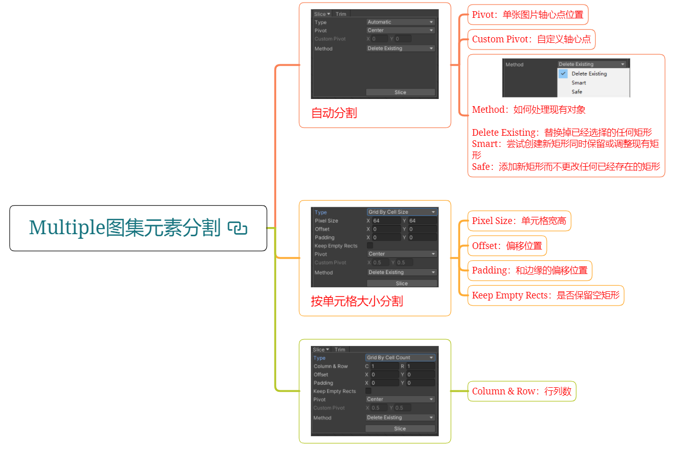
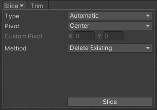
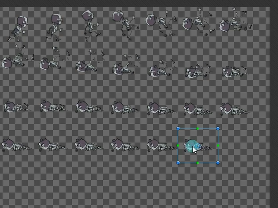
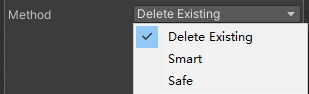
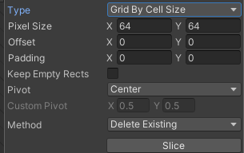
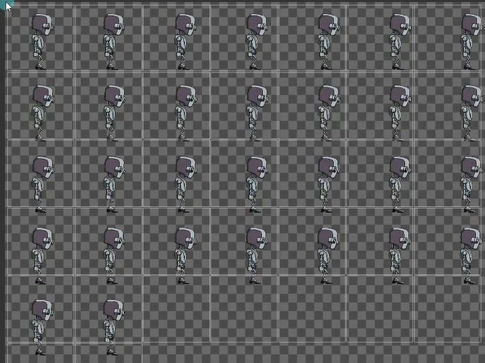
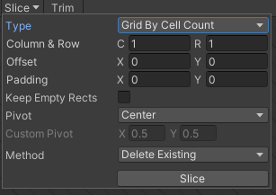
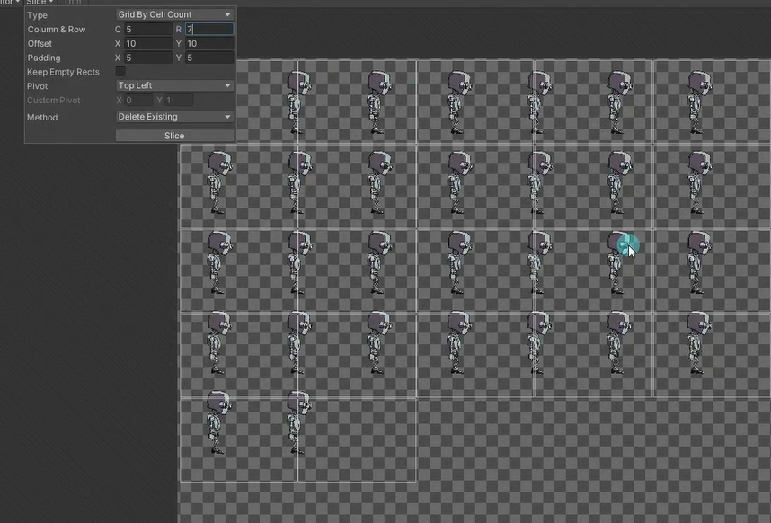

# Multiple图集元素分割
当我们的图片资源是图集时，我们需要在设置时将sprite mode 设置为Multiple。这时我们可以使用Sprite Editor自带的功能进行图集元素分割。
在Sprite Editor窗口中选择要删除的切片，按Delete键可以删除对应切片。也可以按住鼠标左键，选择框框进行切片

# 参数

## 自动分割

### Pivot：单张图片轴心点位置

### Custom Pivot：自定义轴心点

### Method：如何处理现有对象

如果有自己鼠标自行的分割该如何处理

Delete Existing：替换掉已经选择的任何矩形 
Smart：尝试创建新矩形同时保留或调整现有矩形 
Safe：添加新矩形而不更改任何已经存在的矩形

## 按单元格大小分割

### Pixel Size：单元格宽高

### Offset：偏移位置

### Padding：和边缘的偏移位置

### Keep Empty Rects：是否保留空矩形

其它两种模式一般都不用

