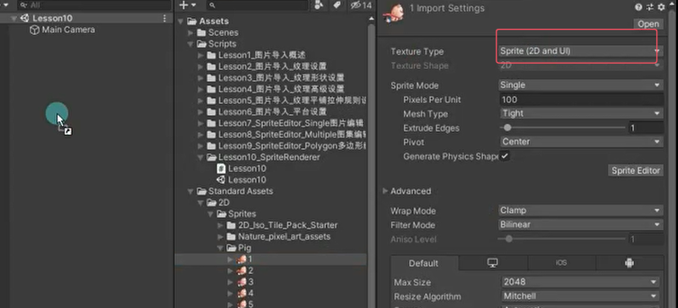
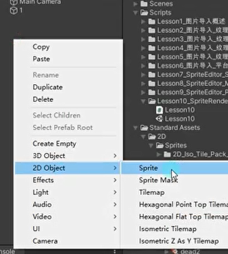
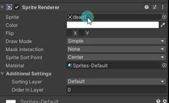
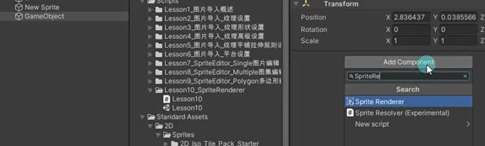
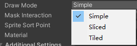
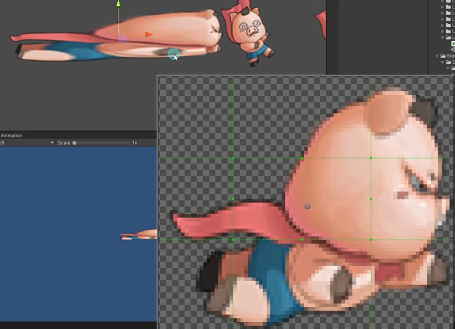
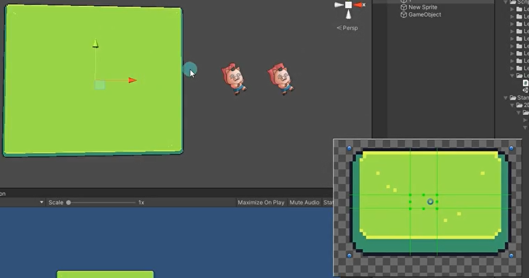
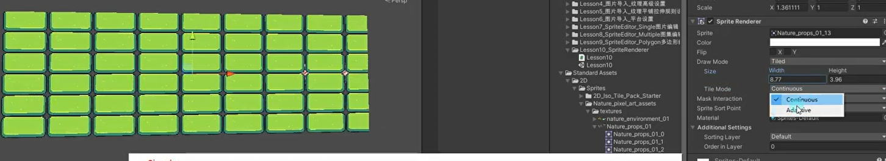
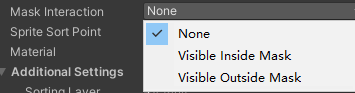
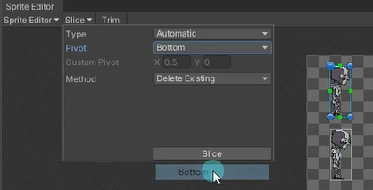

# 知识回顾
我们目前已经学习了如何设置导入的图片
如果我们想将导入的图片用于2D游戏开发，需要将图片类型设置为 Sprite精灵类型
我们还学习了使用Sprite Editor精灵图片编辑器来对精灵图片进行编辑
但是我们还没有真正的使用这些图片
这节课我们就来讲解Sprite精灵图片的使用


# Sprite Renderer 是什么
顾名思义，Sprite Renderer是精灵渲染器 是一个组件
所有2D游戏中游戏资源（除UI外）都是通过Sprite Renderer让我们看到的
它是2D游戏开发中的一个极为重要的组件


# 2D对象创建
1. 直接拖入Sprite图片
   
2. 右键创建
   
   关联想要的图片
   
3. 空物体添加脚本
   

# Sprite Renderer

## Sprite：渲染的精灵图片

## Color*：定义着色，一般没有特殊需求不会修改

## Filp：水平或竖直翻转精灵图片
通过transform也可以改变水平反转的效果的

## Draw Mode：
绘制模式，当尺寸变化时的缩放方式



### Simple：简单模式，缩放时整个图像一起缩放

### Sliced：切片模式
9宫格切片模式，十字区域缩放，4个角不变化
一般用于变化不大的纯色图
（注意：需要把精灵的设置为Full Rect）



### Tiled：平铺模式
将中间部分进行平铺而不是缩放
（注意：需要把精灵的网格类型设置为Full Rect）


- Continuous：当尺寸变化时，中间部分将均匀平铺
- Adaptive：当尺寸变化时，类似Simple模式，当更改尺寸达到Stretch Value时，中间才开始平铺

## Mask Interaction：与精灵遮罩交互时的方式


### None：不与场景中任何精灵遮罩交互

### Visible inside Mask：精灵遮罩覆盖的地方可见
而遮罩外部不可见

### Visible Outside Mask：精灵遮罩外部的地方可见
而遮罩覆盖处不可见

## Sprite Sort Point*：
计算摄像机和精灵之间距离时，使用精灵中心Center还是轴心点Pivot，一般情况下不用修改

## Material*：材质
可以使用一些自定义材质来显示一些特殊效果
一般情况不修改。默认材质是不会受到光照影响的，如果想要受光照影响，可以选择Default-Diffuse

## Additional Settings：高级设置
Sorting Layer：排序层选择
排序层一样的话会，谁先显示谁后显示是受z轴影响的
可以新增加排序层，排序层越前，显示越前面，会越后面渲染

Order in Layer：层级序列号，数值越大约会显示在前面
先会比较排序图层，再比较图层顺序的


# 代码相关
```cs
//新建空物体
GameObject gameObject = new GameObject();

//添加精灵渲染器组件
SpriteRenderer spriteRenderer = gameObject.AddComponent<SpriteRenderer>();

//SpriteRenderer类中sprite变量 当前渲染的精灵图片 传入精灵图片名字
//要渲染的精灵。
//动态的改变图片
spriteRenderer.sprite = Resources.Load<Sprite>("dead1");

//动态的加载 图集中的图 传入图集名字
Sprite[] sprites = Resources.LoadAll<Sprite>("RobotBoyIdleSprite");
//动态的改变成图集中的图片
spriteRenderer.sprite = sprites[10];
print(sprites[10].name);//RobotBoyIdleSprite_10
```

# 总结
主要掌握参数含义 和 如何代码控制
其中重要的参数是
绘制模式 控制缩放规则
遮罩相关
层级相关


# 练习
1. 写一个工具类，让我们可以更加方便的加载Multiple类型的图集资源（提示：提供个方法给外部，传入一个图集名字和这个单张图的名字）
```cs
//Multiple类型的图集管理类
public class MultipleMgr
{
    private static MultipleMgr instance = new MultipleMgr();
    public static MultipleMgr Instatnce => instance;
    private MultipleMgr() {}

    //存储 大图对应的小图资源的信息 的字典
    private Dictionary<string, Dictionary<string, Sprite>> dic = new Dictionary<string, Dictionary<string, Sprite>>();

    /// <summary>
    /// 获取Multiple图集中的某一张小图
    /// </summary>
    /// <param name="multipleName">图集名</param>
    /// <param name="spriteName">单张图片名</param>
    /// <returns>返回获取到的Sprite</returns>
    public Sprite GetSprite(string multipleName, string spriteName)
    {
        //判断是否加载过该大图
        if (dic.ContainsKey(multipleName))
        {
            //判断大图中是否有该小图的信息 有的话直接返回
            if (dic[multipleName].ContainsKey(spriteName))
                return dic[multipleName][spriteName];
        }
        else
        {
            //加载该大图
            Dictionary<string, Sprite> dicTmp = new Dictionary<string, Sprite>();
            Sprite[] sprs = Resources.LoadAll<Sprite>(multipleName);

            //将其对应的小图信息存储到字典中
            for (int i = 0; i < sprs.Length; i++)
            {
                dicTmp.Add(sprs[i].name, sprs[i]);
            }
            dic.Add(multipleName, dicTmp);

            if (dicTmp.ContainsKey(spriteName))
                return dicTmp[spriteName];
        }
        return null;
    }

    /// <summary>
    /// 清空字典中的信息，并卸载未使用的资源
    /// </summary>
    public void ClearInfo()
    {
        //清空字典中的信息
        dic.Clear();
        //卸载未使用的资源
        Resources.UnloadUnusedAssets();
    }
}
```

2. 用提供的角色资源，制作一个通过wasd键 控制其上下左右移动的功能

将要设置的Sprite的轴心设置为脚底一般


```cs
public class PlayerObj : MonoBehaviour
{
    // 玩家移动速度
    public float moveSpeed = 5;

    private float h;

    private SpriteRenderer sr;

    void Start()
    {
        sr = this.GetComponent<SpriteRenderer>();
    }

    void Update()
    {
        // 获取水平方向输入值
        h = Input.GetAxis("Horizontal");
        // 移动玩家对象
        this.transform.Translate(5 * Time.deltaTime * Vector3.right * h);
        // 如果h小于0，则设置sr.flipX为true，否则如果h大于0，则设置sr.flipX为false
        if (h < 0)
            sr.flipX = true;
        else if (h > 0)
            sr.flipX = false;
    }
}

```