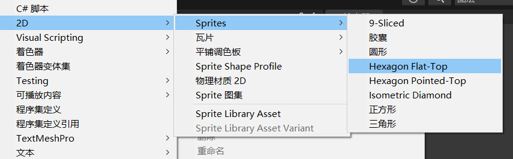
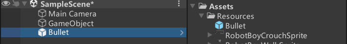

# SpriteCreator是什么
顾名思义，Sprite Creator是精灵创造者
我们可以利用Sprite Editor的多边形工具创造出各种多边形
Unity也为我们提供了现成的一些多边形

它的主要作用是2D游戏的替代资源
在等待美术出资源时我们可以用他们作为替代品
有点类似Unity提供的自带几何体
替代资源是做demo和学习时的必备品


# 使用Sprite Creator
在Project窗口右键创建各种形状的Sprite精灵图片



这样创建出来图可以用于美术还没做好时的替代资源。当出来正式图进行替代就行。有点类似3D场景创建立方体那些基本模型。之后可能也用于遮罩的基本图。

# 练习
使用替代资源，制作一个按空格键让角色发射子弹的功能

创建BulletObj脚本，添加到子弹预制体上。用于控制子弹对象的移动。设置子弹移动的速度和子弹当前的移动方向变量。3秒后销毁子弹对象。创建ChangeMoveDir方法，用于改变子弹的移动方向。接受一个参数dir表示新的移动方向。将nowDir字段设置为新的移动方向。

```cs
public class BulletObj : MonoBehaviour
{
    public float moveSpeed;

    private Vector3 nowDir;

    void Start()
    {
        // 在3秒后销毁子弹对象
        Destroy(this.gameObject, 3);
    }

    // 改变子弹的移动方向
    public void ChangeMoveDir(Vector3 dir)
    {
        // 设置新的移动方向
        nowDir = dir;
    }

    // Update方法在每一帧中都会被调用
    void Update()
    {
        // 移动子弹对象
        this.transform.Translate(moveSpeed * Time.deltaTime * nowDir);
    }
}
```

在PlayerObj.cs
```cs
// 检查是否按下了空格键
if (Input.GetKeyDown(KeyCode.Space))
{
    //创建子弹预设体
    GameObject obj = Instantiate(Resources.Load<GameObject>("BulletObj"), this.transform.position + new Vector3(sr.flipX ? -0.3f : 0.3f, 0.5f, 0), Quaternion.identity);
    //告诉子弹应该朝哪里动
    obj.GetComponent<BulletObj>().ChangeMoveDir(sr.flipX ? Vector3.left : Vector3.right);
}
```