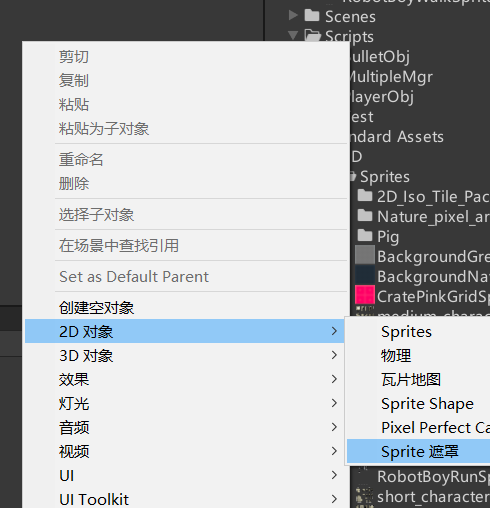
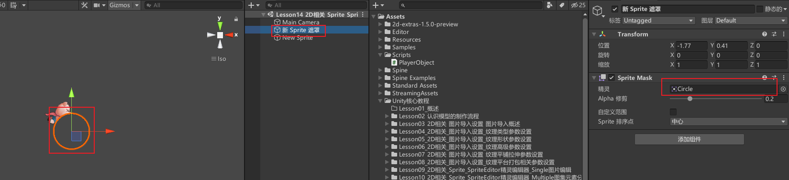
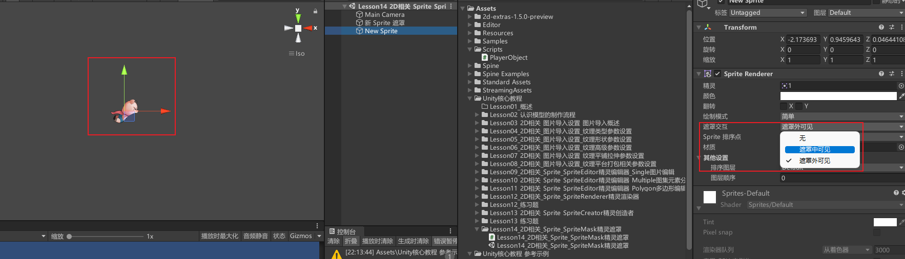
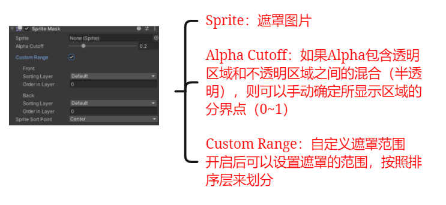
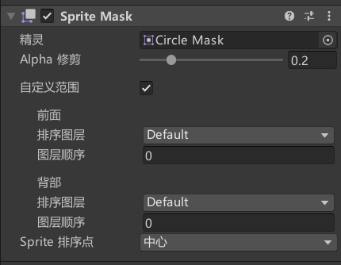
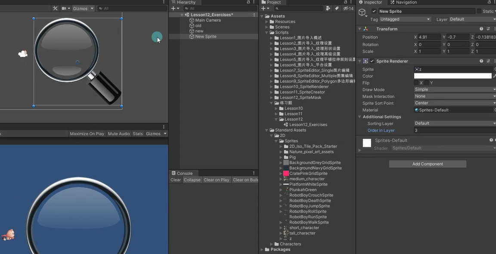
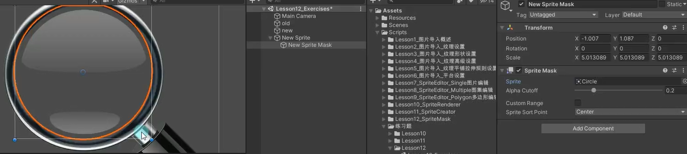

# SpriteMask是什么
顾名思义，SpriteMask是精灵遮罩的意思
它的主要作用就是对精灵图片产生遮罩
制作一些特殊的功能，比如只显示图片的一部分让玩家看到

# SpriteMask创建

# Sprite Mask参数

## Sprite：遮罩图片

## Alpha Cutoff：Alpha修剪
如果Alpha包含透明区域和不透明区域之间的混合（半透明），则可以手动确定所显示区域的分界点（0~1）

## Custom Range：自定义遮罩范围
当场景上有不同的遮罩，不同的遮罩控制的图范围是不一样的

开启后可以设置遮罩的范围，按照排序层来划分

如果想要图片受到遮罩的影响
那么图片的排序层+排序数 应处于`[遮罩的back, 遮罩的front]`

# 练习
制作一个类似放大镜的功能

创建两个小猪图片，一大一小，大的比例是2，小的是1，位置调整的一样。大的层级比小的更高，并且**设置成遮罩中可见**。

给放大镜添加一个遮罩（层级更高）
