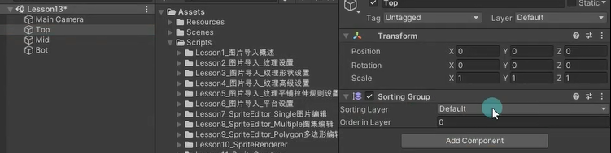
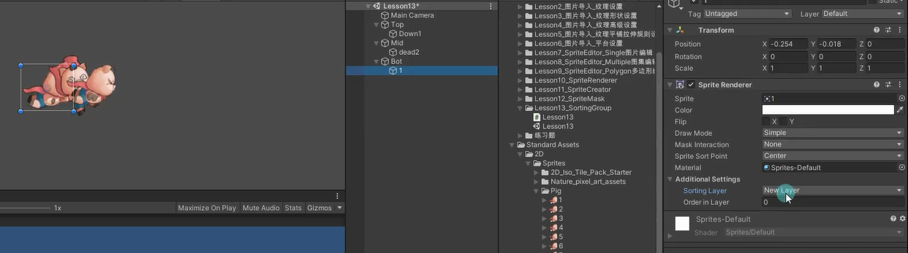

# SortingGroup是什么
SortingGroup（排序分组）就如其名，是用于对多个精灵图片进行分组排序的组件。
它的主要作用是管理和排序同一组内的精灵，使它们的渲染顺序保持一致，就好像它们是单个游戏对象一样。
主要用于分层管理，特别适用于2D游戏开发中需要整体排序的场景。

# SortingGroup的使用
创建一个空物体，然后添加SortingGroup组件。
设置图层和图层顺序，用于管理该物体下所有子物体的排序。

注意：
- 子物体也可以添加SortingGroup脚本，但整体子物体先受父对象的影响再受到你同一级的影响（子排序组先排序子对象，然后再和同层的其他对象进行比较（即同层和同层比））。
- SortingGroup脚本比SpriteRenderer上面的Sorting Layer相关的要更加优先
- 在多个预设体中挂载SortingGroup组件时，可以通过修改排序索引号来决定它们的前后顺序。

