# 为什么要打图集
打图集的目的就是减少 提高性能
在2D游戏开发，以及UI开发中是会频繁使用的功能

平时做游戏直接用，到最后游戏要打包的时候做图集就行了

ps：打图集是将小图合并成图集，和使用图集不同

# 在Unity中打开自带的打图集功能
在工程设置面板中选择Edit -> Project Setting -> Editor来打开Sprite Packer。

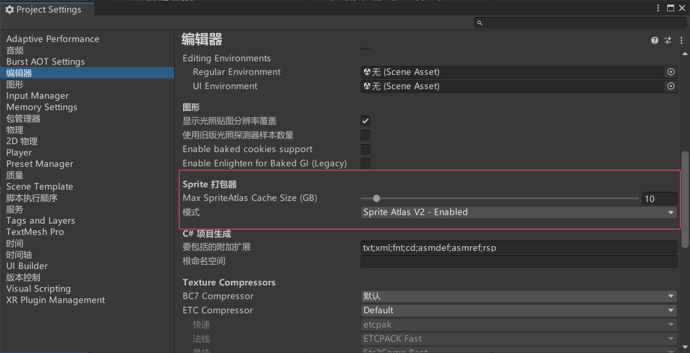

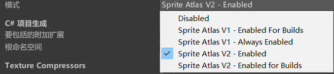

Disabled：默认设置，不会打包图集。假如创建不是2D项目可能就是这个选项。
Enabled For Builds（Legacy Sprite Packer）：Unity仅在构建时打包图集，在编辑模式下不会打包图集。
Always Enabled（Legacy Sprite Packer）：Unity在构建时打包图集，在编辑模式下运行前会打包图集。
Legacy Sprite Packer传统打包模式相对于下面两种模式来说，多了一个设置图片之间的Padding Power间隔距离。Padding Power选项用于选择打包算法在计算打包的精灵之间以及精灵与生成的图集边缘之间的间隔距离。这里的数字代表2的n次方。
Enabled For Build：Unity仅在构建时打包图集，在编辑器模式下不会打包。
Always Enabled：Unity在构建时打包图集，在编辑模式下运行前会打包图集。

**创建图集**
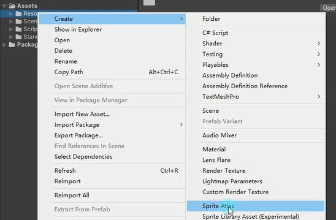


# 图集参数
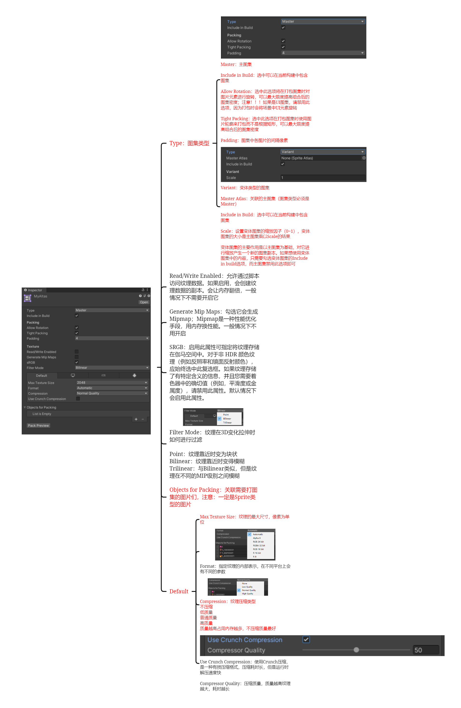

## Type：图集类型
Master：主图集
Variant：变体类型的图集
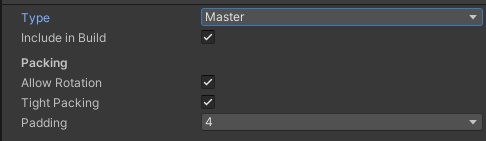
## Include in Build：选中可以在当前构建中包含图集
一般默认勾选就行
## Allow Rotation：允许图片旋转
选中此选项将在打包图集时对图片元素进行旋转，可以最大限度提高组合后的图集密度；
**注意！！！如果是UI图集，请禁用此选项，因为打包时会将场景中UI元素旋转**

## Tight Packing：紧密包装
选中此选项在打包图集时使用图片轮廓来打包而不是根据矩形，可以最大限度提高组合后的图集密度
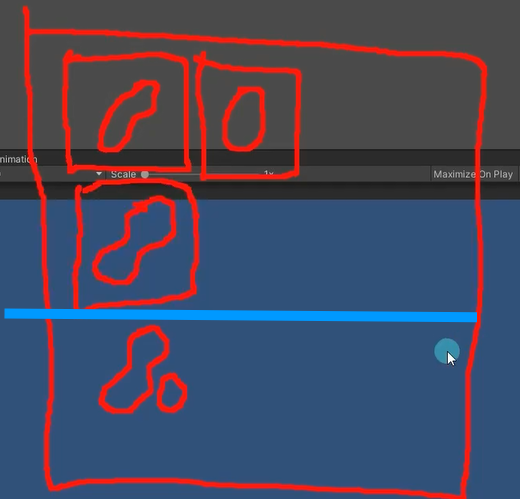
## Padding 填充：图集中各图片的间隔像素


--- 

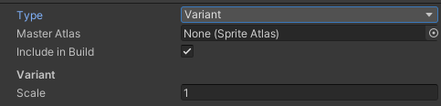
## Variant*：变体类型的图集（用很少）
就是在一个图集之上产生的变体副本，**一般用的很少**

Master Atlas：关联的主图集（图集类型必须是Master）

Include in Build：选中可以在当前构建中包含图集

Scale：设置变体图集的缩放因子（0~1），变体图集的大小是主图集乘以Scale的结果

变体图集的主要作用是以主图集为基础，对它进行缩放产生一个新的图集副本。如果想使用变体图集中的内容，只需要勾选变体图集的Include in build选项，而主图集禁用此选项即可

## Read/Write Enabled：

允许通过脚本访问纹理数据。如果启用，会创建纹理数据的副本。会让内存翻倍，一般情况下不需要开启它

## Generate Mip Maps：生成Mipmap
Mipmap是一种性能优化手段，用内存换性能。一般情况下不用开启

## SRGB：伽马矫正
启用此属性可指定将纹理存储在伽马空间中。对于非 HDR 颜色纹理（例如反照率和镜面反射颜色），应始终选中此复选框。如果纹理存储了有特定含义的信息，并且您需要着色器中的确切值（例如，平滑度或金属度），请禁用此属性。
默认情况下会启用此属性。

## Filter Mode：纹理在3D变化拉伸时如何进行过滤

Point：纹理靠近时变为块状
Bilinear：纹理靠近时变得模糊
Trilinear：与Bilinear类似，但是纹理在不同的MIP级别之间模糊

## Objects for Packing：关联打图集的图片们
注意：
一定是Sprite类型的图片
可以直接拖一个文件夹
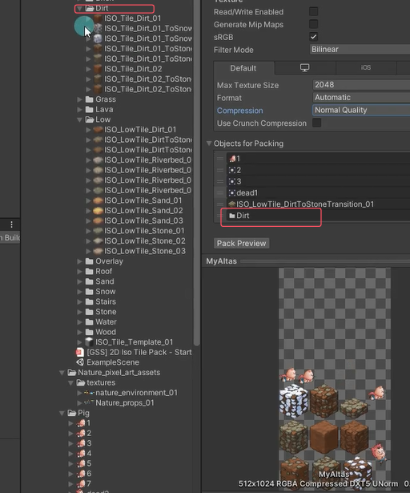

## Default

### Max Texture Size：纹理的最大尺寸，像素为单位

### Format：指定纹理的内部表示
在不同平台上会有不同的参数
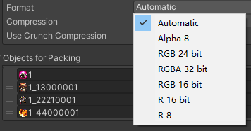
### Compression：纹理压缩类型
不压缩
低质量
普通质量
高质量
质量越高占用内存越多，不压缩质量最好

### Use Crunch Compression：使用Crunch压缩
是一种有损压缩格式，压缩耗时长，但是运行时解压速度快
Compressor Quality：压缩质量，质量越高纹理越大，耗时越长

# 观察Drawcall数量
带卡Stats状态面板来观察Batches
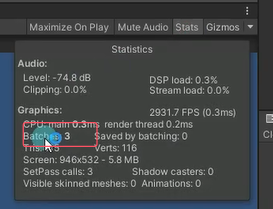

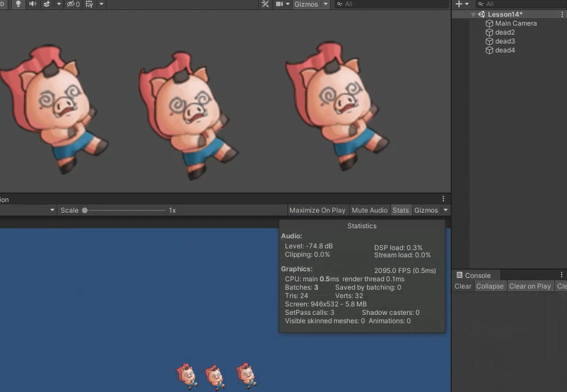
运行后
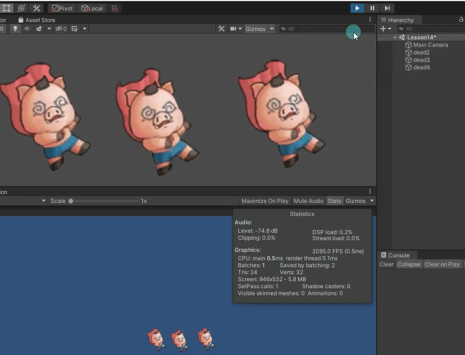


# 代码控制
怎么通过代码加载图集中的某一资源？
然后显示在场景中
```cs
GameObject gameObject = new GameObject();

// 添加一个SpriteRenderer组件
SpriteRenderer sr = gameObject.AddComponent<SpriteRenderer>();

// SpriteAtlas类要引用UnityEngine.U2D命名空间
// 加载名为"MyAtlas"的SpriteAtlas资源
SpriteAtlas spriteAtlas = Resources.Load<SpriteAtlas>("MyAtlas");

//SpriteAtlas中的GetSprite方法 获得图集中的图
//克隆此图集中与打包的名称匹配的第一个 Sprite 并将其返回。
// 从图集中获取名为"dead1"的小图
sr.sprite = spriteAtlas.GetSprite("dead1");
```


