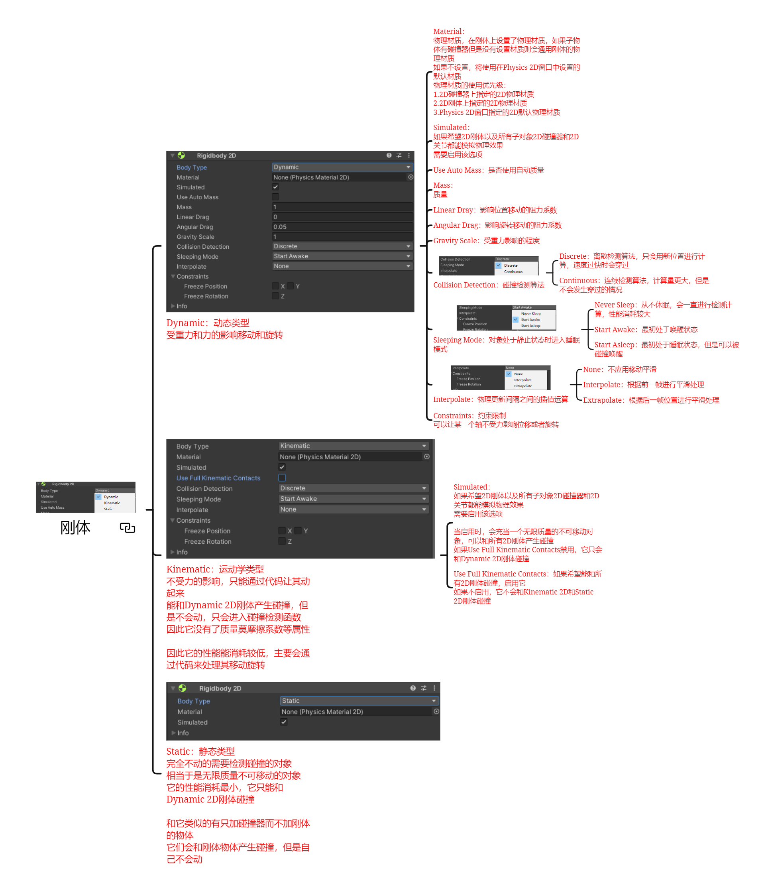
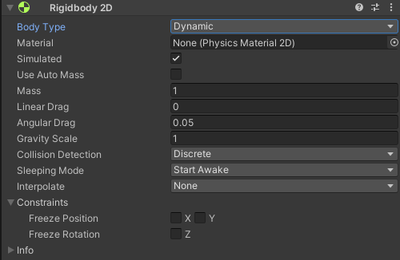
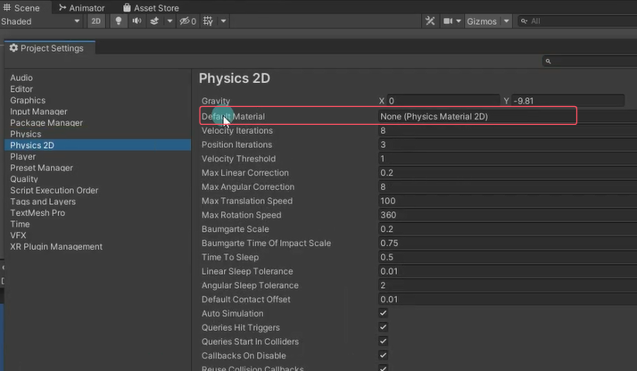
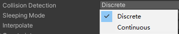
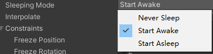
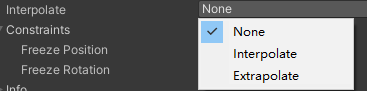
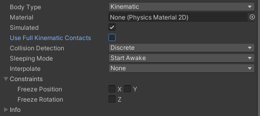
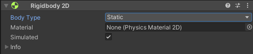

# 学习2D物理系统的前提
学习2D物理系统之前建议先学习Unity入门当中的3D物理系统，因为它们非常的类似。
由于我们之前详细讲解了3D物理系统，所以在讲解2D物理系统时会相对简洁一些，一些讲过的知识点就不过多赘述了。

# 2D物理系统中的刚体组件
刚体是物理系统中用于帮助我们进行模拟物理碰撞中力的效果的。
2D物理系统中的刚体和3D中的刚体基本是一样的，最大的区别是对象只会在XY平面中移动，并且只在垂直于该平面的轴上旋转。
碰撞产生的条件和3D是一样的，都是必须要两个碰撞器，和至少一个刚体rigidbody2d


# 刚体组件

## Dynamic：动态类型
受重力和力的影响移动和旋转

### Material：物理材质
在刚体上设置了物理材质，如果子物体有碰撞器但是没有设置材质则会通用刚体的物理材质 
如果不设置，将使用在Physics 2D窗口中设置的默认材质 

碰撞器Collider和刚体rigidbody都有Material物理材质？
**一般在碰撞器上设置**
rigidbody有子物体，子物体就默认使用父物体刚体的材质
**物理材质的使用优先级**
1. 2D碰撞器上指定的2D物理材质 
2. 2D刚体上指定的2D物理材质 
3. Physics 2D窗口指定的2D默认物理材质

### Simulated：模拟的
默认开启就行
如果希望2D刚体以及所有子对象2D碰撞器和2D关节都能模拟物理效果 需要启用该选项

### Use Auto Mass：是否使用自动质量
一般不开，不准

### Mass：质量

### Linear Dray：影响位置移动的阻力系数

### Angular Drag：影响旋转移动的阻力系数

### Gravity Scale：受重力影响的程度

### Collision Detection：碰撞检测算法

- Discrete：离散检测算法，只会用新位置进行计算，速度过快时会穿过
    
- Continuous：连续检测算法，计算量更大，但是不会发生穿过的情况

### Sleeping Mode：对象处于静止状态时进入睡眠模式

- Never Sleep：从不休眠，会一直进行检测计算，性能消耗较大
    
- Start Awake：最初处于唤醒状态
    
- Start Asleep：最初处于睡眠状态，但是可以被碰撞唤醒
    

### Interpolate：物理更新间隔之间的插值运算

- None：不应用移动平滑
    
- Interpolate：根据前一帧进行平滑处理
    
- Extrapolate：根据后一帧位置进行平滑处理
    

### Constraints：约束限制
可以让某一个轴不受力影响位移或者旋转

## Kinematic：运动学类型

不受力的影响，只能通过代码让其动起来 
能和Dynamic 2D刚体产生碰撞，但是不会动，只会进入碰撞检测函数 因此它没有了质量莫摩擦系数等属性
因此它的性能能消耗较低，主要会通过代码来处理其移动旋转

### Simulated：模拟的
如果希望2D刚体以及所有子对象2D碰撞器和2D关节都能模拟物理效果 需要启用该选项
**当启用时，会充当一个无限质量的不可移动对象，可以和所有2D刚体产生碰撞**
如果Use Full Kinematic Contacts禁用，它只会和Dynamic 2D刚体碰撞

### Use Full Kinematic Contacts：
如果希望能和所有2D刚体碰撞，启用它
如果不启用，它不会和Kinematic 2D和Static 2D刚体碰撞

## Static：静态类型

完全不动的需要检测碰撞的对象 相当于是无限质量不可移动的对象 它的性能消耗最小，它只能和Dynamic 2D刚体碰撞
和它类似的有只加碰撞器而不加刚体的物体 它们会和刚体物体产生碰撞，但是自己不会动


# 如何选择不同类型的刚体
Dynamic动态刚体：受力的作用，要动要碰撞的对象。
Kinematic运动学刚体：通过刚体API移动的对象，不受力的作用，但是想要进行碰撞检测。
Static静态刚体：不动不受力作用的静态物体，但是想要进行碰撞检测（只能和Dynamic动态刚体进行检测）。


# 刚体API
```cs
// GetComponent() 得到 2D 刚体
Rigidbody2D rigid = this.GetComponent<Rigidbody2D>();

// Rigidbody2D.AddForce方法 加力
rigid.AddForce(new Vector2(0, 100));

// Rigidbody2D.velocity属性 刚体速度
rigid.velocity = new Vector2(1, 0);
```


