# 碰撞器是用来干嘛的
碰撞器是用于在物理系统中表示物体体积的的（形状或范围）。
刚体通过得到碰撞器的范围信息进行计算，判断两个物体的范围是否接触。
如果接触，刚体就会模拟力的效果产生速度和旋转。


# 2d碰撞器参数
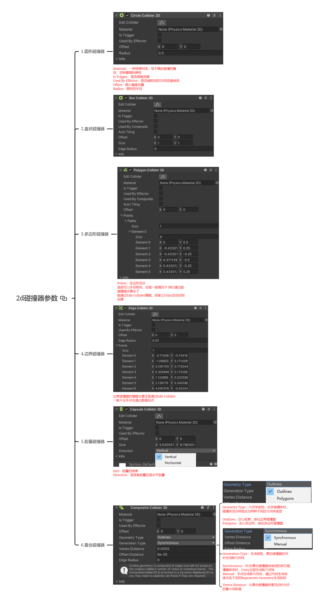
## 圆形碰撞器
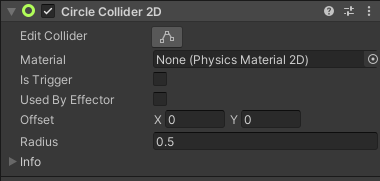
### Material：物理材质
用于确定碰撞的属性，控制摩擦和弹性

### Is Trigger：是否是触发器 
### Used By Effector：是否被附加的2D效应器使用 
### Offset：圆心偏移位置 
### Radius：圆形的半径

## 2.盒状碰撞器
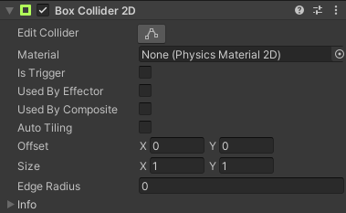
### Use by Composite 由复合使用
如果勾选，则该碰撞器将附加到2D复合碰撞器中使用。
勾选后将消失一些属性，这些属性将在复合碰撞器中配置。

### Auto Tiling 自动拼接
如果SpriteRender精灵渲染器组件中的DrawMode设置为Tiled平铺模式。勾选该选项后，当改变精灵大小时将自动更新碰撞器的尺寸。

### Edge Radius 边缘半径
使四个定点为圆角。
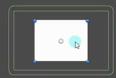

## 3.多边形碰撞器
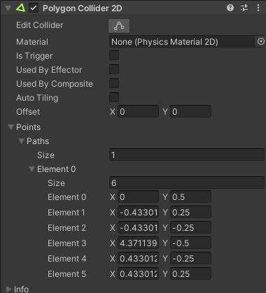

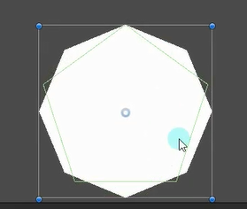


虽然可以手动修改，但是一般情况下 我们通过数值编辑太复杂了 
**都通过Edit Collider编辑，或者让Unity自动识别创建**


## 4.边界碰撞器
由线段组成的范围
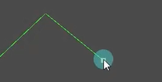
一般用来做地形
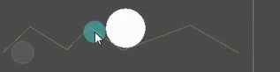

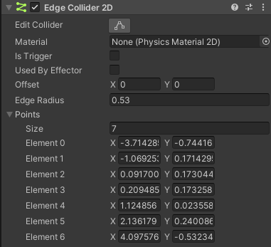
边界碰撞器的编辑主要还是通过Edit Collider
一般不会手动去通过数值加点

## 5.胶囊碰撞器
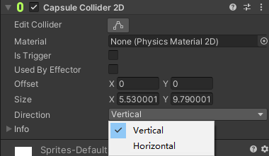
### Size：胶囊的宽高

### Direction：竖直还是水平胶囊

## 6.复合碰撞器
由复数个碰撞器组成，一定要有个刚体组件
给他们添加一个父物体，并添加复合碰撞器
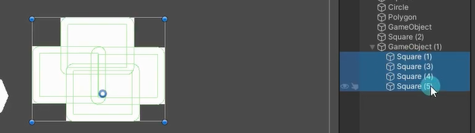
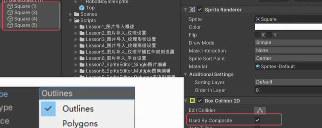
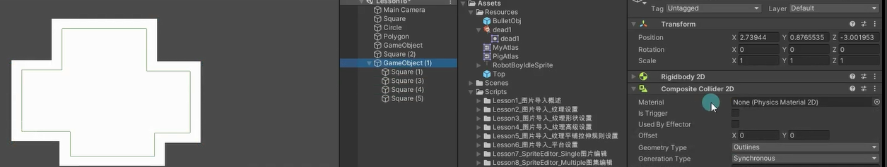


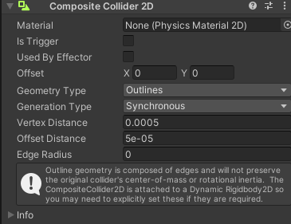
### Geometry Type：几何学类型
合并碰撞体时，碰撞体顶点将组合为两种不同的几何体类型

Outlines：空心轮廓，类似边界碰撞器 
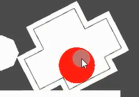
Polygons：实心多边形，类似多边形碰撞器

### Generation Type：生成类型
复合碰撞器在何时生成新几何体

Synchronous：对2D复合碰撞器或使用的其它碰撞器修改时，Unity立即生成新几何体 
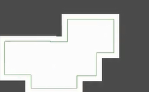
Manual：手动生成新几何体，通过代码生成或者点击下发的Regenerate Geometry生成按钮
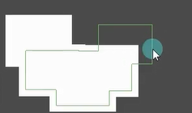

### Vertex Distance：最小间距值
从复合碰撞器收集顶点时允许的最小间距值


# 碰撞检测函数
碰撞检测函数和3D碰撞检测函数除了名字不同外其他基本一致。
在这里只简单讲解不赘述，它是非常重要的知识点。

```cs
private void OnCollisionEnter2D(Collision2D collision)
{
}

private void OnCollisionExit2D(Collision2D collision)
{
}

private void OnCollisionStay2D(Collision2D collision)
{ 
}

private void OnTriggerEnter2D(Collider2D collision)
{
}

private void OnTriggerExit2D(Collider2D collision)
{
}

private void OnTriggerStay2D(Collider2D collision)
{
}
```

# 练习
在之前练习题的基础上，请用2D刚体和碰撞器制作一个玩家，它可以在一个平台上移动跳跃。（注意：移动和跳跃都通过刚体的API进行制作，类似3D物理系统中刚体加力和给速度，之前练习题是通过直接改变坐标移动位置的）

给Player添加碰撞体和刚体，创建几个方形精灵图片添加盒型碰撞器作为要跳跃的平台
记得把角色的z轴旋转关了
```cs
public class PlayerObj : MonoBehaviour
{
    // 玩家移动速度
    public float moveSpeed = 5;

    private float h;

    private SpriteRenderer sr;

    private Rigidbody2D rb;     

    void Start()
    {
        sr = this.GetComponent<SpriteRenderer>();
    }

    void Update()
    {
        // 获取水平方向输入值
        h = Input.GetAxis("Horizontal");

        rb = GetComponent<Rigidbody2D>();

        rb.velocity = new Vector2(h * moveSpeed, rb.velocity.y); //改变刚体速度

        // 如果h小于0，则设置sr.flipX为true，否则如果h大于0，则设置sr.flipX为false
        if (h < 0)
            sr.flipX = true;
        else if (h > 0)
            sr.flipX = false;

        // 检查是否按下了空格键
        if (Input.GetKeyDown(KeyCode.Space))
        {
            //创建子弹预设体
            GameObject obj = Instantiate(Resources.Load<GameObject>("BulletObj"), this.transform.position + new Vector3(sr.flipX ? -0.3f : 0.3f, 0.5f, 0), Quaternion.identity);
            //告诉子弹应该朝哪里动
            obj.GetComponent<BulletObj>().ChangeMoveDir(sr.flipX ? Vector3.left : Vector3.right);
        }
    }
}
```