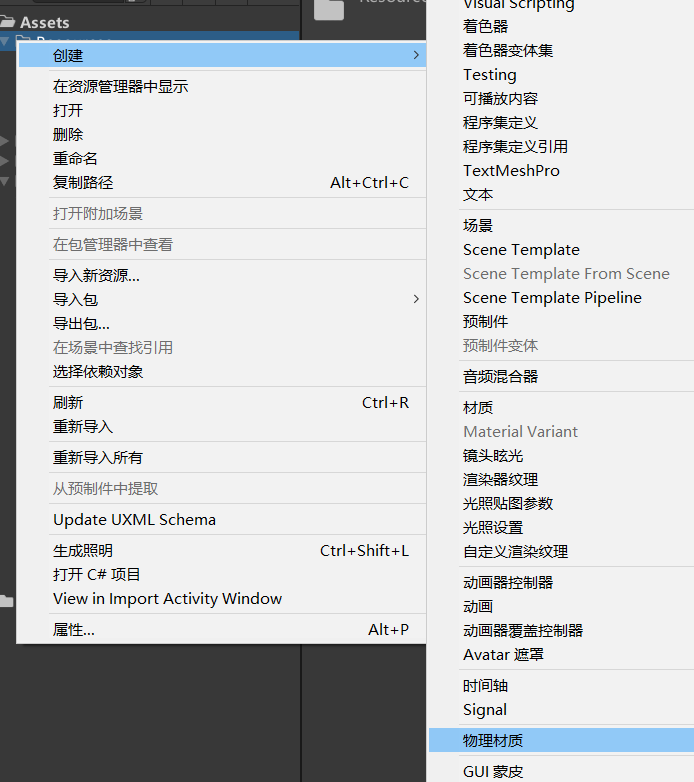
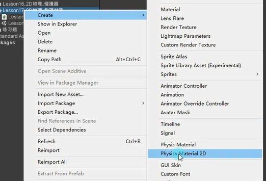
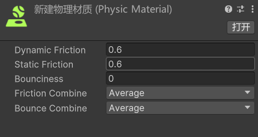

# 什么是物理材质
物理材质是用于决定在物体产生碰撞时这些物体之间的摩擦和弹性表现的。
通过物理材质，我们可以做出类似斜坡不滑落，小球反弹等效果。

# 创建物理材质

# 参数

Dynamic Friction 动摩擦，为0表示没摩擦
Static Friction 静摩擦
Bounciness 反弹程度，0表示没有弹力，1表示完美弹力无能量损失
Friction Combine 决定了两个碰撞体接触时，它们之间动摩擦力（Dynamic Friction）和静摩擦力（Static Friction）的组合方式。
Bounce Combine  确定两个碰撞体接触时，它们之间弹力（Bounciness）的组合方式。
