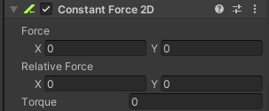

# 什么是恒定力
恒定力是一个特殊的脚本。
它可以给一个2D刚体持续添加一个力。
在做一些随着时间推移而加速的对象时很适用，比如类似火箭发射等效果。
恒定力脚本会线性地为对象添加力和扭矩力，让其移动和旋转。

# 恒定力脚本参数

Force：物理更新时施加于2D刚体上的线性力。
Relative Force：物理更新时施加的线性力（相对刚体对象坐标系）。
Torque：物理更新时施加于2D刚体的扭矩力。