# 2d效应器是什么
2D效应器是配合2D碰撞器一起使用，可以让游戏对象在相互接触时产生一些特殊的物理作用力。
通过2D效应器，可以快捷的实现一些传送带、互斥、吸引、漂浮、单向碰撞等等效果。

# 各种2d效应器参数
要想将一个Sprite的表示成一个效应器，要添加一个Collider和任意一个Effector2d，**isTrigger和used by Effector**都要打开
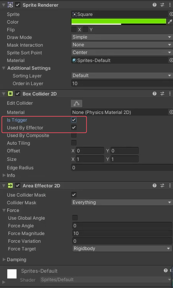

## Area Effector区域效应器
主要作用：在一个区域内让游戏对象受到力和扭矩力的作用
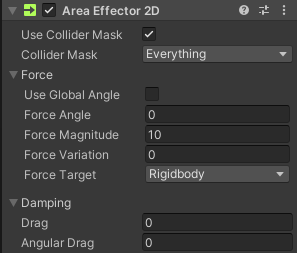
### Use Collider Mask：是否启用碰撞器遮罩
如果开启才会出现下面的Collider Mask，可以通过选择层，决定该效应器只会作用于哪些层的对象

### Use Global Angle：是否使用世界坐标系角度
如果不勾选，角度为局部角度 

### Force Angle：施加力的角度 
### Force Magnitude：施加力的大小 
### Force Variation：施加力的随机大小变化 
会在 +- Force Magnitude基础上根据该值进行随机变化

### ForceTarget：效应器在目标对象上施加力的作用点 
Collider：以碰撞器的当前位置（如果碰撞器有偏移，没有位于质心，可能会产生扭矩力，带来旋转） 
Rigidbody：以刚体的当前质心（不会产生扭矩力）

Drag：阻力 
Angular Drag：扭矩阻力

## Buoyancy Effector浮力效应器
主要作用：模拟流体行为，浮动和阻力相关设置，让玩家在该区域看起来像在水里移动
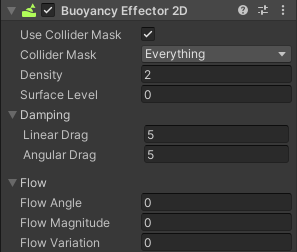

### Density：流体密度
密度较大，碰撞体会下沉，密度越小碰撞体会上浮 密度和流体相同的碰撞体会浮在流体中

### Surface Level：定义浮力流体的表面位置
对象高于此线时，不会对其施加浮力，以下或者相交会施加浮力。沿世界Y轴偏移

### Linear Drag：对象在水中移动的阻力系数 
### Angular Drag：对象在水中旋转的阻力系数

### Flow Angle：
流体流动方向相对世界控件的角度，沿指定方向施加浮力 
### Flow Magnitude：
与FlowAngle结合使用，前者决定力的角度，该值确定浮力大小 
### Flow Variation：
随机改变流体力的值

## Point Effector 点效应器
主要作用：模拟磁铁 吸引或者排斥的效果
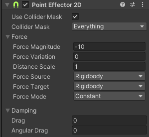

### Force Magnitude：力的大小 
### Force Variation：力的大小变化 
### Distance Scale：效应器和目标之间距离的缩放。
计算距离时，会按该比值对距离进行缩放

### Force Source：力来源
从该点计算距离。 
Collider：碰撞器的位置 
Rigidbody：刚体的位置

### Force Target：作用力目标位置
用改点计算位置 
Collider：碰撞器的位置，如果碰撞器有偏移，可能会产生扭矩力 
Rigidbody：刚体的位置，不会产生扭矩力

### Force Mode：计算力的模式 
Constant：忽略源和目标之间相隔的距离 
Inverse Linear：反线性距离计算，距离越远，力的大小呈线性减小 
Inverse Squared：反平方距离计算，力的大小呈指数减小（按平方下降），类似现实世界重力

## Platform Effector平台效应器
**平台效应器的碰撞器可以不做成Trigger**

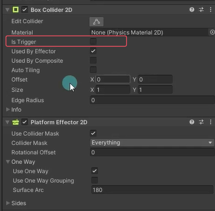

主要作用：2D游戏当中的平台或可往上跳跃的墙壁
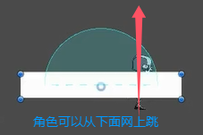
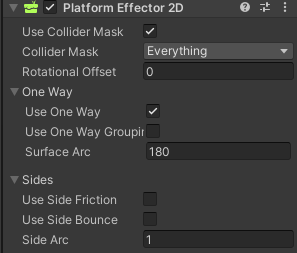

### Rotational Offset：旋转偏移量
控制平台角度偏移
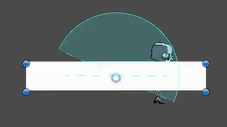

### Use One Way：是否使用单向碰撞行为 
一般勾选，不勾选的话从下面跳不上去

### Use One Way Grouping：
当平台式有多个碰撞器组合时，可以通过它将所有碰撞器设置为单向碰撞行为 

Surface Arc：以局部坐标系下向上的方向为中心，填写一个角度值，定义不允许通过的表面，该角度外的其它地方视为单向碰撞
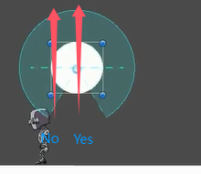

Use Side Friction：是否应该在平台两侧使用摩擦 
Use Side Bounce：是否应该在平台两侧使用弹性 
Side Arc：用于定义左右两侧平台的响应弧度
下面红弧就是平台两侧的作用范围
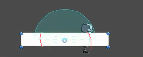

## Surface Effector 表面效应器
表面效应器也不用开Trigger
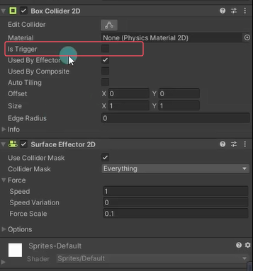

主要作用：模拟传送带
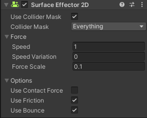

### Speed：表面保持的速度 
### Speed Variation：速度的随机增加值

### Force Scale：缩放沿表面移动时施加的力。
如果是0表示不施加力，相当于禁用。值越低越慢，值越高越快，建议不要设置为1，因为当设置为1时可能会抵消施加在物体上的其它力，比如跳跃的力

### Use Contact Force：是否对接触物体表面的出点施加力
如果选择会让对象旋转（打滚），如果不开启则不会旋转

### Use Friction：是否使用摩擦力 
### Use Bounce：是否使用弹力

# 总结
效应器其实只是Unity为我们写好的一些2D游戏中常用功能的一些代码。在实际开发中我们不应该过于依赖效应器。如果发现效应器和自己的游戏需求不太匹配时，我们完全可以自己实现符合需求的“效应器”。