# SpriteShape是用来做什么的
顾名思义，SpriteShape是用于定义精灵的形状。
从名称上难以确定其具体功能。
它主要用于节约美术资源，方便制作**2D游戏场景地形或背景**。

# 导入SpriteShape工具
在Package Manager中导入相关工具
可以选择性导入示例和拓展资源

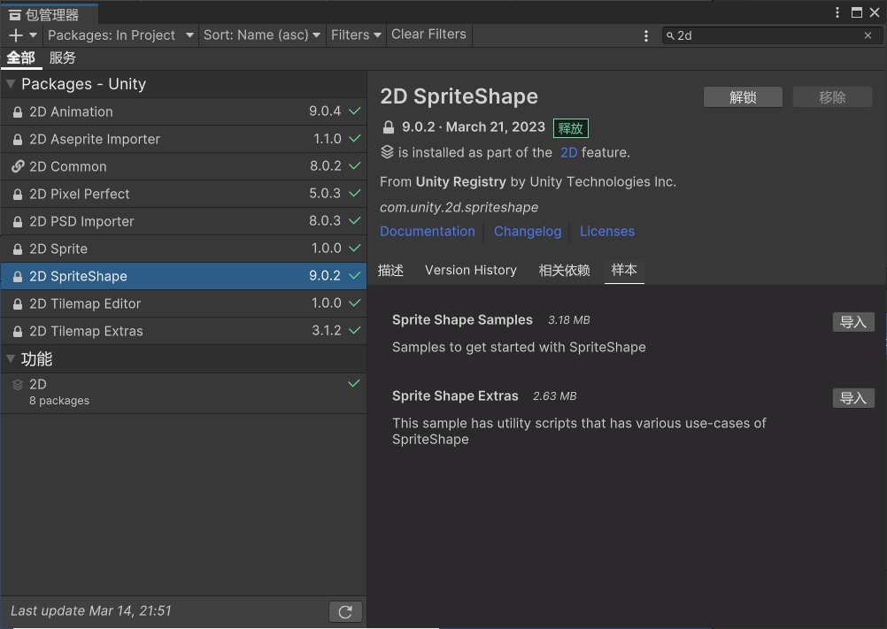

# 准备并创建精灵形状概括资源
在Asset右键
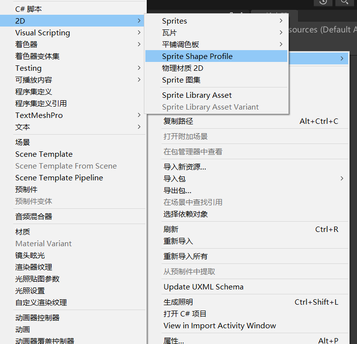

# Sprite Shape Profile参数
精灵形状概述文件配置
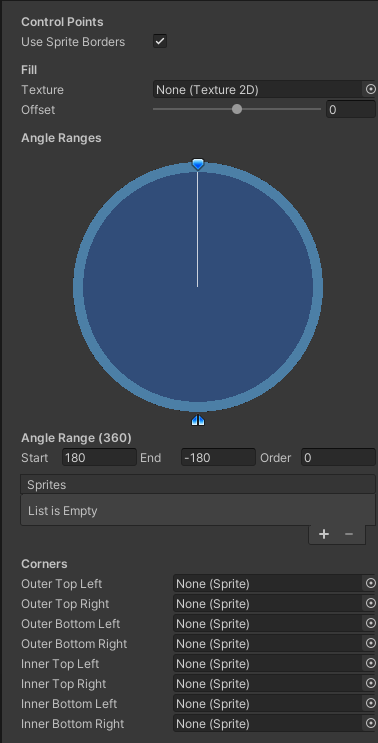

## Use Sprite Borders：是否使用精灵边框
用于九宫格拉伸，默认勾选就行

## Texture：用于填充实心部分的纹理
（使用的纹理的平铺模式必须是Repeat重复模式）

## Offset：纹理偏移量
一般不修改
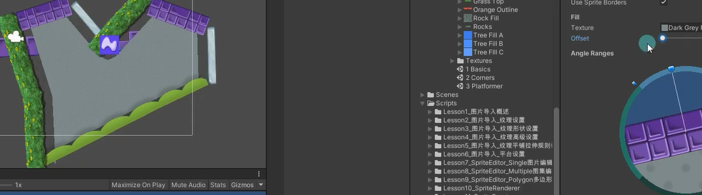

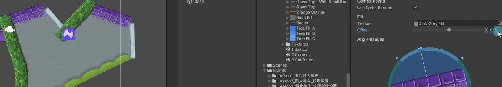

## Angle Ranges
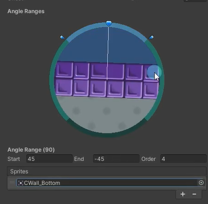  
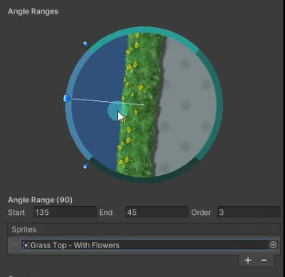

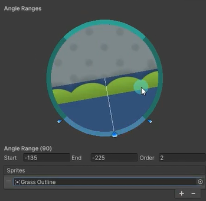

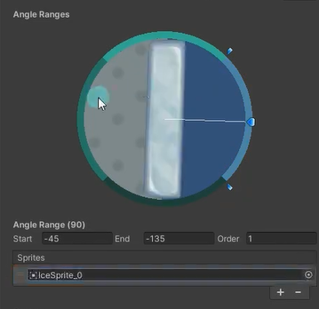
拖入场景后
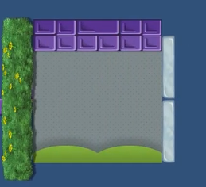
稍微改变一下
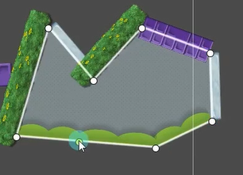

这里的设置主要用于封闭图形
在不同角度范围内使用的图片不同 可以达到一个封闭效果
Angle Ranges：角度范围 
Start：起始角度 
End：结束角度 
Order：Sprite相交时的优先级，优先级高的显示在前面

## Sprites：指定角度范围内的精灵列表
在该角度范围内，可以选择使用的图片资源

## Corners：指定角显示的精灵图片
主要用于封闭图形
外部四个角用的图片 内部四个角用的图片
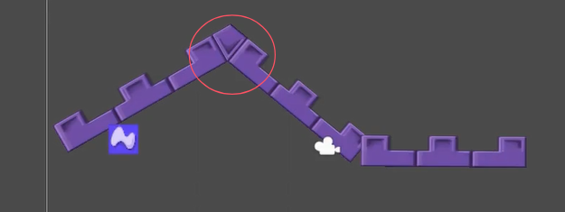

# 使用精灵形状概述资源创建地形
直接拖入到场景中就行

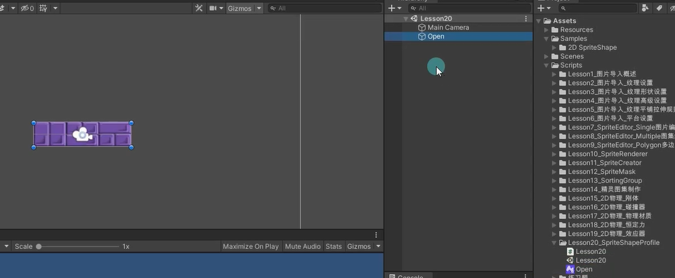

点右边的红框
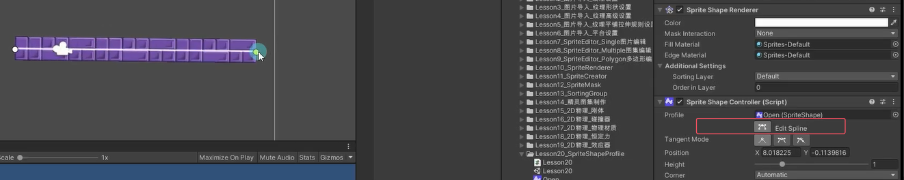
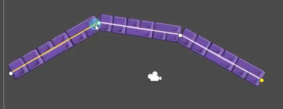

选择一个起点可以改图
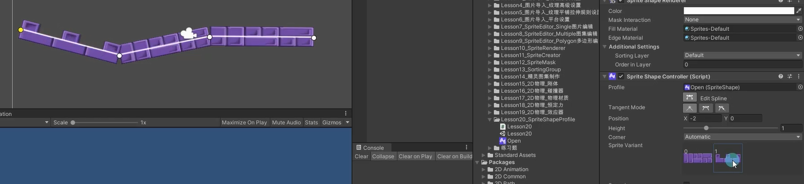