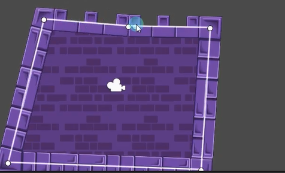
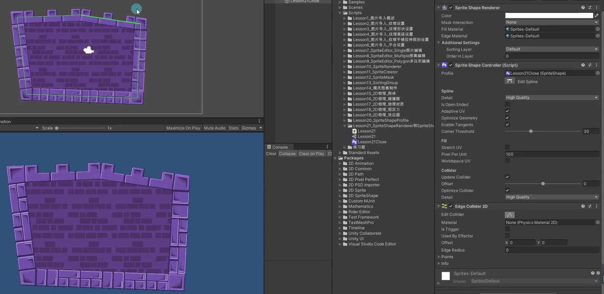

# 回顾怎么使用精灵形状概述文件
创建一个关闭的精灵形状概述文件，设置好四个角度的图和下面八个角列表的图，直接拖拽到场景里。

# 精灵形状渲染器和控制器参数

## Sprite Shape Renderer
精灵形状渲染器
该控件主要是控制 材质 颜色 以及和其它Sprite交互时的排序等等信息

### Color：颜色

### Mask Interaction：遮罩相互作用规则设置

### Fill Material和Edge Material：填充材质和边缘材质

### Sorting Layer和Order in Layer：排序相关

## Sprite Shape Controller
精灵形状控制器

### Profile：使用的精灵形状概述文件

### Detail：精灵形状的质量
高中低三种质量

### Is Open Ended：是否是开放的，不封闭的
封闭的

开放的

### Adaptive UV：自适应UV
如果开启，会自动帮助我们判断是平铺还是拉伸 
开启后只有宽度够才会平铺，如果宽度不够会拉伸 
先拉伸

后平铺

不开启始终平铺，但是可能会出现裁剪效果 一般根据你的实际效果进行选择

### Optimize Geometry：优化三角形数量
勾选后会最小化精灵图形中的三角形数量

### Enable Tangents*：是否启用切线计算功能

如果你的着色器中需要切线信息参与计算，则勾选

### Cache Geometry*：缓存几何体
一般不开启

### Corner Threshold：角阈值
当拐角处的角度达到这个阈值（a）时将使用角图片

### Stretch UV*：是否拉伸UV
如果勾选纹理的UV将伸展到整个精灵形状的直线上
在封闭里面拉伸

封闭区域里面平铺

### Pixel Per Unit*：Unity单位对应多少像素
禁用拉伸UV时才有
较高的值会较少纹理的大小

### Worldspace UV*：根据世界控件的UV填充纹理

### 启用编辑状态后

- Tangent Mode ：切线模式
  从左至右依次是： 
  **顶点模式**-点两侧不构成曲线 
  
  
  **切线模式**-点两侧构成曲线，并且可以控制切线弧度 
  
  **左右切线模式**-点两侧构成曲线，并且可以分别控制左右两侧切线弧度
  

- Position：选中点的局部坐标位置
    
- Height：控制点左右两侧精灵图片的高度
  
    
- Corner：是否使用角度图片
  Disabled：不使用角度图片 
  Automatic：自动

- Sprite Variant：选择使用的精灵图片
    
- Snapping*：是否开启捕捉设置控制点

# 生成碰撞器
1. 使用边界碰撞器

2. 使用多边形碰撞器 配合复合碰撞器
先添加多边形碰撞器

再添加复合碰撞器，并把多边形碰撞器应用于复合碰撞器
