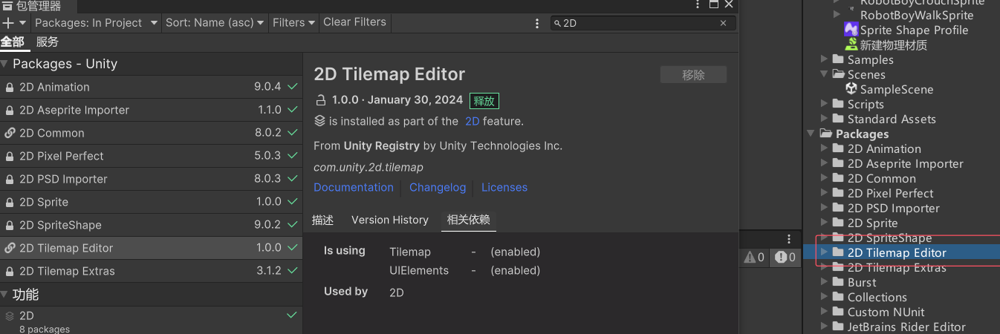
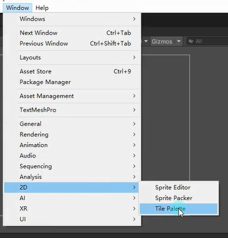
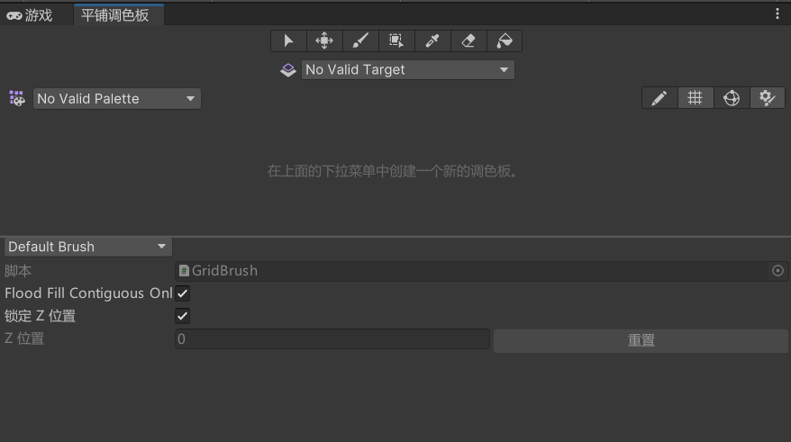
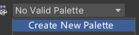
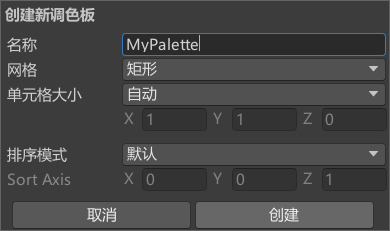
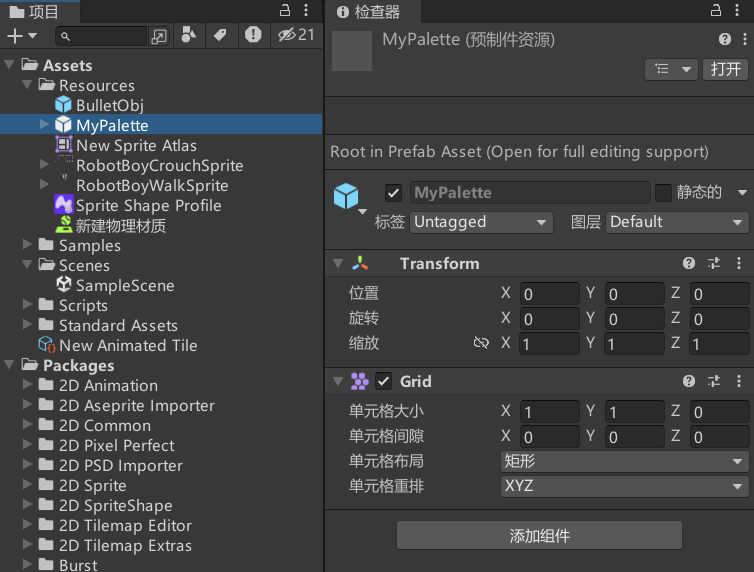
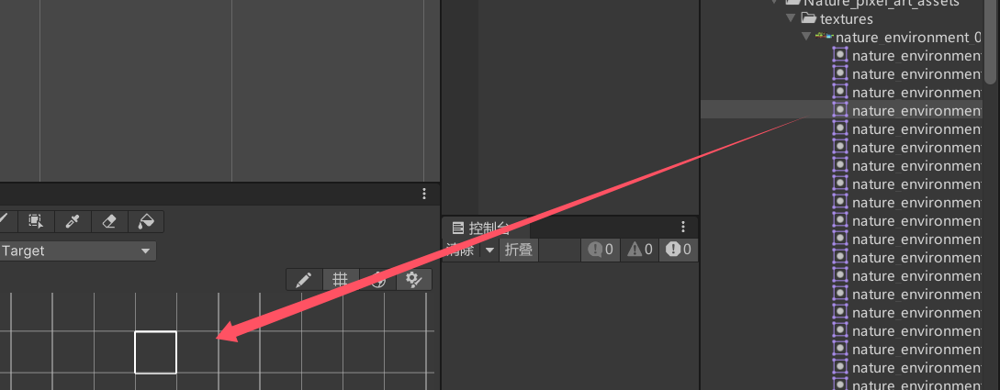
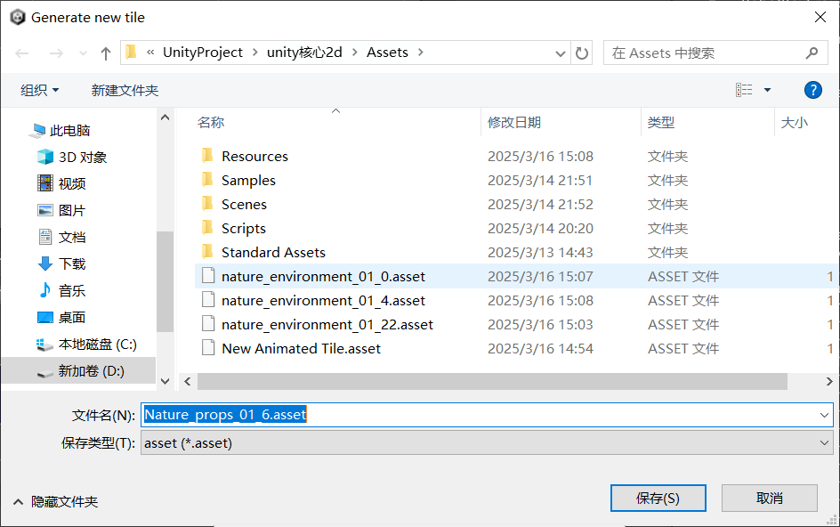
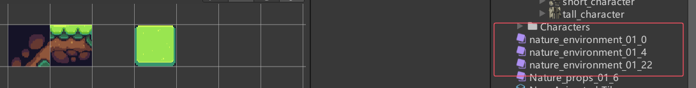
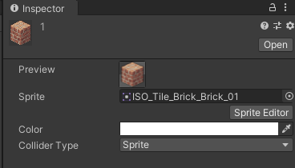

# 什么是Tilemap
Tilemap，通常称为瓦片地图或平铺地图，是Unity2017中新增的功能。
Tilemap主要用于快速编辑2D游戏中的场景，通过复用资源的形式提升地图多样性。
Tilemap工作原理就是用一张张的小图排列组合为一张大地图。

**Tilemap和SpriteShape的异同：**
共同点：他们都是用于制作2D游戏的场景或地图的。
不同点：
SpriteShape可以让地形有弧度，TileMap不行。
TileMap可以快捷制作有伪“Z”轴的地图，SpriteShape不行。

# 从PackageManager中引入Tilemap包

# Tilemap的最小单位——“瓦片资源”
在Tile Palette瓦片调色板窗口创建。
打开Tile Palete平铺调色板

新建一个Palette

把Sprite直接拖到平铺调色板中，并选择保存的路径

# 参数相关

Preview：预览图
Sprite：瓦片关联的精灵纹理
Color：瓦片色调颜色
Collider Type：碰撞器类型
    None：不生成碰撞器
    Sprite精灵：基于精灵轮廓生成碰撞器形状
    Grid网格：基于瓦片单元格生成碰撞器形状
