# 瓦片调色板窗口使用
## 创建相关

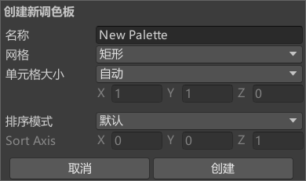

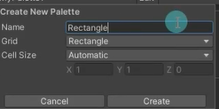

### Name：瓦片调色器名称

### Grid：瓦片的网格布局 
- Rectangle：矩形瓦片 
  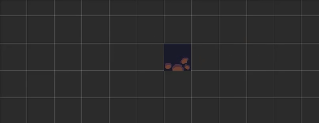
- Hexagon：六边形瓦片 
  Hexagon Type：六边形瓦片地图类型 
    - Point Top：点朝顶部的六边形 
      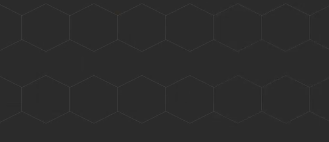
    - Flat Top：面朝顶部的六边形 
      
- Isometric：等距瓦片，单元格为菱形 
- Isometric Z as Y：等距瓦片并且Unity将单元格Z轴转换为局部Y坐标  （伪z轴）

### Cell Size：瓦片绘制到单元格的大小 
- Automatic：基于瓦片资源的精灵大小自动设置 
- Manual：自定义大小

## 操作技巧

### 单击瓦片——选择瓦片

### 在多个瓦片上移动——选择多个瓦片

### Alt+左键拖动——平移

### 滚轮键拖动——平移

### 旋转滚轮键——放大/缩小

## 面板相关
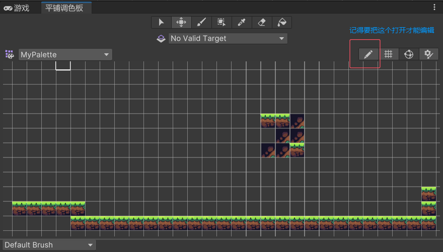

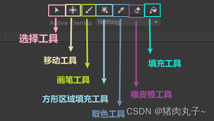

<iframe src="//player.bilibili.com/player.html?isOutside=true&aid=492255944&bvid=BV13N411t76k&cid=1316657838&p=1" scrolling="no" border="0" frameborder="no" framespacing="0" allowfullscreen="true" ></iframe>

# 编辑瓦片地图
现在场景中创建瓦片地图
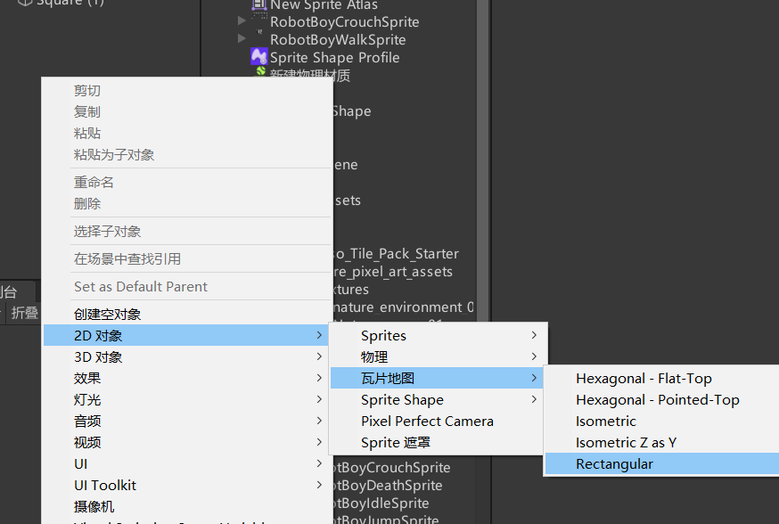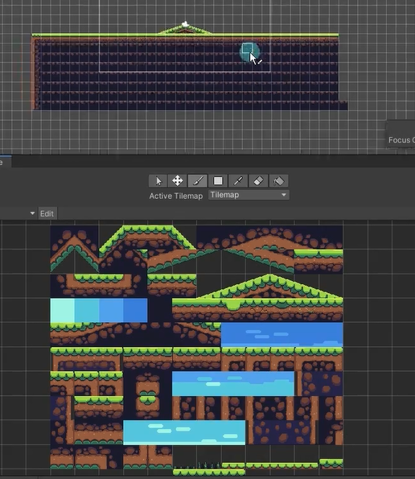

可以在场景中再创建一个瓦片地图，作为天空层，设置层级比原来那层低。激活的瓦片地图要选择成天空层。可以框选天空的图片上去。
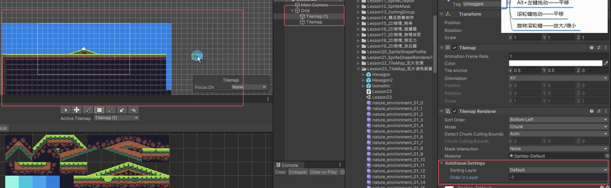

创建等距瓦片地图ISOmetric x y，拖拽资源进去，会发现资源和瓦片格子不适配。是因为原图片中心点造成的。把原图片中心点调成菱形的中心点。就对准了。
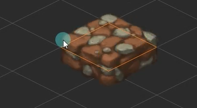
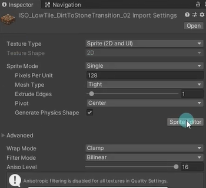
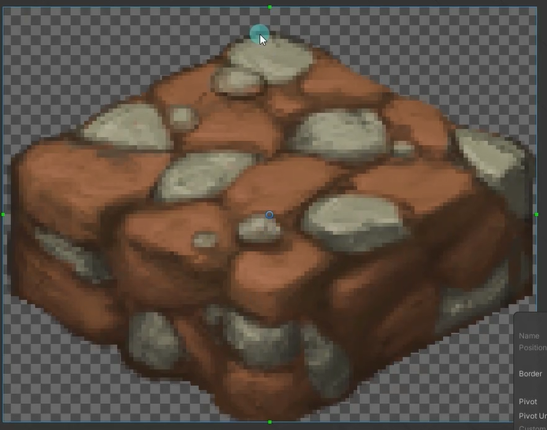

改为
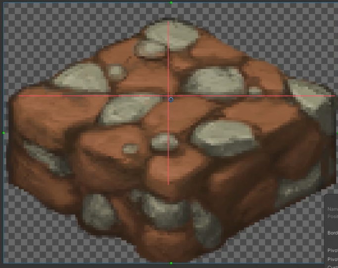
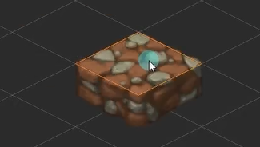

在场景创建一个z和y的等距瓦片地图，直接把z和y等距的瓦片放上去会发现有点奇怪。
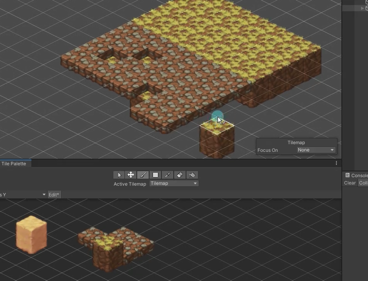

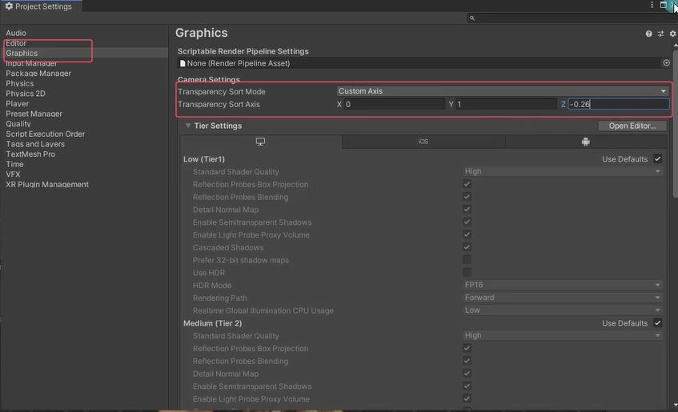

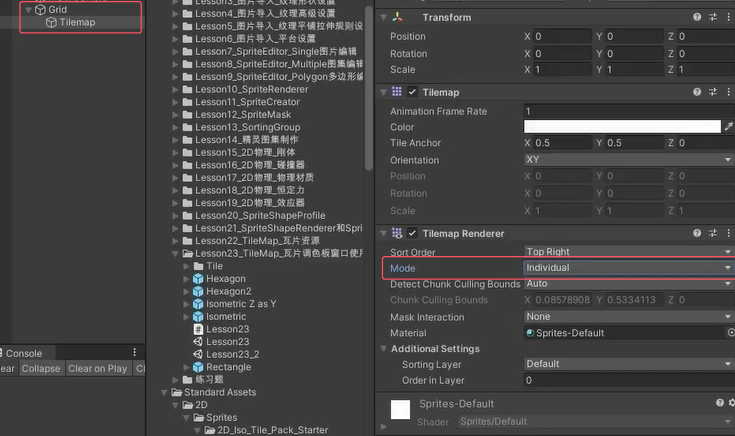

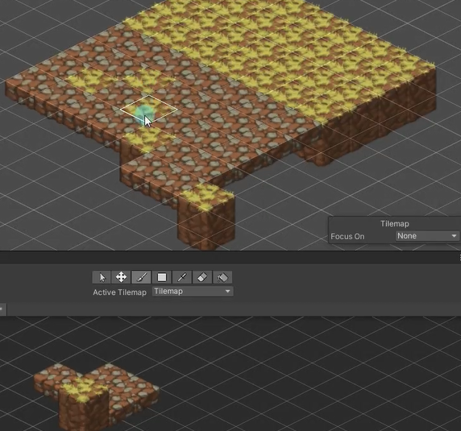

可以不改图片的轴心点来调整高低，关掉下面的锁定z位置然后按+-来调整
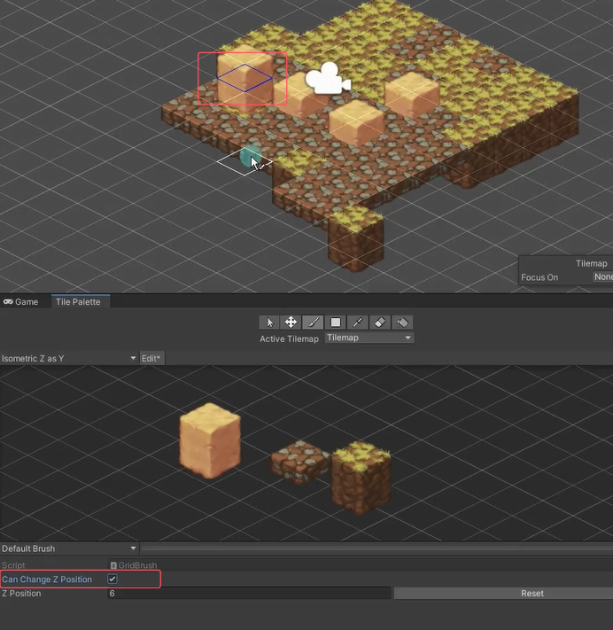

**不同的瓦片地图的作用**
矩形瓦片地图用于做横版游戏地图
六边形瓦片地图用于做策略游戏地图
等距瓦片地图用于做有”Z”轴的2D游戏

**注意：**
在编辑等距瓦片地图时：
1. 需要修改工程的自定义轴排序以Y轴决定渲染顺序。
2. 如果地图存在前后关系需要修改TileRenderer的渲染模式。
3. 可以通过Z轴偏移来控制绘制单个瓦片时的高度。（+-）
4. 精灵纹理的中心点会影响最终的显示效果。