# 回顾瓦片地图编辑
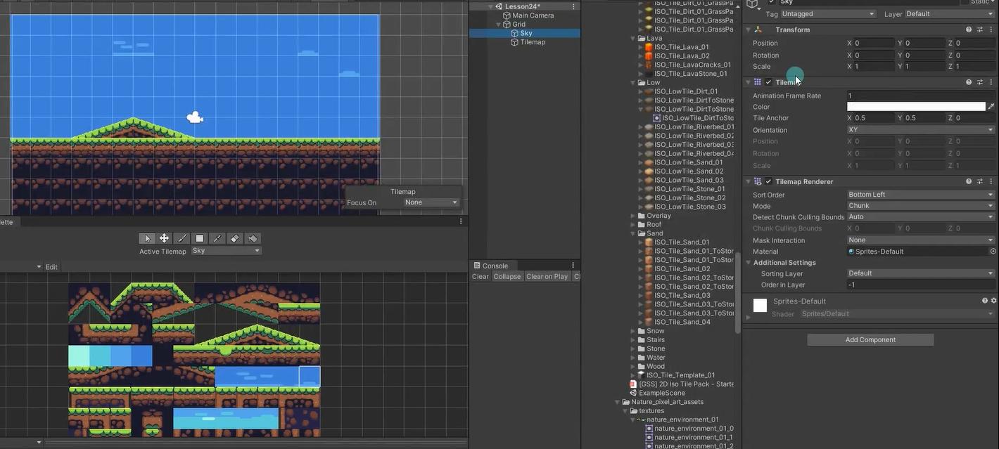


# 瓦片地图关键脚本和碰撞器参数
## Grid
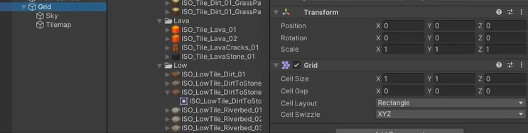
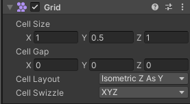

### Cell Size：网格单元格的大小
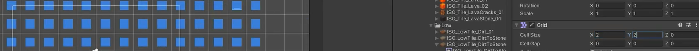
### Cell Gap：网格之间的间隔大小
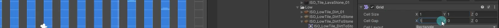

改图片的Pixels Per Unit也可以达成影响效果
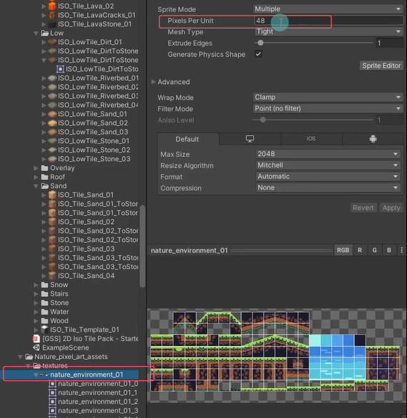
### Cell Layout：网格单元的形状和排列
Rectangle：矩形 
Hexagon：六边形 
Isometric：等距布局，单元格为菱形 
Isometric Z as Y：等距布局，但Unity将单元格Z轴转换为局部Y坐标

### Cell Swizzle*：
Unity将XYZ单元格坐标重新排序为你选择的类型

## Tilemap*
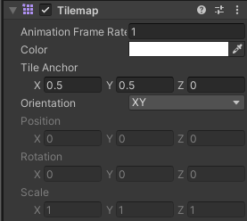
### Animation Frame Rate：动画的速率
Unity播放瓦片动画的速率。相当于倍速

### Color：瓦片色调颜色

### Tile Anchor：瓦片的锚点偏移

### Orientation：瓦片地图上瓦片的方向。
相当于2D平面使用的是Unity中的哪两个轴

## Tilemap Renderer
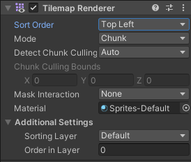
### Sort Order：排序方向
设置所选瓦片地图上的瓦片排序方向

### Mode：渲染模式
Chunk：按位置对瓦片进行分组，并将瓦片精灵一起批处理进行渲染，性能较好  
Individual：单独渲染每个瓦片，会考虑他们的位置和排序顺序。会让瓦片精灵和场景中其它渲染器或自定义排序轴进行交互

### Detect Chunk Culling*：渲染器如何剔除瓦片地图的边界
Auto：自动检测  
Manual：手动设置拓展边界

### Chunk Culling Bounds*：
当选择手动设置剔除拓展边界时，可以在这里自己填写拓展的值


# 瓦片地图碰撞器
为挂载TilemapRenerer脚本的对象添加Tilemap Collider2D脚本，会自动添加碰撞器。注意：想要生成碰撞器的瓦片Collider Type类型要进行设置。

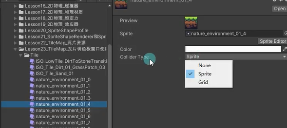

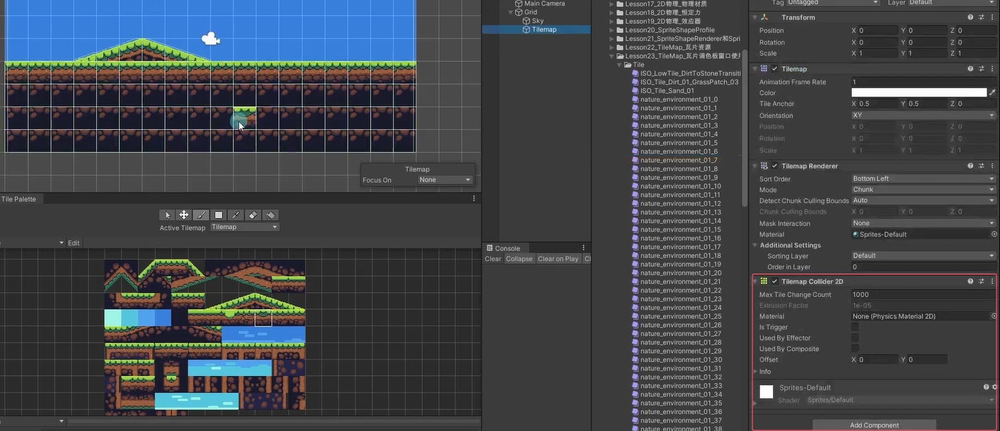

可以添加个复合碰撞器来合并碰撞器
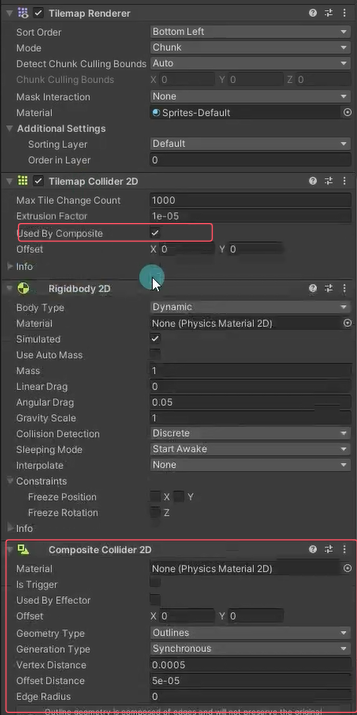

# 练习题
## 横版通关的地图
请用TileMap制作一个横版通关的地图 让一个角色可以在其中移动

创建一个2D精灵作为玩家，给他添加碰撞器和刚体。注意调整两个瓦片地图和玩家对象的层级。
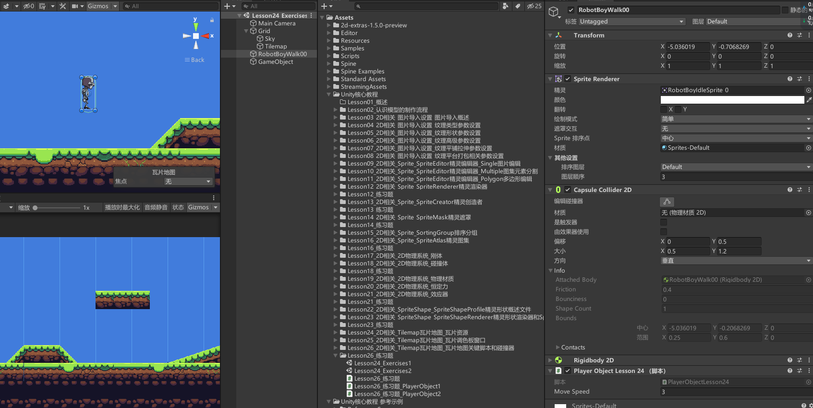
```cs
public class PlayerObject1 : MonoBehaviour
{
    public float moveSpeed = 3;
    private SpriteRenderer sr;
    private Rigidbody2D rigidBody2D;
    private float h;

    void Start()
    {
        rigidBody2D = this.GetComponent<Rigidbody2D>();
        sr = this.GetComponent<SpriteRenderer>();
    }

    void Update()
    {
        h = Input.GetAxis("Horizontal");
        rigidBody2D.velocity = new Vector2(h * moveSpeed, rigidBody2D.velocity.y);
        if (h < 0)
            sr.flipX = true;
        else if (h > 0)
            sr.flipX = false;
        if (Input.GetKeyDown(KeyCode.Space))
        {
            rigidBody2D.AddForce(Vector2.up * 300);
        }
    }
}
```


如果想要左上红框做平台效用器的话，可以重新在瓦片调色板中在添加一个一模一样的图片，可以把新生成的瓦片图片资源设置碰撞器类型为None。我们可以创建空物体添加平台碰撞器，调整位置和大小放到瓦片碰撞器的位置。这样就做成瓦片碰撞器了。
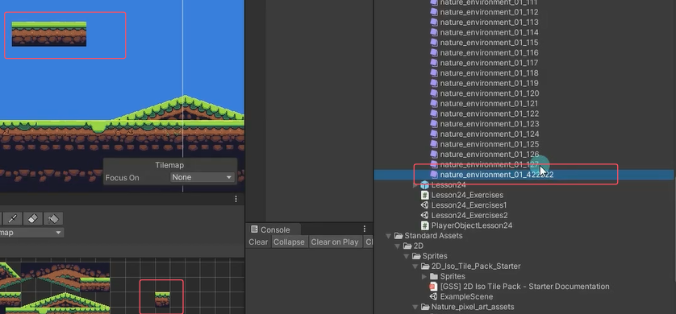

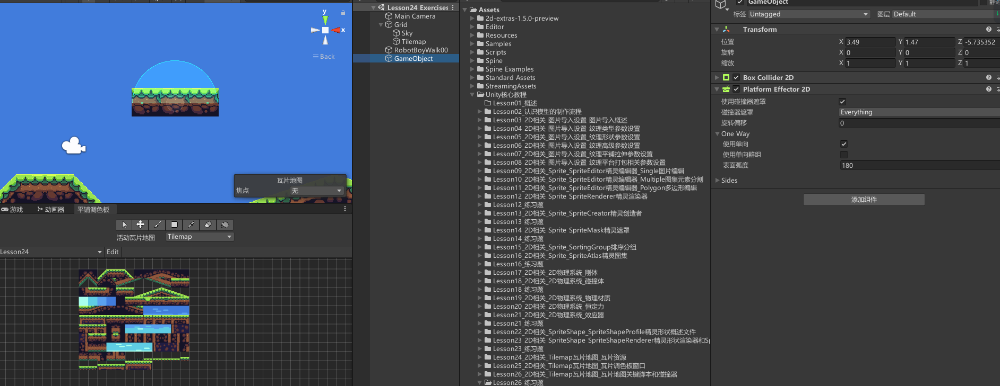

不要局限于瓦片碰撞器。假如做一个可以被跳跃销毁的顶箱子或者踩怪，可以直接拖入图片作为2D对象，然后写逻辑，不使用瓦片相关也没问题。


## 伪Z轴的地图
请用TileMap制作一个有伪Z轴的地图 让一个角色可以在其中移动
**伪Z轴：将Y轴有跳跃功能，也有前进功能**

### 等距瓦片的两项重要设置
首先
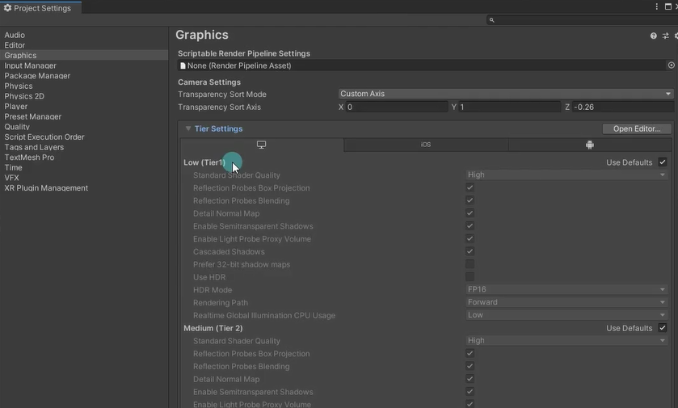

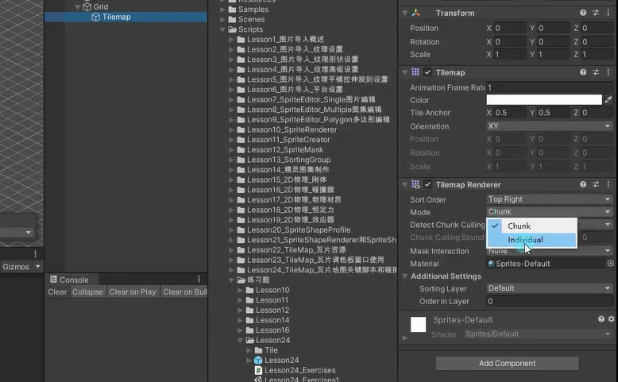

### 等距瓦片和等距瓦片z和y的区别
开启了下面改变Z轴的选项。等距瓦片把瓦片丢到场景里按-和+不会调整伪Z轴的距离，等距瓦片z和y会改变。（一般不用zy，会有排序啥的问题）
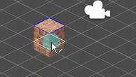


设置轴心点
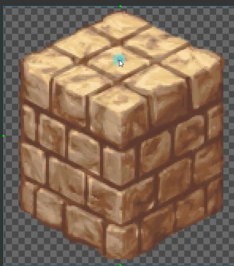


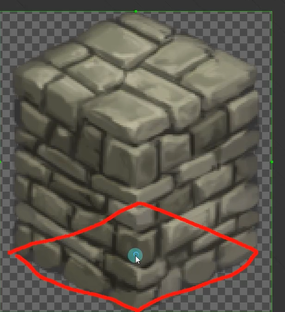


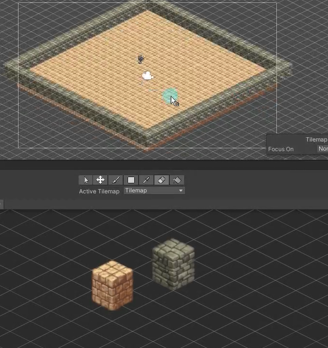
### 等距瓦片的排序问题
#### 轴心点排序
设置角色渲染器按照轴心排序
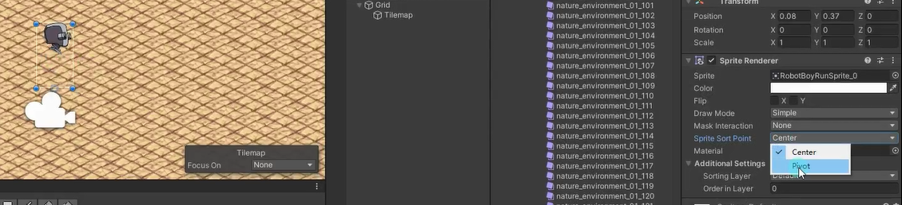

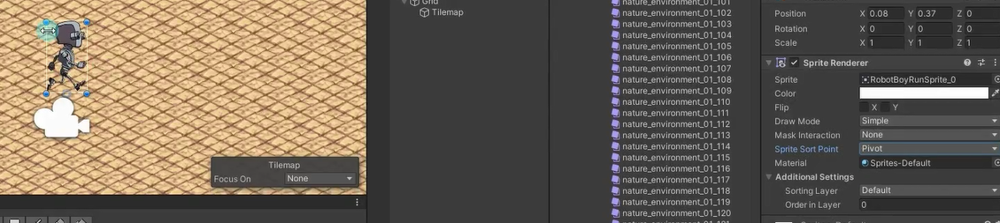

还是有问题？
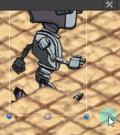
规则是什么？y轴
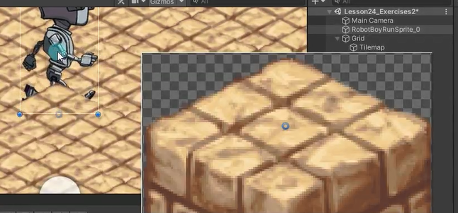
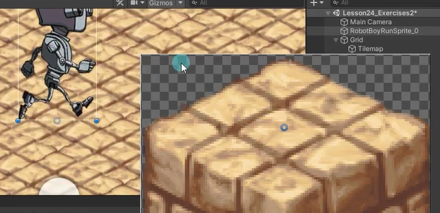


#### 排序层排序
更改角色的排序层
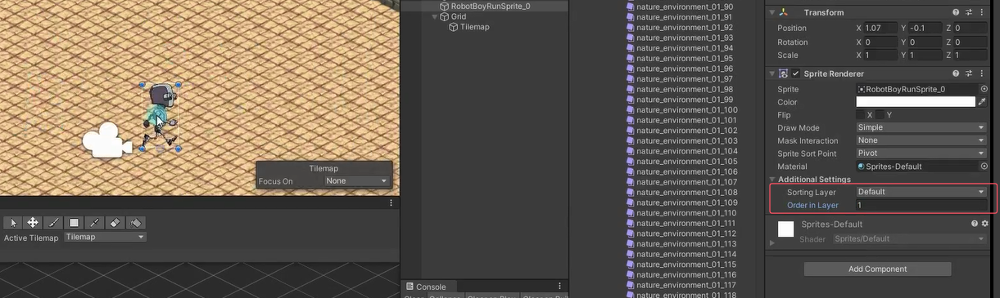

有产生新的问题
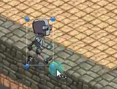

可以利用Tilemap可以加多个情况来解决
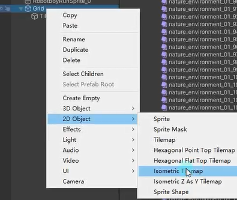

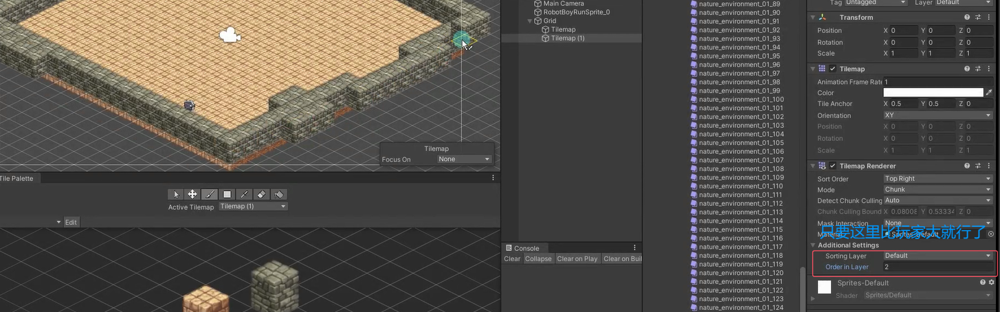


又又又有新问题
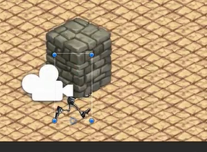

还可以创建一个不同层级的和玩家同一排序层的Tilemap，通过轴心点排序
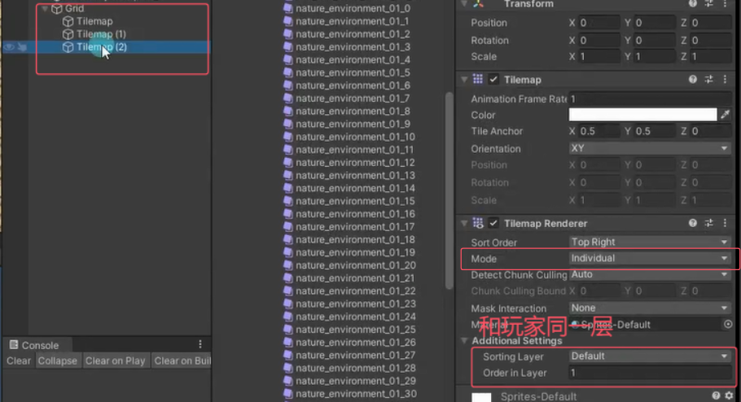

自己添加的图的排序点一定要选泽pivot排序
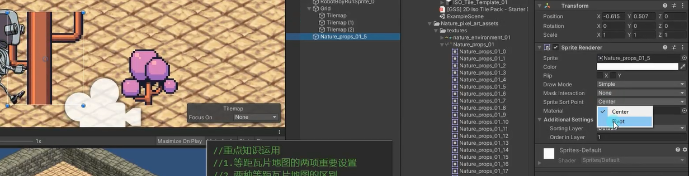

可以用自己拖精灵来制作场景，和Tilemap区别如下
2d精灵图片对象可以密集的放很多个对象。
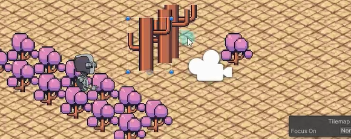

### 等距瓦片地图角色不使用重力
控制移动不应该用刚体来移动，要用transform来移动
玩家Rigidbody组件设置如下
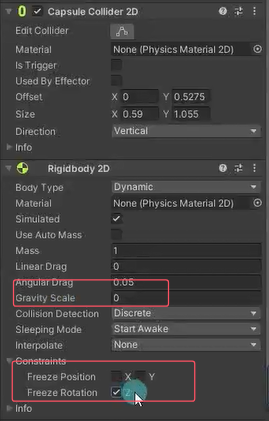

### 等距瓦片碰撞器相关问题
中间黄色地面是不产生碰撞的
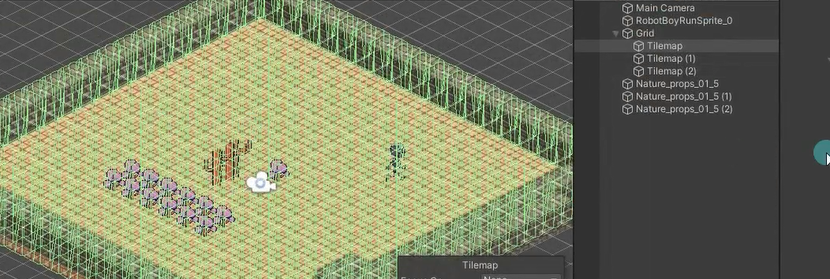
将中间的图片资源的碰撞模式改为空
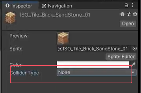

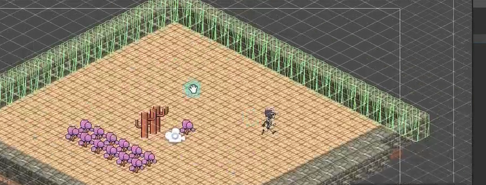

对于等距瓦片围墙这种一般不按照碰撞类型不按Sprite来生成，一般按照Grid来生成
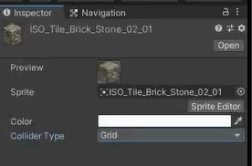

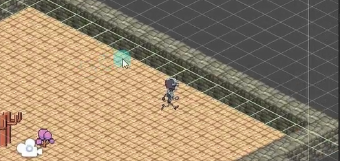


编写角色脚本
```cs
public class PlayerObject2 : MonoBehaviour
{
    public float moveSpeed = 3;
    private float h;
    private float v;
    public SpriteRenderer sr;

    void Start()
    {
        sr = this.GetComponent<SpriteRenderer>();
    }

    void Update()
    {
        h = Input.GetAxis("Horizontal");
        v = Input.GetAxis("Vertical");
        this.transform.Translate(Vector3.right * moveSpeed * Time.deltaTime * h);
        this.transform.Translate(Vector3.up * moveSpeed * Time.deltaTime * v);
        if (h < 0)
            sr.flipX = true;
        else if (h > 0)
            sr.flipX = false;
    }
}
```

想将围墙的碰撞范围往外一点，以达到更好的角色移动视觉效果
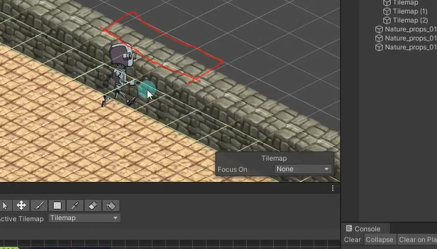

在拿同样的图再次拖到TilePalette中生成右侧红框的，将其碰撞类型改为None，再用其覆盖掉里面那一圈
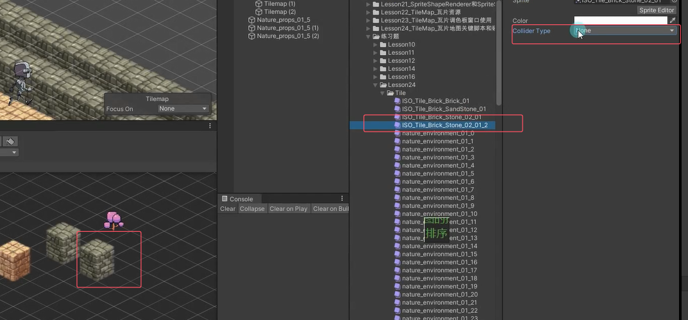

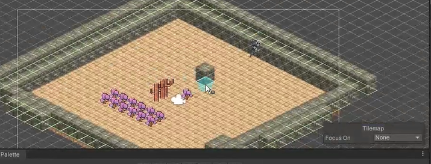


### 等距瓦片的角色跳跃问题
创建一个空物体Root，将角色设置为其子对象，然后将角色身上的Collider和rigidbody脚本移动到Root中
通过设置角色的y轴（相对root）来控制跳跃 
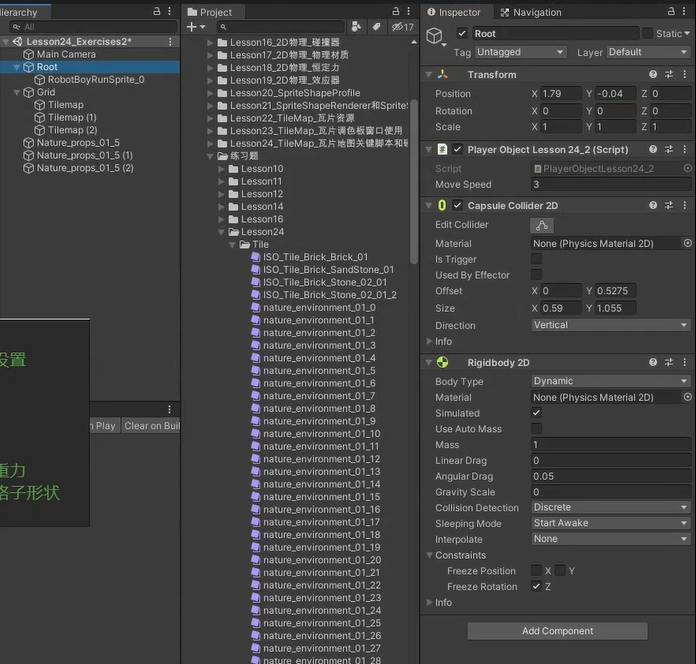