# 导入瓦片地图扩展包
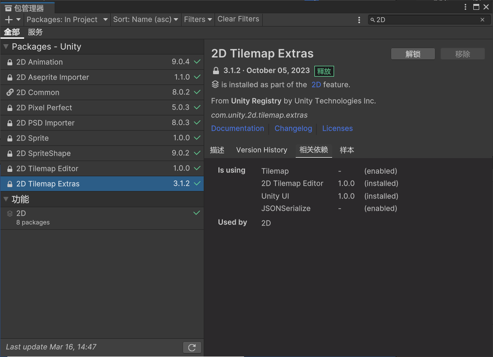

Project右键
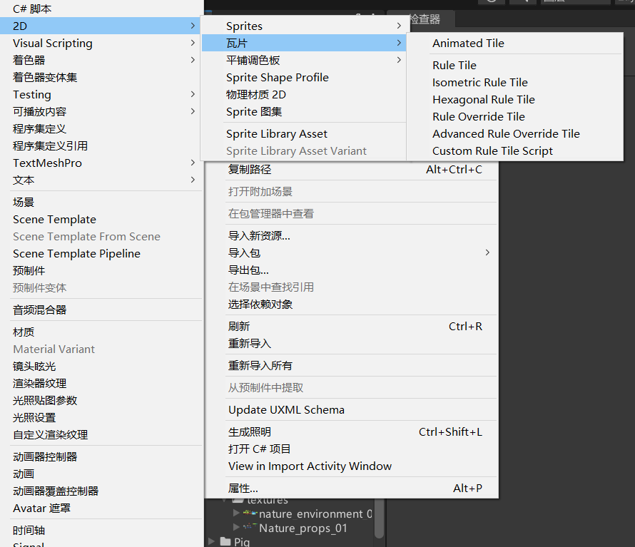

# 新增瓦片类型
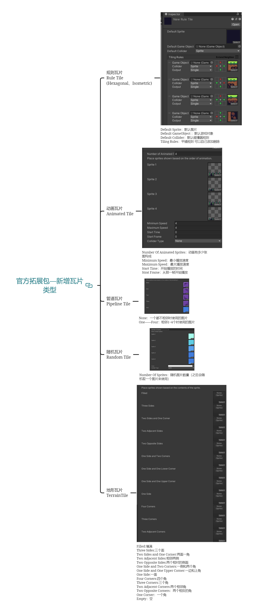
## 规则瓦片 Rule Tile (Hexagonal、Isometric)
### Default Sprite：默认图片
### Default GameObject ：默认游戏对象 
### Default Collider：默认碰撞器规则 
### Tiling Rules：平铺规则 可以自己添加删除

当满足x的地方没图，绿的地方有图就会使用右边选择的图
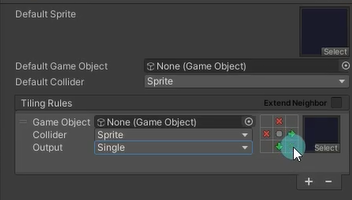
将RuleTile规则瓦片拖入到调色板中，在场景绘制时就会有相应的规则

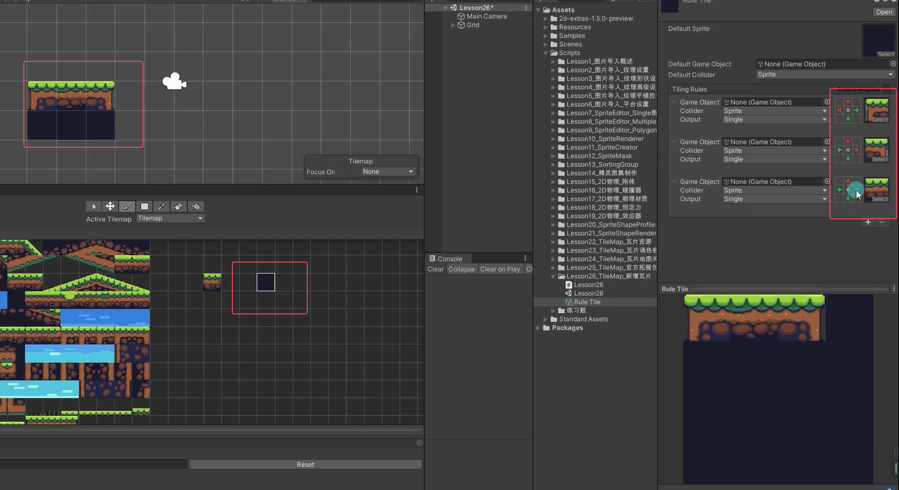

对应情况的瓦片可以关联游戏对象，但是一般不会关联
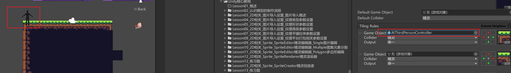

还可以更改Output来设置随机输出的图片
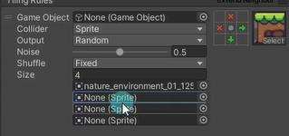
输出类型改成动画模式的话可以关联多张图片，出现当前图片时会在多张图片按一定速度进行顺序轮播，看起来就像动画
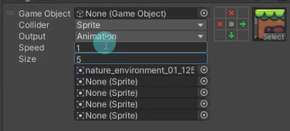

## 动画瓦片 Animated Tile
可以指定序列帧，产生可以播放序列帧动画的瓦片
角色一般不用这个，角色一般用2d对象去做，一般用场景上随风飘扬的小草什么的

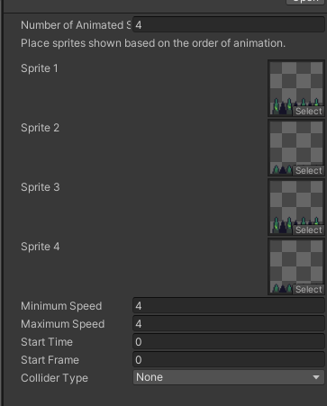

设置好了把瓦片拖拽文件拖到平铺调色板，在拖到场景里，场景里的动画瓦片就会不停的播放了。
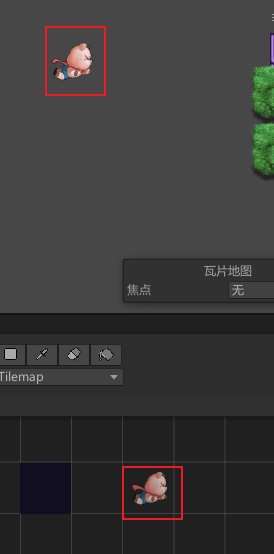

### Number Of Animated Sprites：动画有多少张图构成

### Minimum Speed：最小播放速度 
### Maximum Speed：最大播放速度 
### Start Time：开始播放的时间 
### Strat Frame：从那一帧开始播放

## 管道瓦片 Pipeline Tile
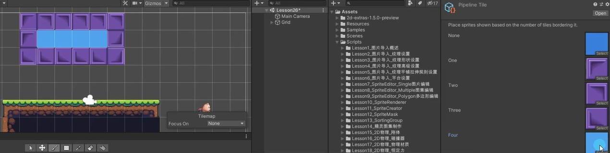
None：一个都不相邻时使用的图片
One——Four：相邻1~4个时使用的图片

## 随机瓦片 Random Tile
Number Of Sprites：随机图片数量（之后会随机取一个图片来使用）
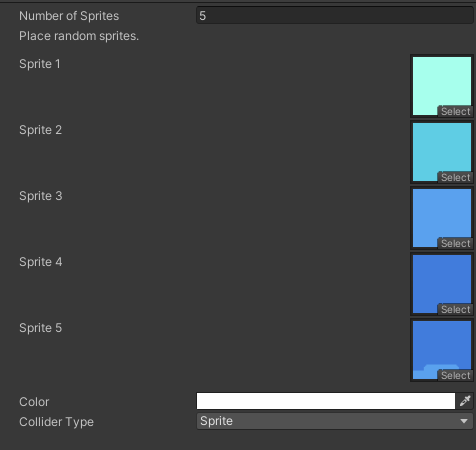

## 地形瓦片 TerrainTile
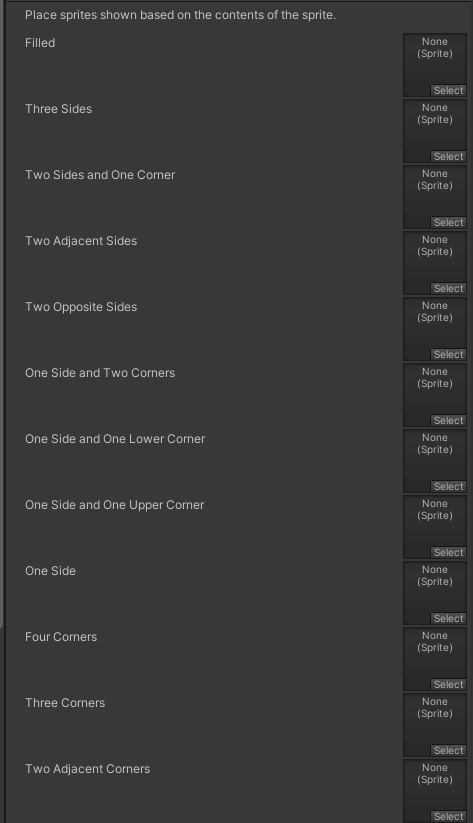

跟规则瓦片差不多一样
Filled:填满
Three Sides:三个面 
Two Sides and One Corner:两面一角 
Two Adjacent Sides:相邻两侧 
Two Opposite Sides:两个相对的侧面 
One Side and Two Corners:一侧和两个角 
One Side and One Upper Corner:一边和上角 
One Side:一面 Four Corners:四个角 
Three Corners:三个角 
Two Adjacent Corners:两个相邻角 
Two Opposite Corners：两个相反的角 
One Corner：一个角 
Empty：空

## 权重随机瓦片 WeightedRandomTile
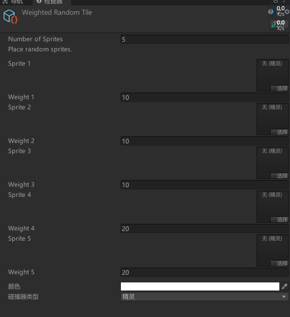

## 规则覆盖瓦片 Rule Override Tile
**在规则瓦片的基础上**，改变图片或指定启用的规则
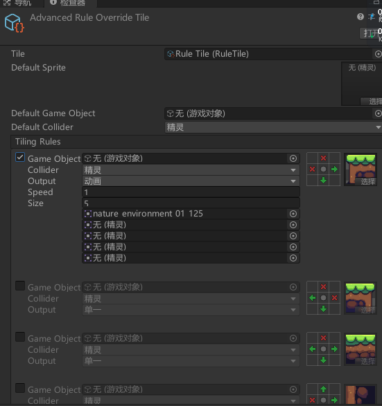

# 新增笔刷类型
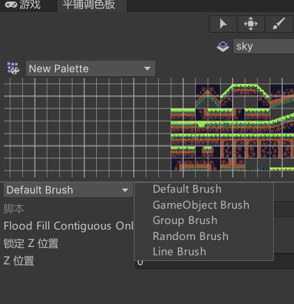

## GameObject Brush
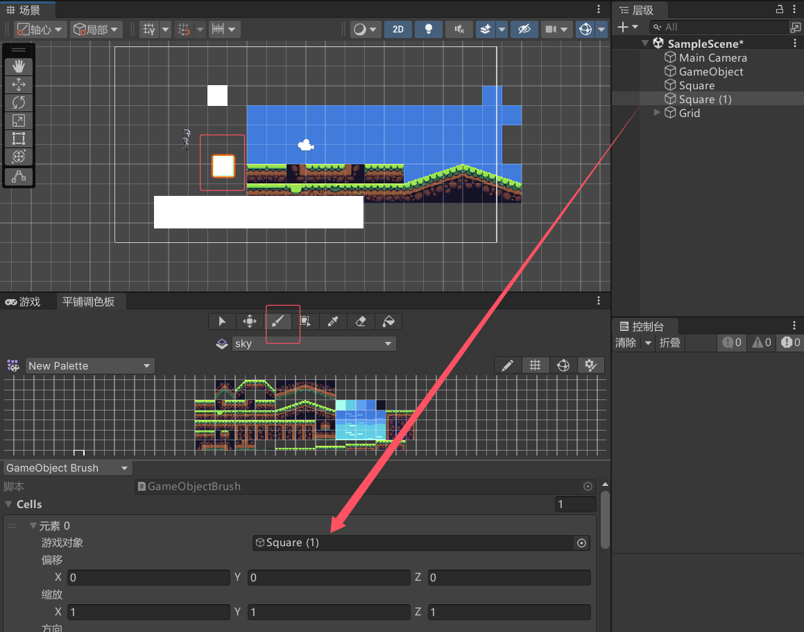

## Random Brush
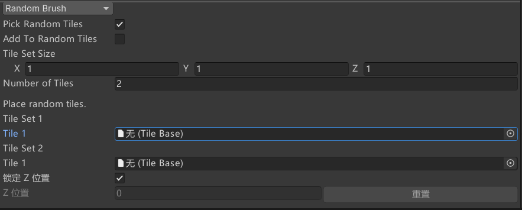

Tile Set Size
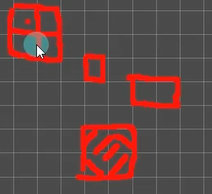

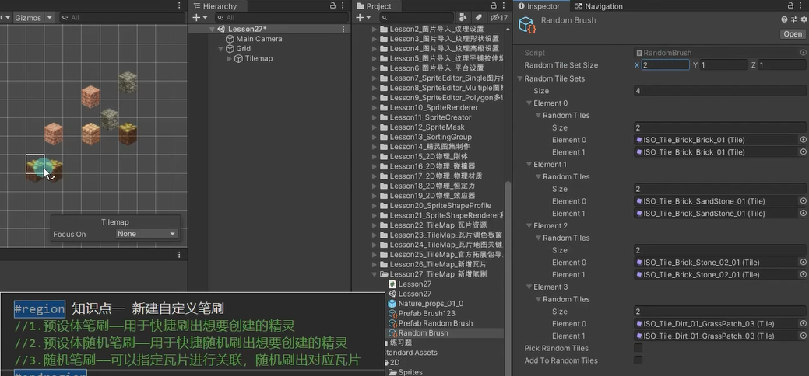

## Coordinate Brush* 坐标笔刷
可以实时的看到格子的坐标
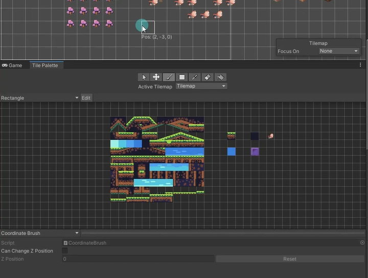

## Group Brush 组合笔刷
可以设置参数，当点击一个瓦片样式时，会自动取出一个范围内的瓦片。

Gap决定x、y、z遇到几个空格之后就不继续扩充吸取的范围。
Limit决定最大的吸取范围，从0开始。

## Line Brush 线性笔刷
决定起点和终点画一条线出来。
选择线性笔刷后点击画笔可以在瓦片地图中点击确定起点和终点，会用选择的瓦片连成线。
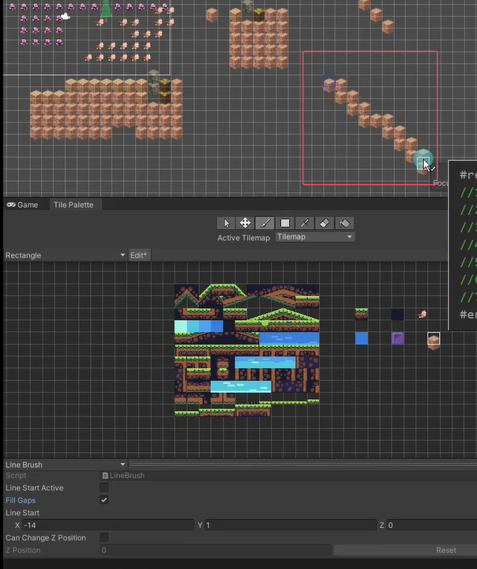

Line Start Active 是否以上一次绘制的起点作为新的起点。
Fill Gaps 自动填充，会把线画的更粗。

## Tint Brush* 着色笔刷
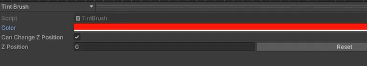
可以给瓦片着色，瓦片的颜色锁要开启（Inspector窗口切换Debug模式 修改Flags）。
不开启颜色锁没有作用。
找到瓦片资源图片，右上角把图片设置成Debug模式，修改Flag为None。
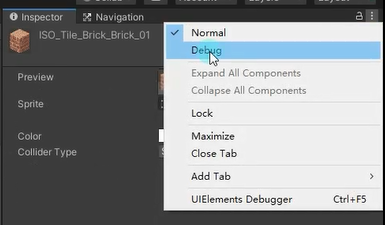
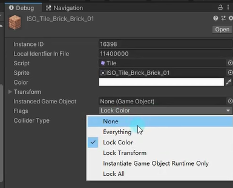