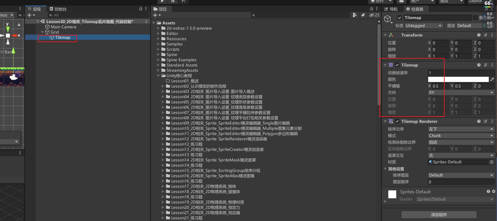
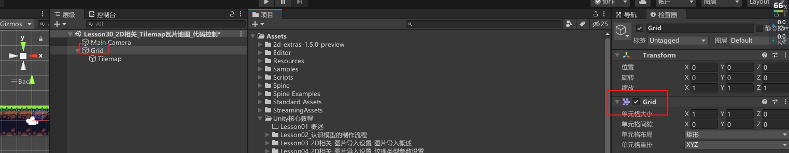
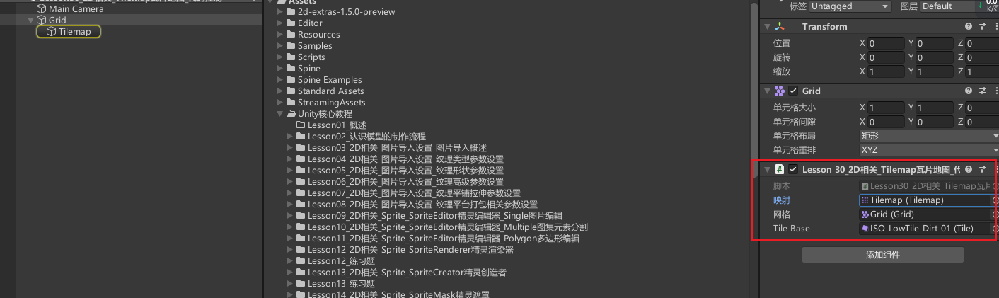

# 获取Tilemap和TileBase和Grid

Tilemap组件：用于管理瓦片地图。


TileBase组件：单张瓦片资源对象基类。
Grid组件：用于坐标转换。


```cs
using UnityEngine.Tilemaps;

// 瓦片地图信息，可以通过它得到瓦片格子
public Tilemap tilemap;
// 格子位置相关控制，可以通过它进行坐标转换
public Grid grid;
// 瓦片资源基类，通过它可以得到瓦片资源
public TileBase tileBase;
```




# 重要API
## Tilemap.ClearAllTiles方法 清空瓦片地图
```cs
//Tilemap类中的ClearAllTiles方法 清空瓦片地图
//清除 Tilemap 中放置的所有瓦片。
tilemap.ClearAllTiles();
```

## Tilemap.GetTile方法 获取指定坐标格子的瓦片格子
```cs
//传入的是Vector3Int类型
//根据给定的瓦片地图中某个单元格的 XYZ 坐标，获取瓦片。
TileBase tempTileBase = tilemap.GetTile(Vector3Int.zero);
print(tempTileBase);
```

## Tilemap.SetTile方法 设置瓦片和删除瓦片
```cs
//根据给定的瓦片地图中某个单元格的 XYZ 坐标，设置瓦片。
//设置瓦片
tilemap.SetTile(new Vector3Int(0, 2, 0), tileBase);
//删除瓦片
tilemap.SetTile(new Vector3Int(1, 0, 0), null);
```

## Tilemap.SwapTile方法 替换瓦片
```cs
//将 changeTile 的所有现有瓦片交换为 newTile 并刷新所有交换的瓦片。
//是将瓦片资源图片替换的意思 资源所有使用到瓦片资源的图片都会进行变化
tilemap.SwapTile(tempTileBase, tileBase);
```

## Tilemap.WorldToCell方法 世界坐标转格子坐标
将世界位置转换为单元格位置。
传入的参数是Vector3类型世界坐标
我们可以先屏幕坐标转世界坐标，再世界坐标转格子坐标
