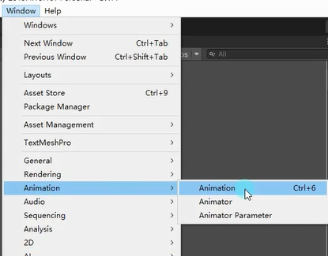
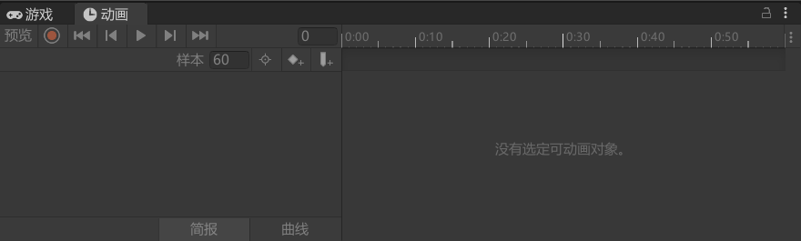
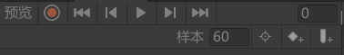
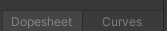
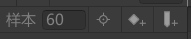
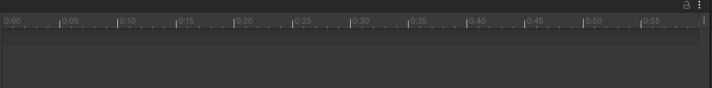

# 打开Animation窗口

# Animation窗口是用来干嘛的
Animation窗口直译就是动画窗口，主要用于在Unity内部创建和修改动画。所有在场景中的对象都可以通过Animation窗口为其制作动画。

**原理：**
制作动画时：记录在固定时间点对象挂载的脚本的变量变化。
播放动画时：将制作动画时记录的数据在固定时间点进行改变，产生动画效果。

# 动画关键词说明
## 动画时间轴
每一个动画文件都有自己的一个生命周期，从动画开始到结束。我们可以在动画时间轴上编辑每一个动画生命周期中的变化。

## 动画中的帧
假设某个动画的帧率为60帧每秒，意味着该动画1秒钟最多会有60次改变机会。每一帧的间隔时间是 1s/60 ≈ 16.67毫秒。也就是说，我们最快可以每16.67毫秒改变一次对象状态。

## 关键帧
动画在时间轴上的某一个时间节点上处于的状态。

# Animation 面板功能

## 面板左侧

从左至右：
1.预览模式（开关）
2.录制模式（开关）打开后预览模式默认开启
3.回到动画开头
4.上一关键帧（快捷键：键盘逗号）
5.播放动画（快捷键：键盘Alt+逗号）
6.下一关键帧（快捷键：键盘句号）
7.回到动画结尾（快捷键：键盘Alt+句号）
8.当前处于第几帧

从左至右：
Dopesheet：关键帧模式
Curves：曲线模式

从左至右：
按选择筛选
添加关键帧
添加事件

## 面板右侧
动画时间轴面板：当编辑动画时，会在该面板上编辑关键帧等信息

