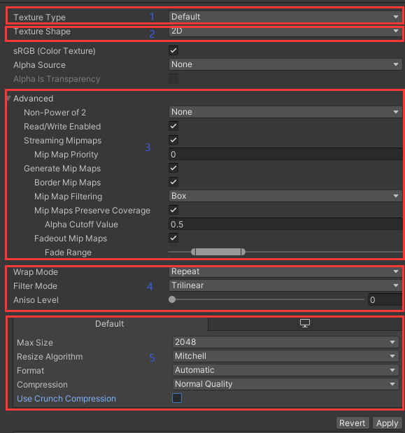

# Unity支持的图片格式
- BMP：是Windows操作系统的标准图像文件格式，特点是几乎不进行压缩，占磁盘空间大。
- TIF：基本不损失图片信息的图片格式，缺点是体积大。
- JPG：**一般指JPEG格式，属于有损压缩格式，能够让图像压缩在很小的存储空间，一定程度上会损失图片数据，无透明通道。**
- PNG：**无损压缩算法的位图格式，压缩比高，生成文件小，有透明通道。**
- TGA：**支持压缩，使用不失真的压缩算法，还支持编码压缩。体积小，效果清晰，兼备BMP的图像质量和JPG的体积优势，有透明通道。**
- PSD：是PhotoShop（PS）图形处理软件专用的格式，通过一些第三方工具或自制工具可以直接将PSD界面转为UI界面。

此外，Unity还支持EXR、GIF、HDR、IFF、PICT等格式。其中，在Unity中最常用的图片格式是**JPG、PNG和TGA**三种。

# 图片设置的六大部分
图片导入设置包括以下几个主要参数：
1. 纹理类型
2. 纹理形状
3. 高级设置
4. 平铺拉伸
5. 平台设置
6. 预览窗口

