# 创建动画
1. 在场景中选中想要创建动画的对象
   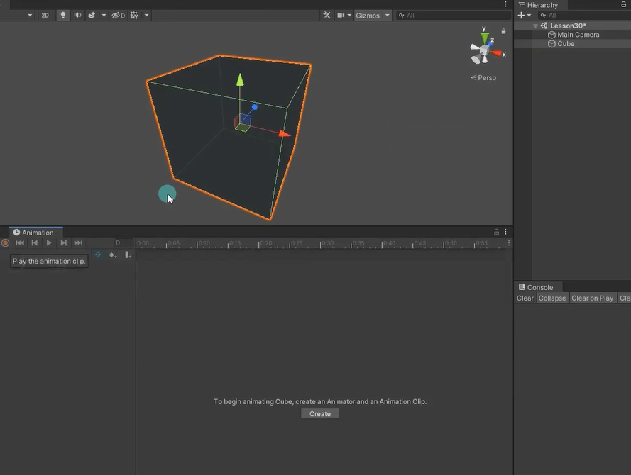
2. 在Animation窗口中点击创建
3. 选择动画文件将要保存到的位置
   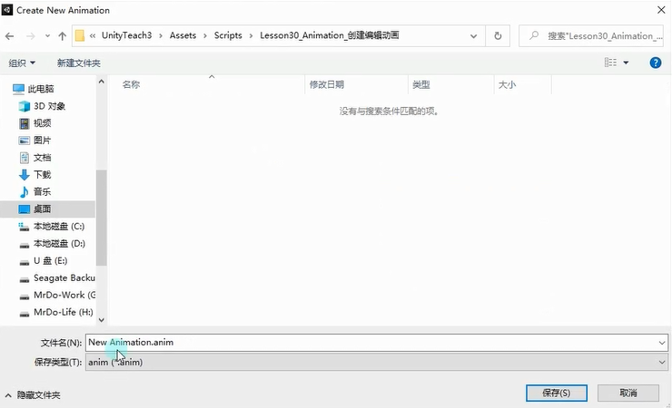
   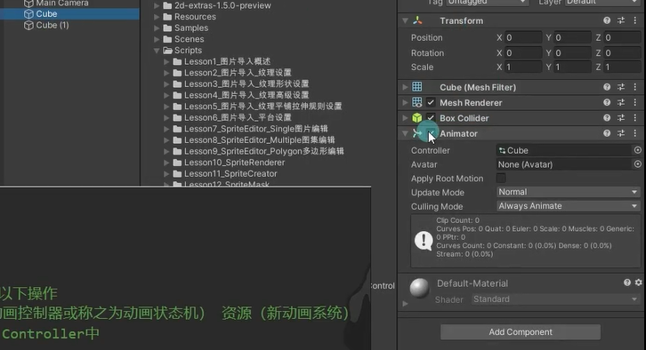
**保存Animation动画文件时，Unity会帮助我们完成以下操作**
创建一个 Animator Controller（动画控制器或称之为动画状态机） 资源（新动画系统）
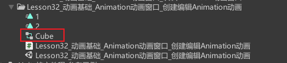

将新创建的动画文件添加到Animator Controller动画状态机中
双击打开
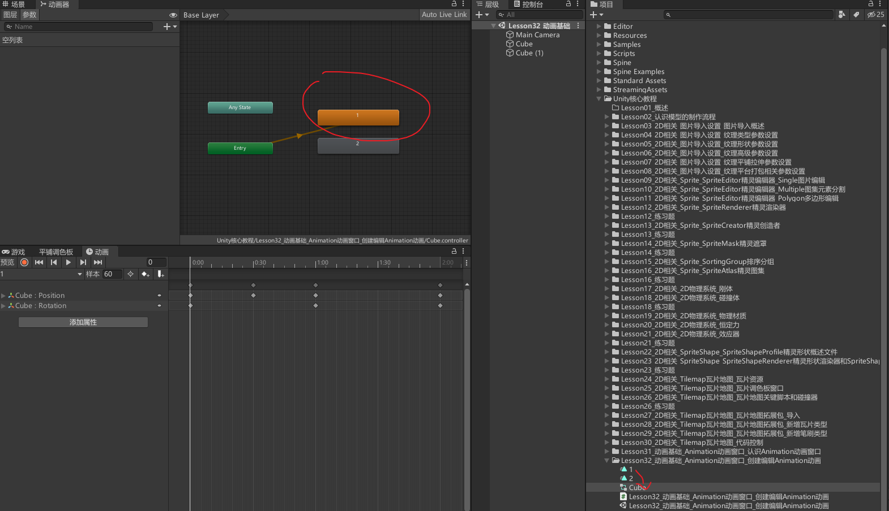

为场景上的对象添加Animator组件
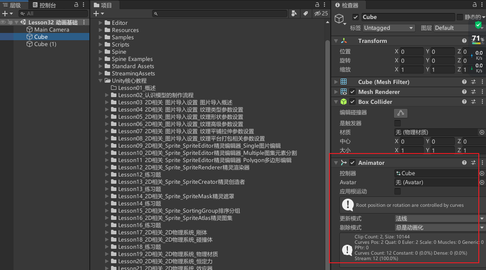

为Animator组件关联创建的Animator Controller文件
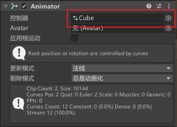

# 面板变化

## 左侧面板

多出一个可以选择当前动画的下拉列表
可以在这里创建新动画和切换动画
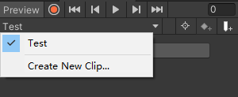
多出一个可以添加变化属性的按钮
在这里你可以任意添加你想要在动画中变化的脚本变量
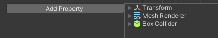

## 右侧面板
时间轴可以拖动
注意： 时间轴上的单位为n秒n帧 一格代表一帧（并不是秒）

选择关键帧右键

# 关键帧模式下编辑动画
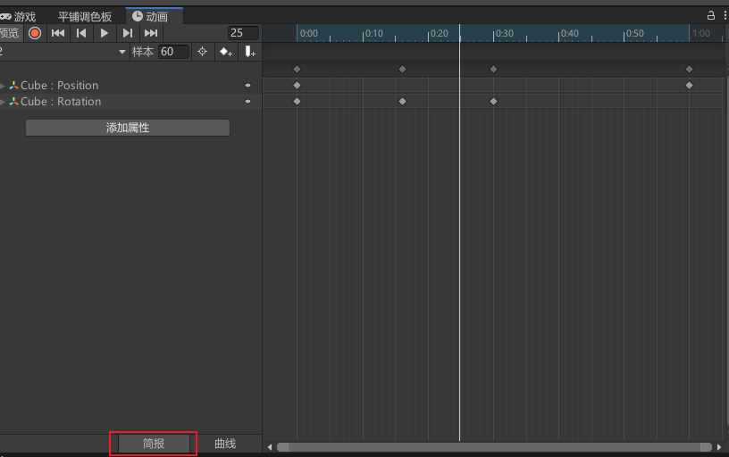

点击录制按钮，进入录制状态。就可以随便选择一个时间点给他添加关键帧。但是点击添加关键帧按钮会发现没有用。因为没有告诉这个动画会改变物体的哪些属性和变量。
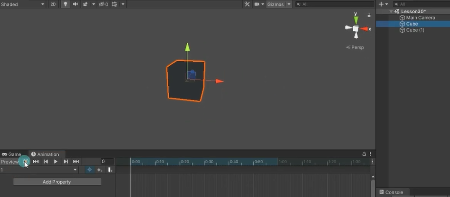
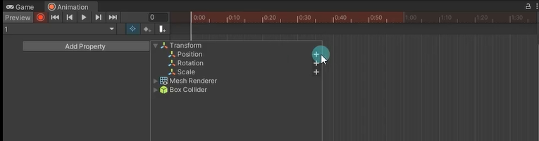
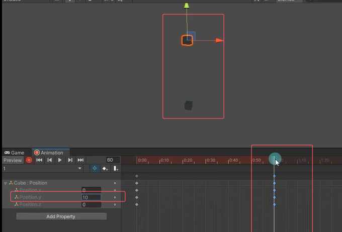
还有一种添加关键帧的方法，点击录制按钮后直接改Inspector窗口的值，会自动在时间轴添加关键帧
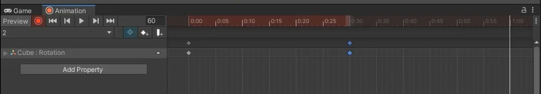
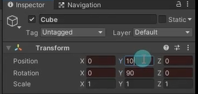

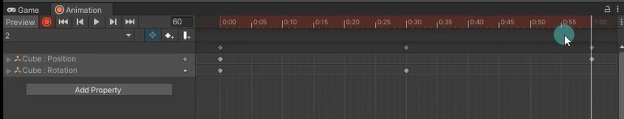

# 曲线模式下编辑动画
曲线模式可以控制非匀速变化
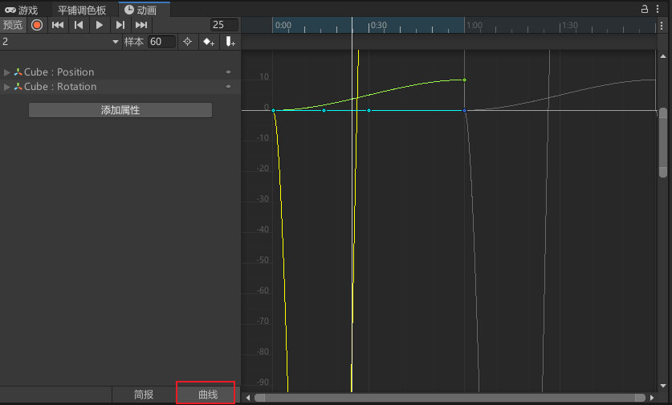

在曲线模式下可以直接右键添加关键帧，添加完关键帧后切换成关键帧模式也能看到刚刚添加的关键帧。
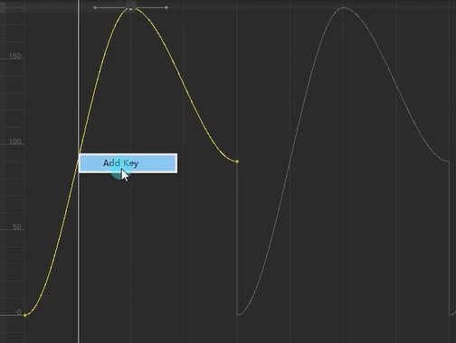

在关键帧模式下或者曲线模式下，选择关键帧右键
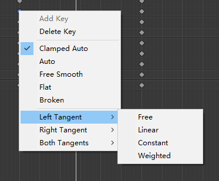
Add Key：添加关键帧
Delete Key：删除关键帧
Clamped Auto：切线模式，自动设置切线
Auto：旧版切线模式，和Clamped Auto基本类似，主要用于老动画系统，建议不使用除非是老动画
Free Smooth：自由设置切线
Flat：切线设置为水平
Broken：单独控制左右曲线切线
Free：自由设置
Linear：直线
Constant：常量切换
Weighted：权重切换，可以拉长缩短切线

# 动画文件界面参数
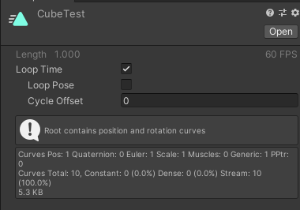
Loop Time：是否是循环动画（在动画结尾时重新开始）
Loop Pose：无缝循环运动
Cycle Offset：循环动画在其他时间开始时的周期偏移

对Animation打开Debug模式，注意Sample Rate帧率（采样率），和 Wrap Mode动画播放模式（贴图间拼接模式）这两个参数
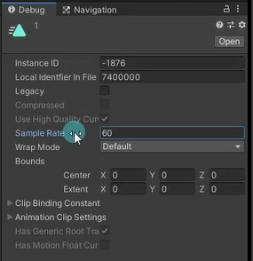
在Animation里面改和在Animation文件改一样的
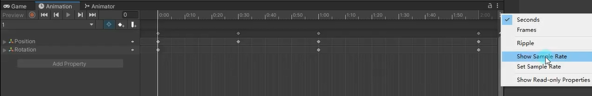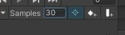

