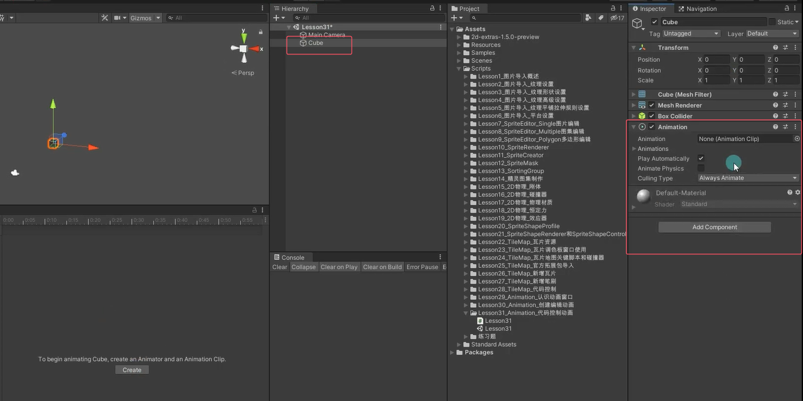
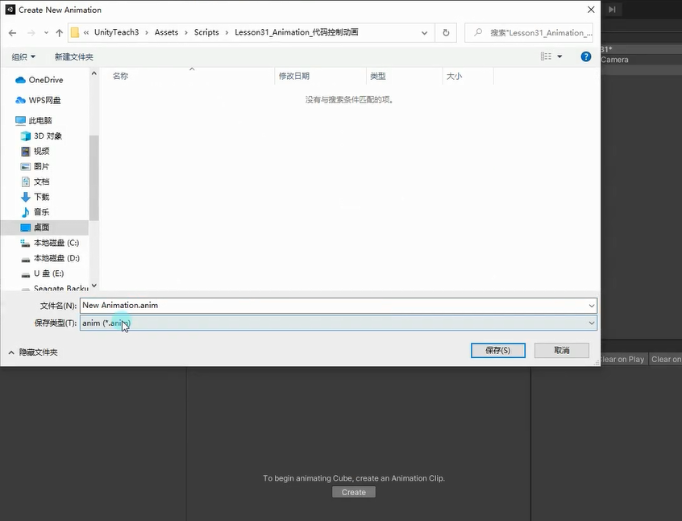
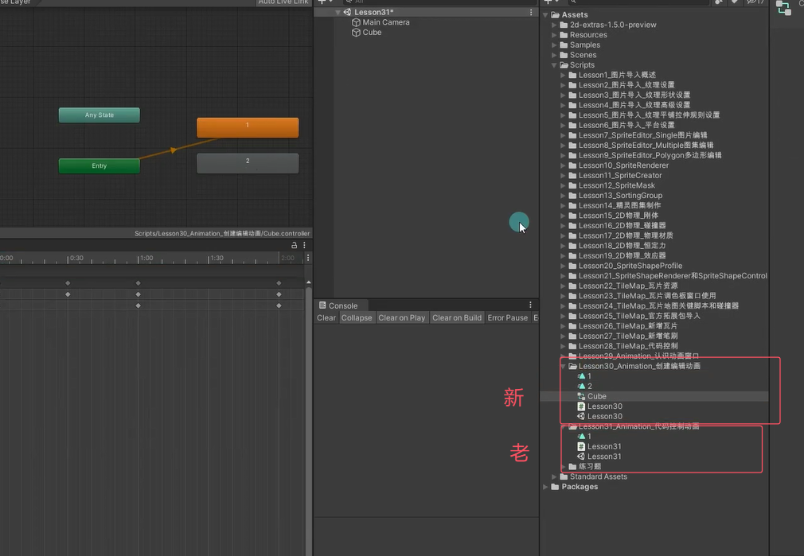
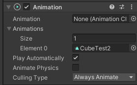
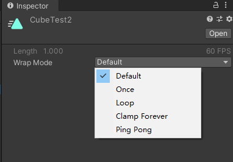
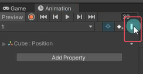
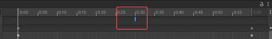
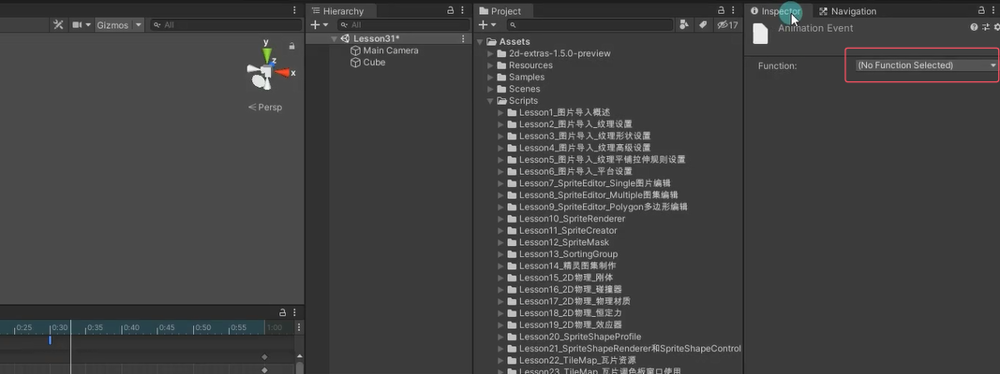
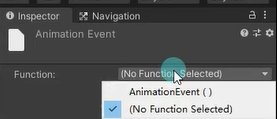

# 什么是老动画系统
Unity中有两套动画系统：
新：Mecanim动画系统——主要用Animator组件控制动画。
老：Animation动画系统——主要用Animation组件控制动画（Unity4之前的版本可能会用到）。
目前我们为对象在Animation窗口创建的动画都会被新动画系统支配。有特殊需求或者针对一些简易动画，才会使用老动画系统。


# 老动画系统控制动画播放
注意：
在创建动画之前为对象添加Animation组件之后再制作动画。
这时制作出的动画和之前的动画格式是有区别的。

使用老动画系统来创建动画要先給物体添加一个Animation脚本，挂载过后Unity就会认为这个对象要使用老动画系统。





**编辑和新动画系统一样**
动画文件格式不一样

# 参数相关

Animation：默认播放的动画。（注意拖选的一定是老动画系统的动画文件）
Animations：该动画组件可以控制的所有动画
Play AutoMatically：是否一开始就自动播放默认动画。
Animate Physics：动画是否与物理交互。
Culling Type：决定什么时候不播放动画。
- Always Animate：始终播放。
- Based On Renderers：基于默认动画姿势剔除，比如动画在屏幕外可能就不播了。

**老动画文件参数**


Default：读取设置得更高的默认重复模式
Once：播放一次就停止
Loop：从头到尾不停循环播放
PingPong：从头到尾从尾到头不停播放
ClampForever：播放结束会停在最后一帧，并且会一直播放最后一帧（相当于状态不停止），表现效果和Once一样，但是逻辑处理上不同

# 代码控制播放
```cs
private Animation animation;

void Start()
{
    animation = this.GetComponent<Animation>();
}
```

**Animation.Play方法 播放动画**
```cs
//播放没有混合的动画。
//会直接生硬的切换动画 假如播放到一半切换动画 回强行停止第一个播放的动画 切换到第二个播放动画的初始状态 进行播放
if (Input.GetKeyDown(KeyCode.Alpha1))
{
    animation.Play("1");
}
if (Input.GetKeyDown(KeyCode.Alpha2))
{
    animation.Play("2");
}
```

**Animation.CrossFade方法 淡入播放,自动产生过渡效果**
```cs
//在后续 time 秒的时间段内，使名称为 animation 的动画淡入，使其他动画淡出。
//会先淡出把状态慢慢变成要播放的动画的初始在状态，再播动画
if (Input.GetKeyDown(KeyCode.Alpha3))
{
    //当你当前的动画的状态和播放动画的开始状态不一样的时候就会产生过渡效果
    animation.CrossFade("3");
    //animation.Play("3");
}
```

**Animation.PlayQueued方法 前一个播完直接再播放下一个**
```cs
//在先前的动画播放完毕后再播放动画。
//可以理解为把动画加到队列中 等上一个动画播放完再播 会生硬的切换初始状态
if (Input.GetKeyDown(KeyCode.Alpha4))
{
    animation.PlayQueued("2");
    // animation.CrossFadeQueued("2");   // 有过渡效果
}
```

**Animation.Stop方法 停止播放所有动画**
```cs
animation.Stop();
```

**Animation.IsPlaying方法 是否在播放某个动画**
```cs
if ( animation.IsPlaying("1") )
{

}
```

**Animation.wrapMode变量 播放模式设置**
```cs
animation.wrapMode = WrapMode.Loop;//设置成循环播放
```

**其它（了解即可，新动画系统中会详细讲解）**
```cs
//层级和权重以及混合（老动画系统需要通过代码来达到动画的遮罩、融合等效果）
//设置层级
animation["1"].layer = 1;
//设置权重
animation["1"].weight = 1;
//混合模式 叠加还是混合
animation["1"].blendMode = AnimationBlendMode.Additive;
//设置混组相关骨骼信息
animation[""].AddMixingTransform();
```

# 动画事件
动画事件主要用于处理当动画播放到某一时刻想要触发某些逻辑，比如进行伤害检测、发射子弹、特效播放等等。



在Animation窗口选择某一动画的某一帧下，点击添加动画事件的按钮添加动画事件。
添加后可以在时间轴看到一个蓝色的条。蓝色的条可以在时间轴任意拖动。



点击可以在右侧Inspector窗口看见动画事件相关参数，现在还没有绑定任何事件。


在挂载到执行动画对象上的代码上添加用于动画事件关联的函数。函数可以有参数，可以是int，float，GameObject类型。
```cs
public void AnimationEvent(GameObject go)
{
    print("动画事件触发");
}
```




总结
老动画系统主要用于处理老版本项目和简单的一些自制动画。
新项目都不建议大家使用了。
关键组件：Animation

