# 创建动画状态机
直接选择场景物体后在动画窗口点Create 
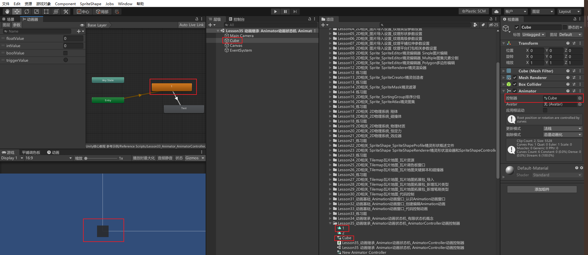


还可以手动在Project窗口创建动画控制器
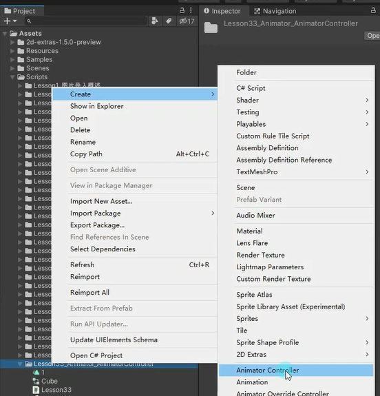
新建的 Animator 文件是空的，可以拖 Animation 动画文件进去。

# 动画控制器（状态机） 编辑面板
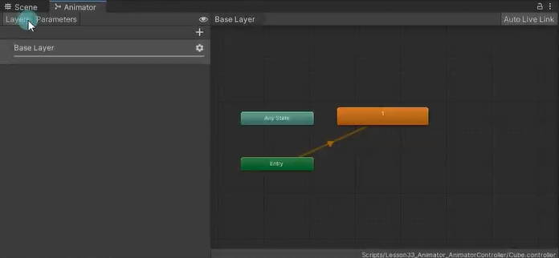
## 左侧面板
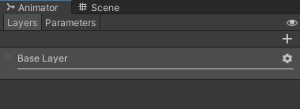
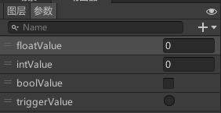
Layers：动画层级页签，为动画添加更多的层级，层级高的动画播放会覆盖层级低的
Parameters：参数页签，为动画状态机添加控制状态切换的参数 眼睛图标：显隐左侧面板

## 右侧面板
网格化布局区域：
主要用于编辑状态之前的切换关系 
1. 窗口中的每一个矩形表示一个状态 
2. 窗口中的每一个箭头表示一个切换条件

 默认三大矩形： 
 绿色Entry矩形：进入状态机流程 
 红色Exit矩形：退出状态机流程 
 Any State：任意状态，代表状态机中的任意状态

人为添加矩形： 
橙色矩形：一开始的默认状态动画，和Entry相连 表示一开始播放的动画 
灰色矩形：自己添加的某一种动作状态

# 添加动画
## 自动添加
为对象创建动画后会自动将动画添加到状态机中
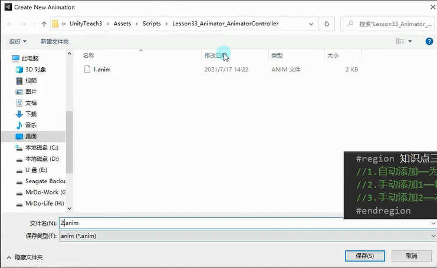

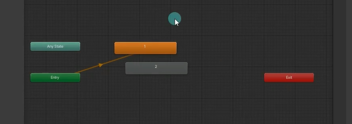

## 直接将动画文件拖入到状态机
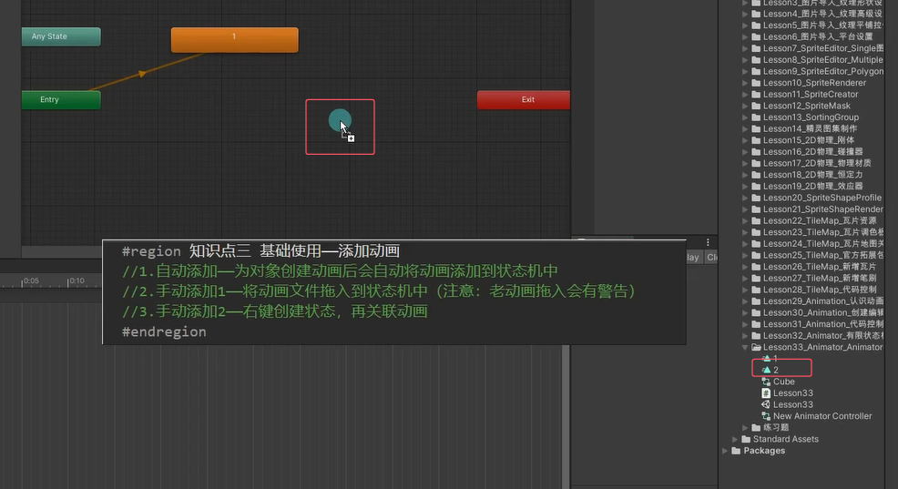
点击状态发现自动就关联了2
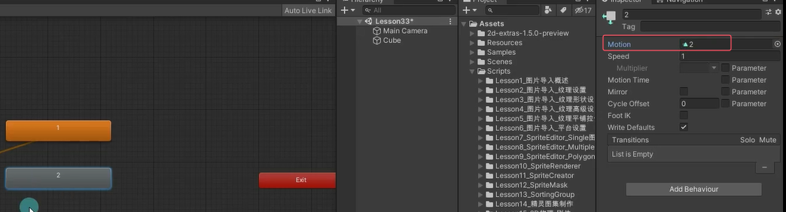
可以改名，但关联的还是2
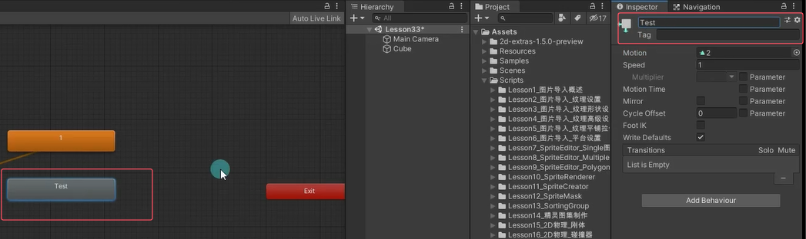

## 直接在窗口里面右键一个状态再关联
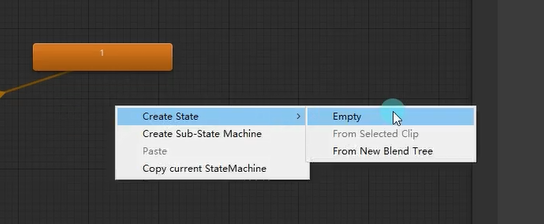

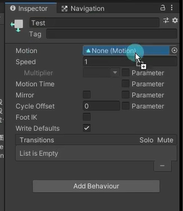


# 添加切换连线
对一个矩形右键选择创建过渡。
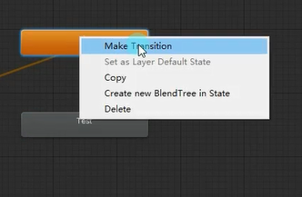

添加连线后意味着这两个矩形状态可以进行状态切换，可以给连线设置切换的条件。没有连线的话两个状态不能进行切换。

选择矩形右键可以把该矩形状态设置为该层的默认状态。
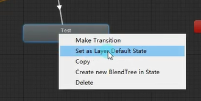


# 添加切换条件
把左侧面板切换成参数标签，点击加号添加四种参数变量条件。
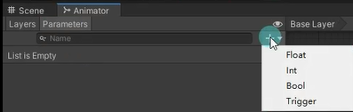

注意这里的Trigger
一个布尔参数，当被转换消耗时，由控制器重置（用圆形按钮表示）。可以理解为特殊的 bool 值，当设置为 true 完成切换条件后马上会自动设置为 false。
一般用于下面这种有来有回的连线（一但进入Test动画播放完成之后立马会去的 
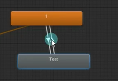


# 设置动画间切换条件
选择一个连线，点击下方条件列表添加切换条件，点击下拉框会出现我们刚刚设置好的切换条件参数进行选择。同理选择条件框后按减号可以删除。
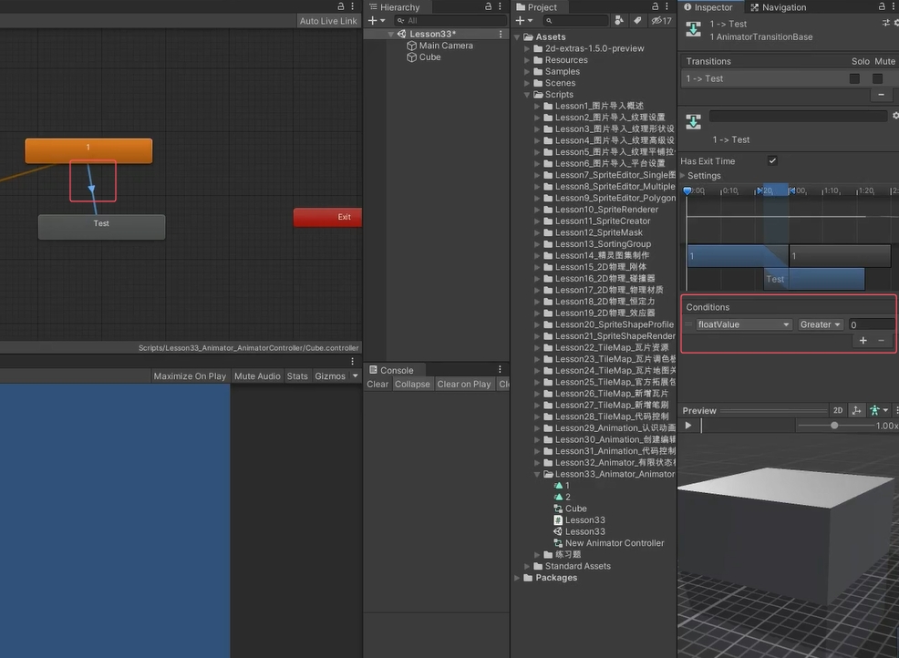

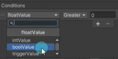

# Animator参数相关
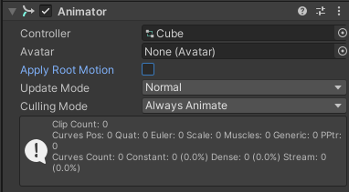
## Controller：对应的动画控制器（状态机）

## Avatar：对应的替身配置信息
（之后讲解3D模型时详细讲解）

## Apply Root Motion：是否启用动画位移更新

## UpdateMode：更新模式（一般不修改它）
Normal：正常更新
Animate Physics：物理更新
Unscaled Time：不受时间缩放影响

## Culling Mode：裁剪剔除模式
Always Animate：始终播放动画，即使在屏幕外也不剔除
Cull Update Transforms：摄像机没有渲染该物体时，停止位置、IK的写入
Cull Completely：摄像机没有渲染物体时，整个动画被完全禁用


# Animator 代码控制
```cs
//我们用代码控制状态机切换主要使用的就是Animator提供给我们的API
//我们知道一共有四种切换条件 int float bool trigger
//所以对应的API也是和这四种类型有关系的
animator = this.GetComponent<Animator>();
```

**Animator.SetXXX方法 通过状态机条件切换动画**
```cs
//通过状态机条件切换动画
//设置动画参数状态
animator.SetFloat("条件名", 1.2f);
animator.SetInteger("条件名", 5);
animator.SetBool("条件名", true);
animator.SetTrigger("条件名");
```

**Animator.GetXXX方法 获得动画参数状态**
```cs
//获得动画参数状态
animator.GetFloat("条件名");
animator.GetInteger("条件名");
animator.GetBool("条件名");

//直接切换动画 除非特殊情况 不然一般不使用
//animator.Play("状态名");
//注意：状态名和动画名不一样 动画名拖进来默认名字就是状态名 但是可以修改的和动画名不一样的
```

假如切换时发现有延迟，可能是因为连线切换的参数中勾选了有推出时间，注意的话会播完上个动画在继续播下个动画。取消勾选即可。
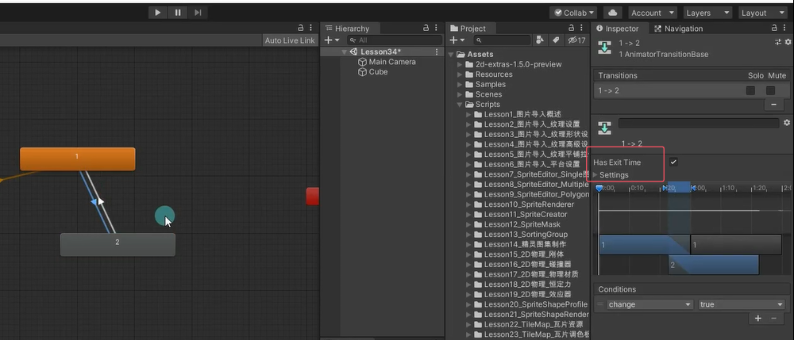


