# 什么是序列帧动画
我们最常见的序列帧动画就是我们看的日本动画片，以固定时间间隔按序列切换图片就是序列帧动画的本质。当固定时间间隔足够短时，我们肉眼就会认为图片是连续动态的，进而形成动画（会动的画面）。
它的本质和游戏的帧率概念有点类似。
原理就是在一个循环中按一定时间间隔不停地切换显示的图片。


# 代码制作序列帧动画
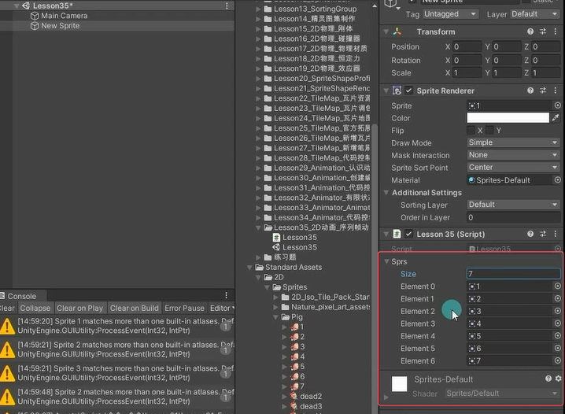
```cs
public class Lesson37_2D动画_2D序列帧动画 : MonoBehaviour
{
    public Sprite[] sprs; //存放序列帧图片
    private SpriteRenderer sr; //显示图片
    private float time = 0; //记录帧间隔时间
    private int nowIndex = 0; //记录当前显示的图片索引

    void Start()
    {
        sr = this.GetComponent<SpriteRenderer>();
        sr.sprite = sprs[nowIndex];
    }

    void Update()
    {
        //每一次增加帧间隔时间
        time += Time.deltaTime;
        //当帧间隔时间达到某一个条件时就切换图片
        if (time >= 0.03f)
        {
            //切换图片
            nowIndex++;
            //记得从头显示
            sr.sprite = sprs[nowIndex % sprs.Length];
            time = 0;
        }
    }
}
```


# Animation窗口制作序列帧动画
## 方法一
创建一个空物体
创建一个动画
直接将某一个动作的序列帧拖入窗口中

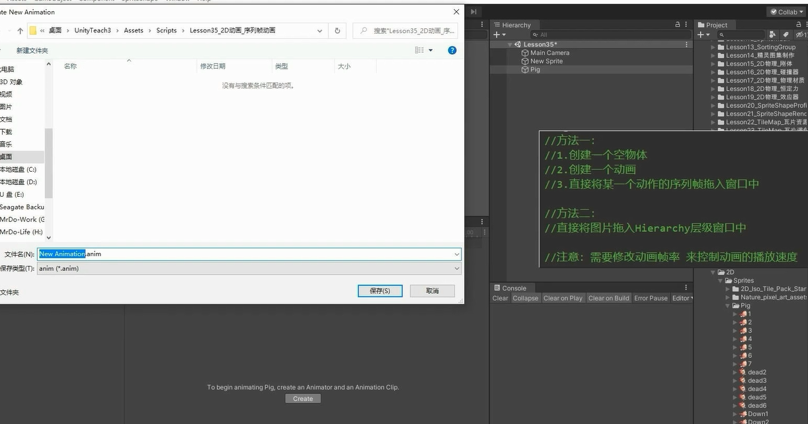


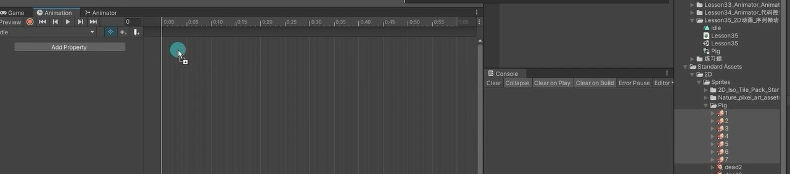

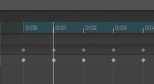

## 方法二
适合第一次用
直接将图片拖入Hierarchy层级窗口中

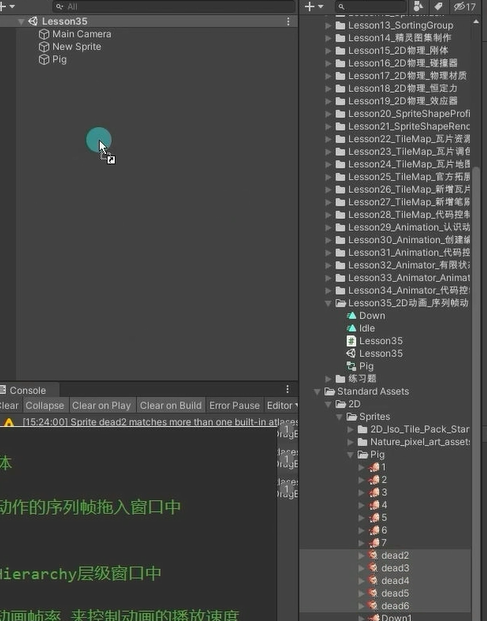

默认你要创建序列帧动画
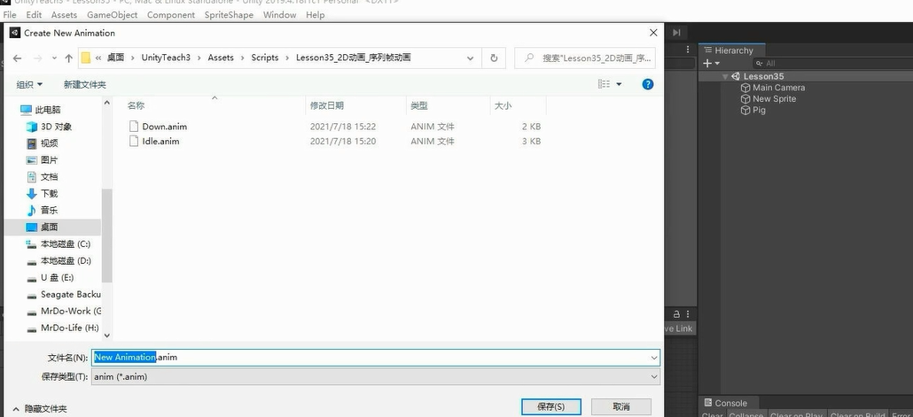


# 利用Animator进行动画控制 

创建好动画，设置好切换参数和条件等
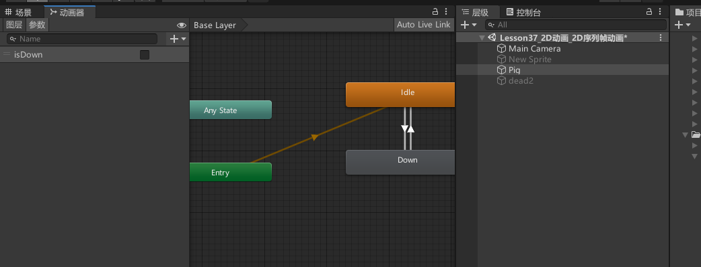

代码中拖拽得到动画控制器
```cs
public class Lesson37_2D动画_2D序列帧动画 : MonoBehaviour
{
    public Animator animator;

    void Update()
    {
        if (Input.GetKeyDown(KeyCode.Space)) 
            animator.SetBool("isDown", true);
        else if (Input.GetKeyUp(KeyCode.Space))
            animator.SetBool("isDown", false);
    }
}
```

# 练习
在之前2D相关练习题的基础上，为控制的对象加上序列帧动画

给机器人创建待机动画，找到待机动画图集，拖入图片进去。注意图集要设置底部为轴心
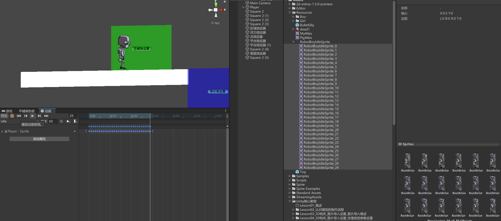


给机器人创建走路动画，找到待机走路图集，拖入图片进去。注意图集要设置底部为轴心
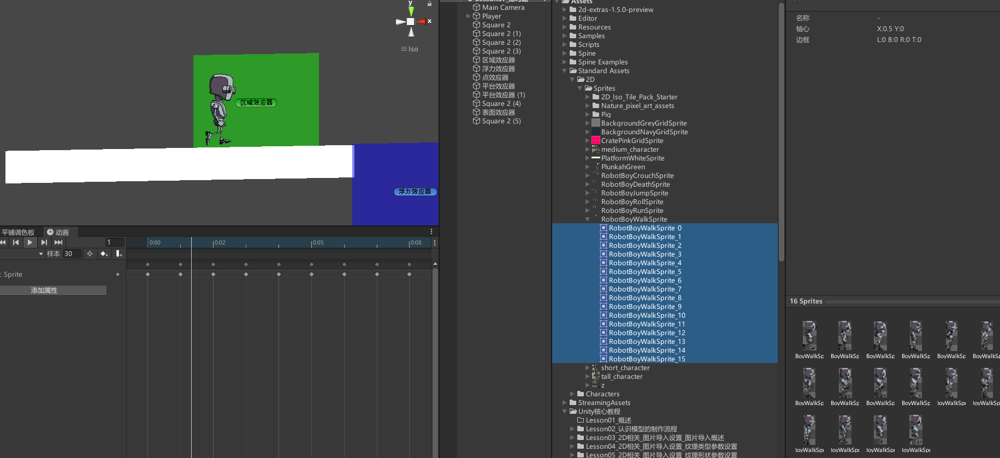

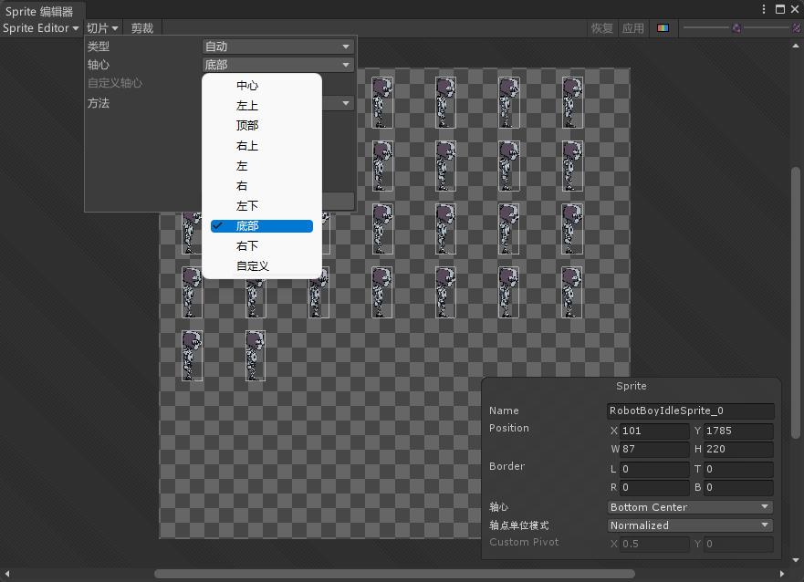

给机器人创建跳跃动画，找到跳跃动画图集，拖入图片进去。注意图集要设置底部为轴心

创建x，y速度的int动画参数，并且添加过渡和切换条件。x速度等不等于0决定是Idle状态还是Walk状态，y速度等不等于0决定是跳跃状态还是非跳跃状态。
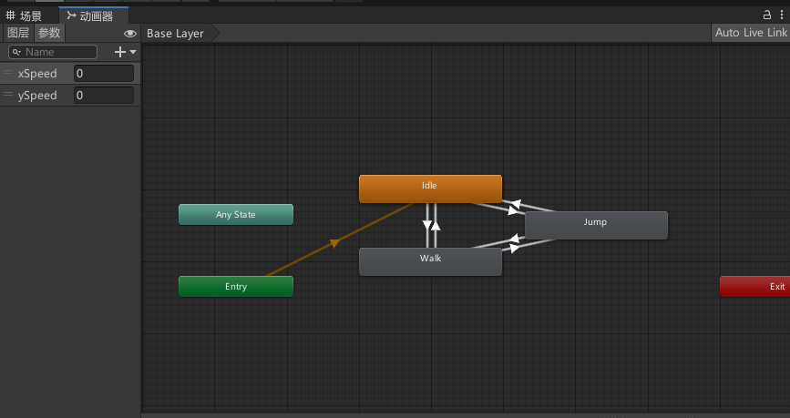

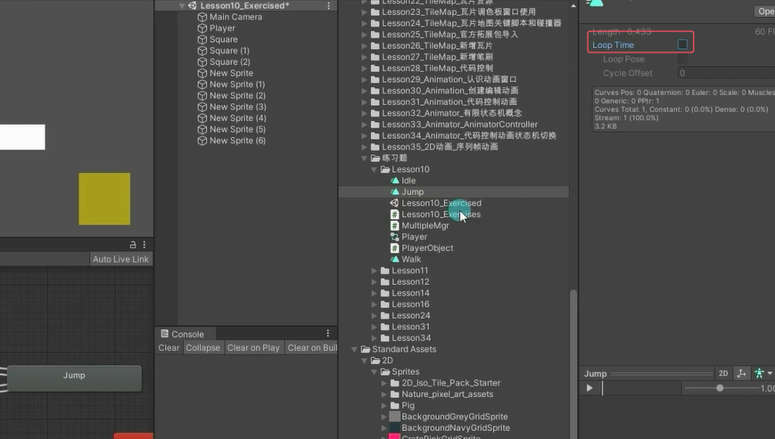

**一般不用y的速度来判断是否播放跳跃动画，可以和地面碰撞器判断**


```cs
using System.Collections;
using System.Collections.Generic;
using UnityEngine;

public class Lesson37_练习题_PlayerObject : MonoBehaviour
{
    public float moveSpeed = 5;

    // 声明一个浮点数类型变量 h;
    private float h;

    // 声明 SpriteRenderer 类型变量 sr;
    private SpriteRenderer sr;

    private Rigidbody2D rigidBody2D;

    private float frontH;

    // 声明 Animator 类型变量 animator;
    private Animator animator;

    void Start()
    {
        sr = this.GetComponent<SpriteRenderer>();

        rigidBody2D = this.GetComponent<Rigidbody2D>();

        animator = this.GetComponent<Animator>();
    }

    void Update()
    {
        h = Input.GetAxisRaw("Horizontal");

        // 设置动画参数 xSpeed 为 h 的整数值
        animator.SetInteger("xSpeed", (int)h);

        // 设置动画参数 ySpeed 为刚体 y 方向速度的整数值
        animator.SetInteger("ySpeed", Mathf.CeilToInt(rigidBody2D.velocity.y));

        if (h != 0)
            rigidBody2D.velocity = new Vector2(h * moveSpeed, rigidBody2D.velocity.y);

        if (h < 0)
            sr.flipX = true;
        else if (h > 0)
            sr.flipX = false;

        if (Input.GetKeyDown(KeyCode.Space))
        {
            GameObject obj = Instantiate(Resources.Load<GameObject>("BulletObj"), this.transform.position + new Vector3(sr.flipX ? -0.3f : 0.3f, 0.5f, 0), Quaternion.identity);

            obj.GetComponent<BulletObj>().ChangeMoveDir(sr.flipX ? Vector3.left : Vector3.right);
        }

        // 当按下 J 键时，给刚体施加一个向上的瞬时力
        if (Input.GetKeyDown(KeyCode.J))
        {
            rigidBody2D.AddForce(Vector2.up * 300);
        }
    }
}
```