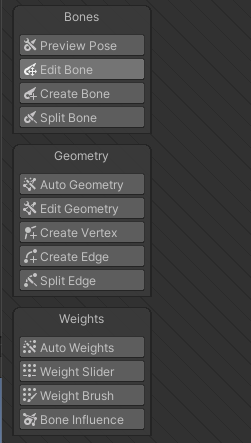

# 什么是2d骨骼动画
首先回顾一下序列帧动画
传统的序列帧动画为了达到好的动画效果
理论上来说，图片越多，动作越流畅
**往往需要较多的美术资源，虽然效果好但是资源占用较多**

而2D骨骼动画是利用3D骨骼动画的制作原理进行制作的
将一张2D图片分割成n个部位，为每个部位绑上骨骼，控制骨骼旋转移动
达到用最少的2D美术资源做出流畅的2D动画效果

# Unity中如何制作2d骨骼动画
主要方式有两种
使用Unity2018新加功能 2D Animation 工具制作
使用跨平台骨骼动画制作工具 Spine 制作

# 导入2d Animation工具
在Package Manager窗口 搜索 2D Animation并安装 假如不是2d项目，要手动导入，否则自动就有

 可以自己查看示例场景和示例图片。切换成皮肤编辑模式查看骨骼
 

# SkinningEditor模式下面板讲解

SkinningEditor模式下面板讲解
导入工具后 在Sprite Editor窗口会多一个选项 Skinning Editor 切换到Skinning Editor模式

因为官方示例的图都是设置好骨骼的 可以找到对应的图的路径在资源管理器中打开 删除对应的meta文件 回到unity 系统会默认生成新的meta文件 之前绑定的骨骼相关就丢失了

# SkinningEditor模式下面板参数

## 左上方

### Reset Pose
将角色骨骼和关节恢复到原始位置

### Sprite Sheet：图集显示

### Copy复制当前选择的数据

### Paste粘贴复制数据

## 左方

### Bone 骨骼相关
- Preview Pose 预览模式，可以预览动作并不会真正的改变设置
    
- Edit Bone 编辑骨骼，可以改变骨骼的位置、长度、方向、名称等等
    
- Create Bone 创建骨骼
  注意要双击图片 图片产生橙色边缘线后 再点击创建骨骼，根骨骼一般是人物的躯干或者脚下
  
  这两个是没有父子关系的
  
  如果想创建更多的子对象，就点击想创建的子对象的根部 进行设置起点和终点
  
    
- Split Bone 拆分骨骼，将一个骨骼一分为二

### Geometry 蒙皮相关 
蒙皮决定了骨骼主要控制哪一部分
先自动再手动

- Auto Geometry 自动蒙皮
  
    
    - OUtline Detail 边缘细节，值越大，轮廓越细致
        
    - Alpha Tolerance 阿尔法公差值，控制蒙皮细节
        
    - Subdivide 细化程度，控制蒙皮细节
        
    - Weights 是否自动设置权重，一般勾选
- Edit Geometry 编辑蒙皮
    
- Create Vertex 创建顶点
  注意创建的顶点越多计算量越大
    
- Create Edge 创建边线
    
- Split Edge 拆分边，用一个新的顶点分离一个边
    

### Weights 权重相关 
决定了当骨骼动时如何印象顶点和边
比如控制如下图的顶点受到两边骨骼的程度

- Auto Weights 自动赋予权重
  
  
- Weight Slider 编辑顶点和边的权重
  
    
    - Mode：计算模式 
      Add And Subtract：加减法 （一般选这个）
      Grow And Shrink：增长和收缩 
      Smooth：平滑
            
    - Bone：设置权重的骨骼
        
    - Normalize：标准化设置
        
    - Amount：数量级（一般不会改不然如下）
      
        
    - Vertex Weight：顶点权重 对应的骨骼
            
- Weight Brush 用笔刷赋予权重
  
  直接选个骨骼之后直接刷顶点权重
  
  
    - - Size：笔刷大小
    - Hardness：笔刷强度，越大效果越明显
        
    - Step：步数
        
- Bone Influence 选择骨骼用的Sprite
  主要用于在psb图片中使用 骨骼控制点的图片关联
  

### Visibility

切换选定精灵或骨骼的可见性

- 左侧拖动条 控制编辑时骨骼透明度
    
- 右侧拖动条 控制编辑时权重透明度
    
- 下方列表 浏览各骨骼名和骨骼层级信息

# 骨骼动画的使用

把设置好骨骼的图片丢到场景里，添加SpriteSKin脚本，点击CreateBones按钮，骨骼会自动关联

打开Animator的窗口来创建动画，调整各个骨骼子物体位置来生成动画效果

