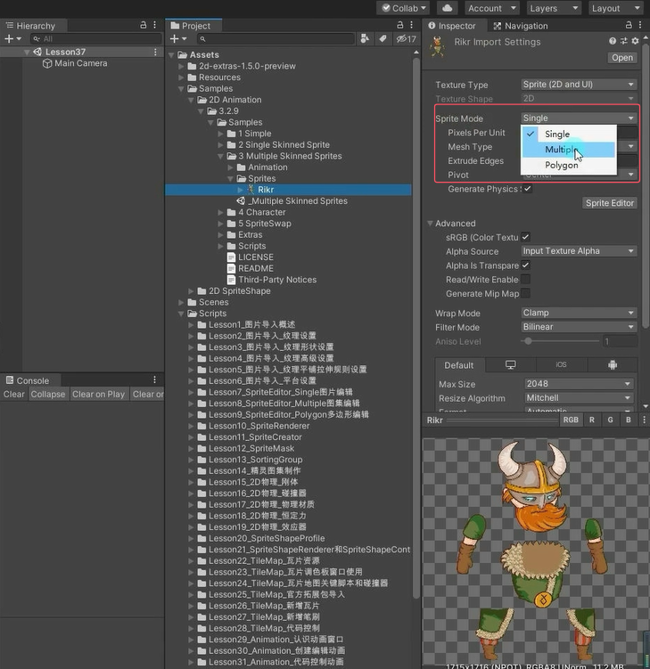
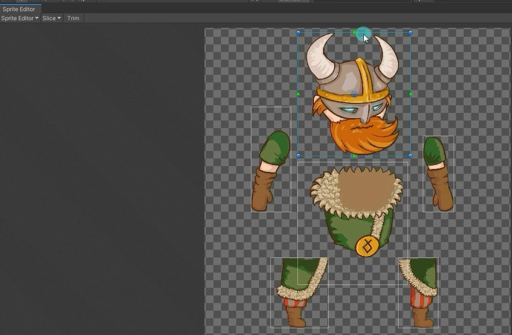
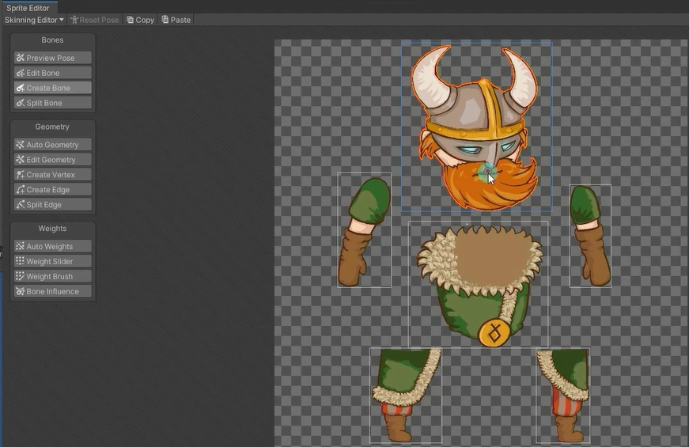
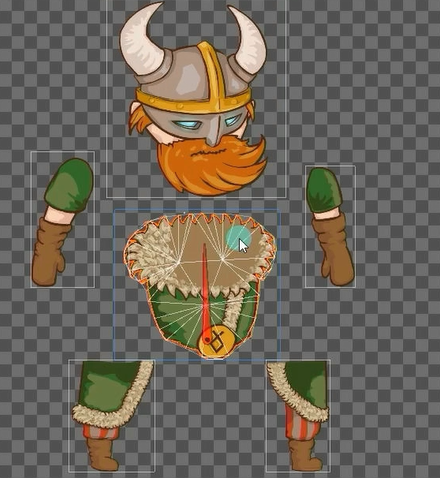
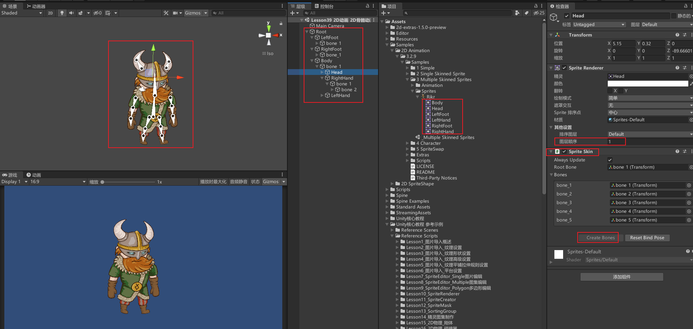
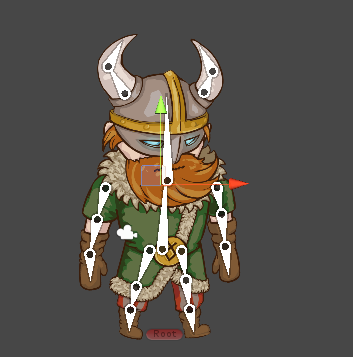

# 注意事项
设置Sprite为图集模式

对图集图片进行切片

# 图集骨骼编辑

双击想要编辑的区域，会出现橙色边缘线

直接骨骼蒙皮权重就行

# 图集骨骼动画使用
设置一个空物体为根物体。拖拽图集下各个图片到根物体下。逐个添加SpriteSkin脚本并点击生成骨骼按钮。
通过手动设置各个图片的相对父对象来让头随着身体移动这种操作，并调整排序层级。注意调整根物体的子物体，让根物体的中心点在脚下。

