# 认识PSB文件
认识PS之前先认识PS

PS（photoshop）是一款强大的图像处理软件，在各领域都被广泛使用。在游戏行业中也是美术同学使用最多的图像处理软件之一。
PSD和PSB两种格式，都是PS这款软件用于保存图像处理数据的文件格式。

PSD和PSB两种格式并没有太大的区别。最大的区别是PSD格式兼容除PS以外的其他一些软件，而PSB只能用PS打开。
在Unity中官方建议使用psb格式

# 在Unity中使用PSB文件
需要在Packages Manager窗口中引入 2D PSD Importer工具包
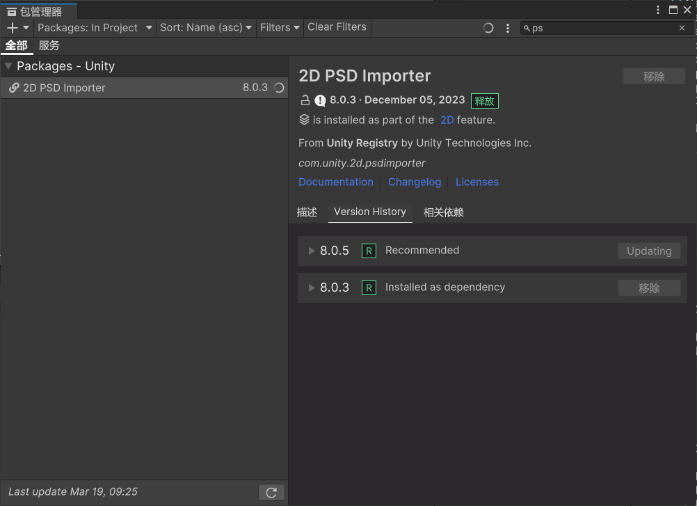
2D项目会自动下载，3D不会
在Unity中使用PSB文件做骨骼动画，可以让美术设置好图层，各图片位置，各个图片的名字，就不用像图集那样一个一个拼了
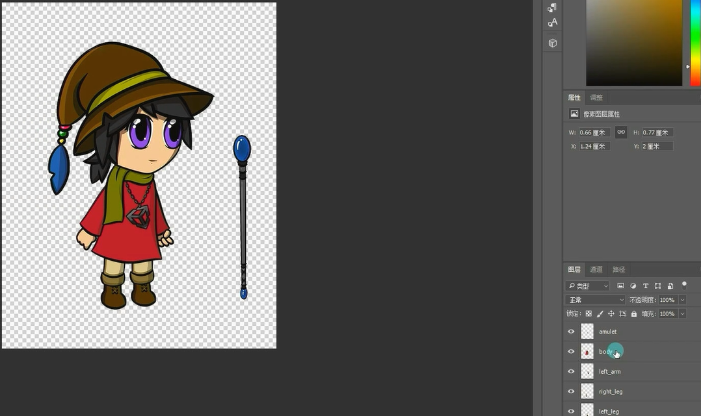

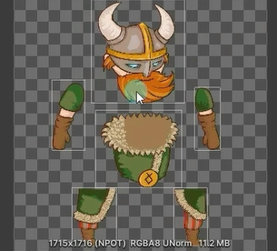

# 设置PSB文件关键参数
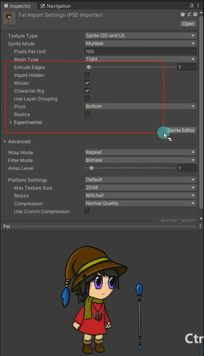

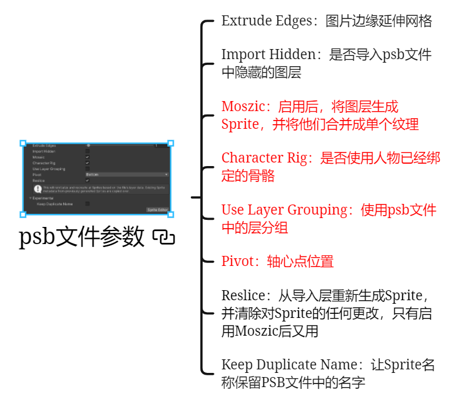

## Extrude Edges*：图片边缘延伸网格

## Import Hidden*：是否导入psb文件中隐藏的图层
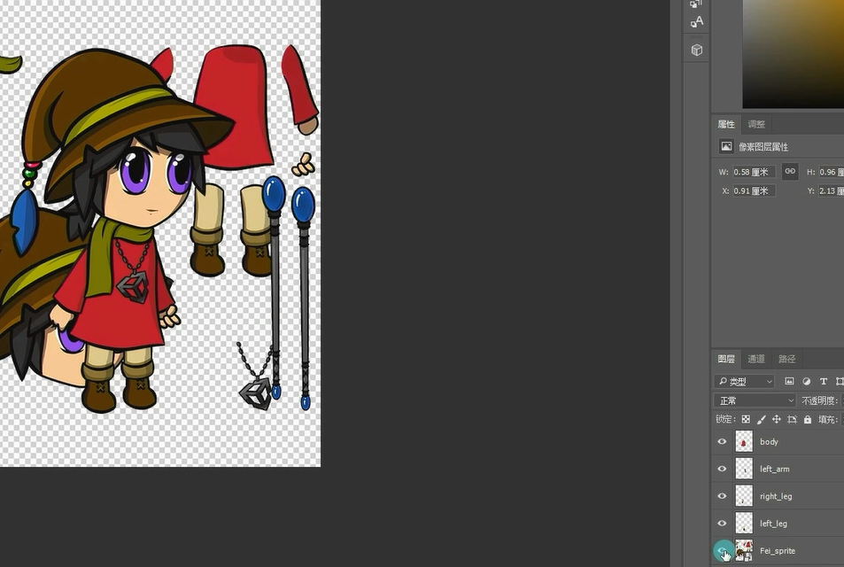

## Moszic：
启用后，将图层生成Sprite，并将他们合并成单个纹理

## Character Rig：是否使用人物已经绑定的骨骼

## Use Layer Grouping：使用psb文件中的层分组
一般不勾选

## Pivot：轴心点位置

## Reslice*：
一般不勾选
从导入层重新生成Sprite，并清除对Sprite的任何更改，只有启用Moszic后又用

## Keep Duplicate Name*：保留PSB文件中的名字
让Sprite名称保留PSB文件中的名字

# 为PSB文件编辑骨骼信息
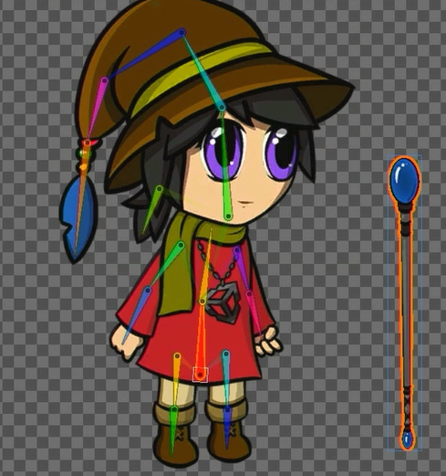

只能一部分一部分的生成蒙皮，但自动生成的蒙皮不知道哪个骨骼会影响哪部分就会有下面的效果，手臂影响身体

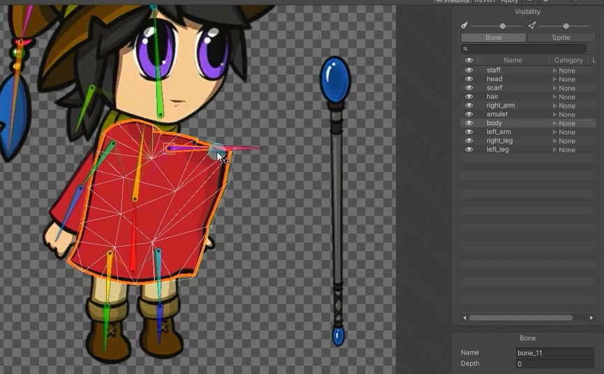
可以通过下面的操作取消掉关联的骨骼
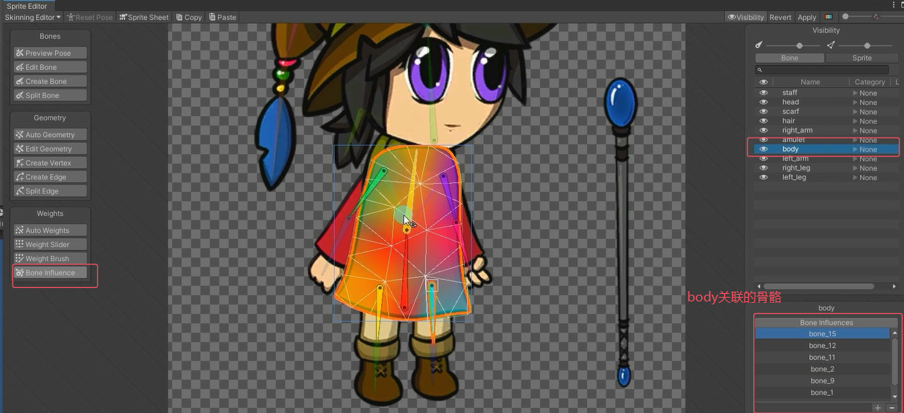

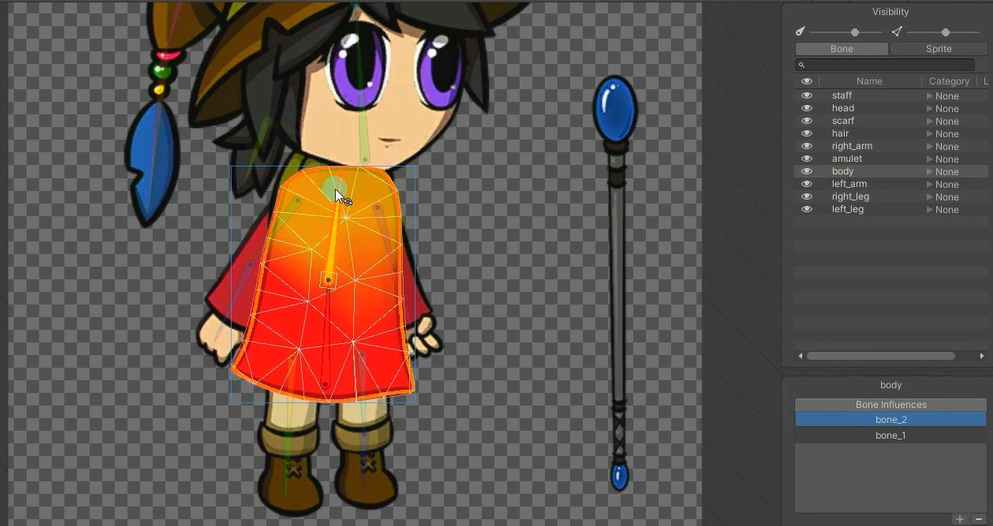

对于这种没有骨骼关联的也可以添加骨骼关联
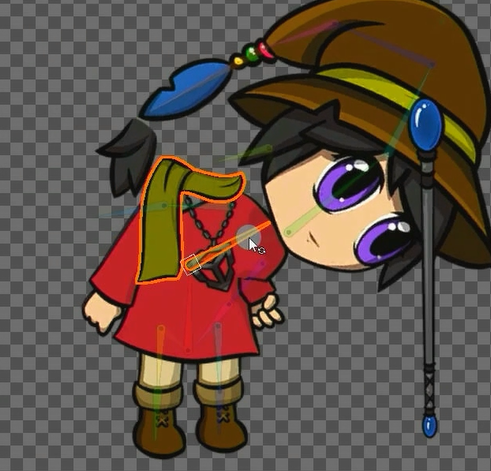

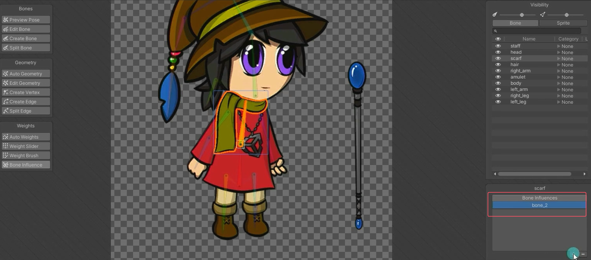

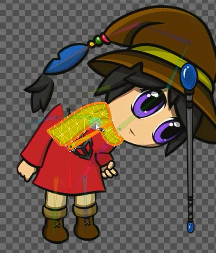

再做些细微调整
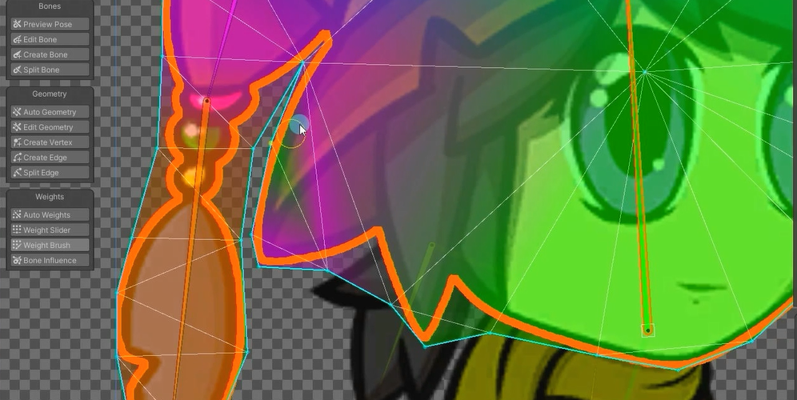

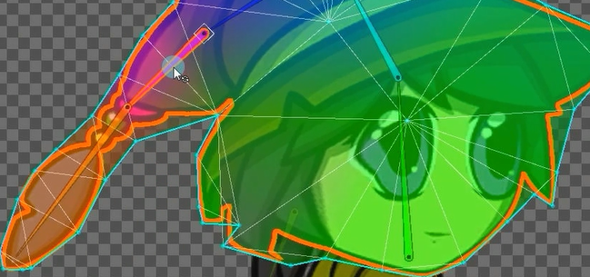

# 为PSB文件制作骨骼动画
创建一个空物体，直接拖进去其实就可以直接用了，也会自动创建子物体和骨骼

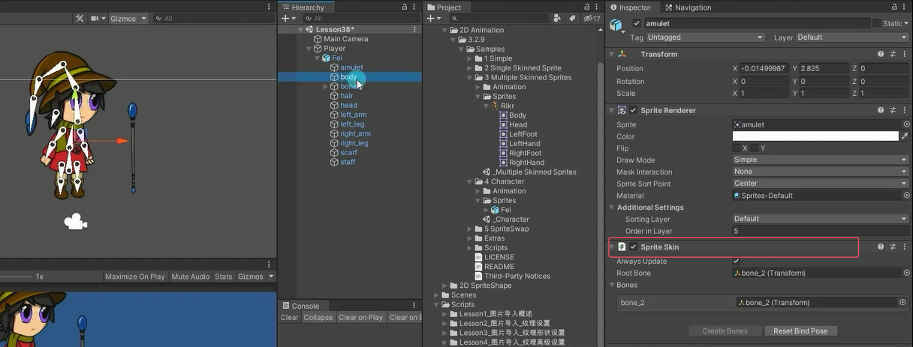

假如想把权杖拿到手上。要把拖进来的PS图片对象解预制体，不然无法移动权杖的父子关系，设置到拿到手上，调整层级
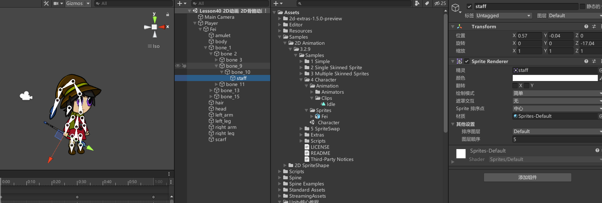

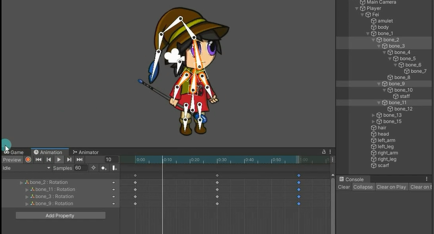

