# 什么是IK
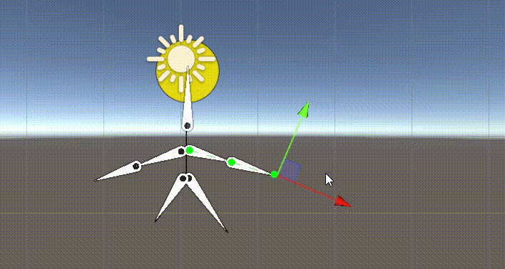
在骨骼动画中，构建骨骼的方法被称为正向动力学。
它的表现形式是，子骨骼（关节）的位置根据父骨骼（关节）的旋转而改变。
用我们人体举例子，当我们抬起手臂时，是肩部关节带动的整个手臂的运动，用父子骨骼理解的话就是父带动了子。

而IK全称是Inverse Kinematics，翻译过来的意思就是反向动力学的意思。
它和正向动力学恰恰相反。
它的表现形式是，子骨骼（关节）末端的位置改变会带动自己以及自己的父骨骼（关节）旋转。
用我们人体举例子，当我们拿起一个杯子的时候是用手掌去拿，以杯子为参照物，我们移动杯子的位置，手臂会随着杯子一起移动，用父子骨骼理解的话就是子带动了父。

# 2DIK包引入
2022版本自带有
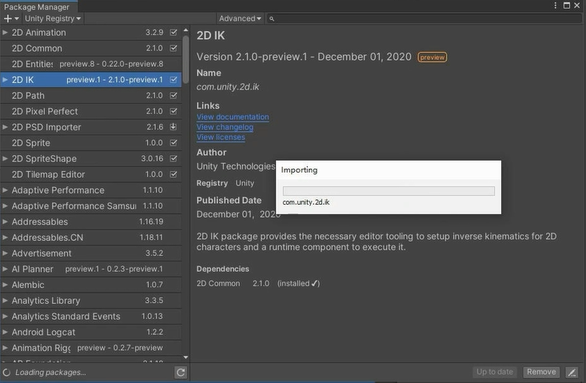

# 2DIK的使用
先给权杖也弄骨骼
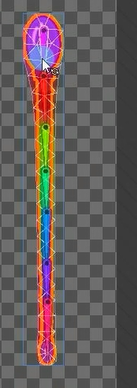

新建一个空物体作为根对象，拖PSB图片做成子物体，给根物体添加IKManager2D组件
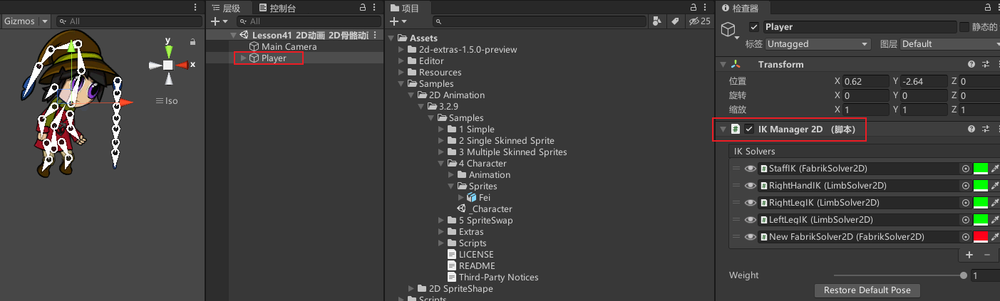


## IK相关脚本参数
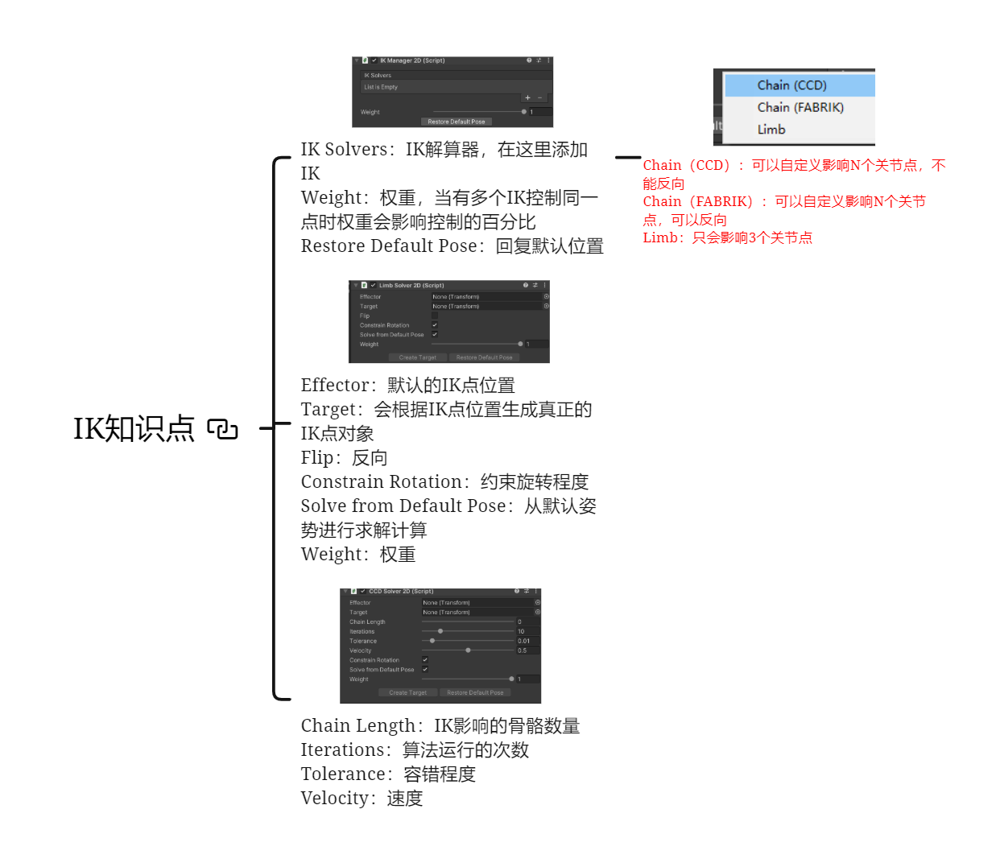
### IK Manager 2D 脚本参数
IK Solvers：IK解算器，在这里添加IK
 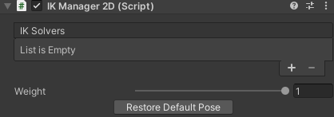
Chain（CCD）：可以自定义影响N个关节点，不能反向
Chain（FABRIK）：可以自定义影响N个关节点，可以反向 
Limb：只会影响3个关节点，一般四肢选这个
Weight：权重，当有多个IK控制同一点时权重会影响控制的百分比
Restore Default Pose：回复默认位置

给左右手和脚的末端和权杖的末端添加空物体，会利用这些空物体在对应位置添加IK点


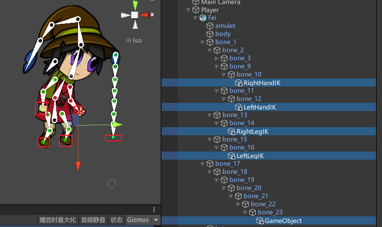


在根对象的IKManager2D组件点击加号添加一个Chain（CCD）类型的IK，添加完会出现一个New CCDSolver2D子物体挂载NCCDSolver2D脚本
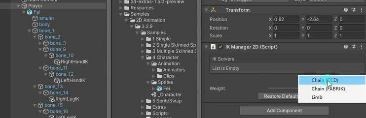

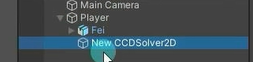

### CCD Solver 2D参数

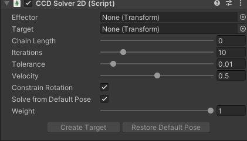


将权杖末端的空对象赋值进来。
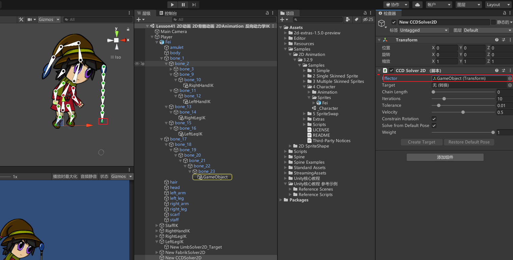

Chain Length：IK影响的骨骼数量，往上影响多少个骨骼节点，加大数值，点变成绿色就意味着影响了那个骨骼。
Iterations：算法运行的次数。
Tolerance：容错程度。
Velocity：速度。

点击创建对象，会出来一个对象并关联，这个对象可以理解为创建出来的IK节点，通过这个IK节点反向控制骨骼，现在移动子物体因为有了IK父物体也会跟着动。
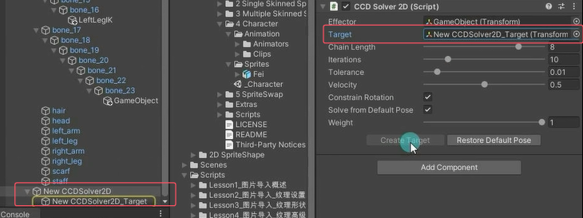

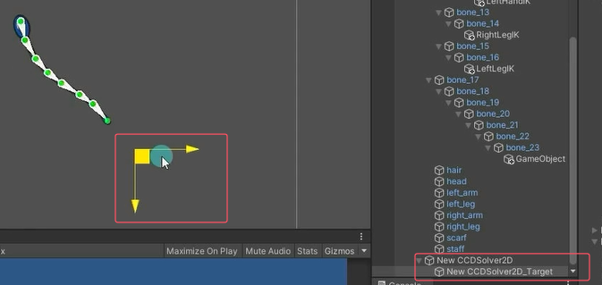


Effector：默认的IK点位置
Target：会根据IK点位置生成真正的IK点对象 
Flip：反向 
Constrain Rotation：约束旋转程度 
Solve from Default Pose：从默认姿势进行求解计算 
Weight：权重


CCD模式不能完全反向。
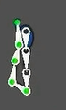

但FABRIK模式可以
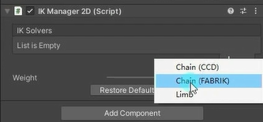
和上面ccd模式基本一样操作
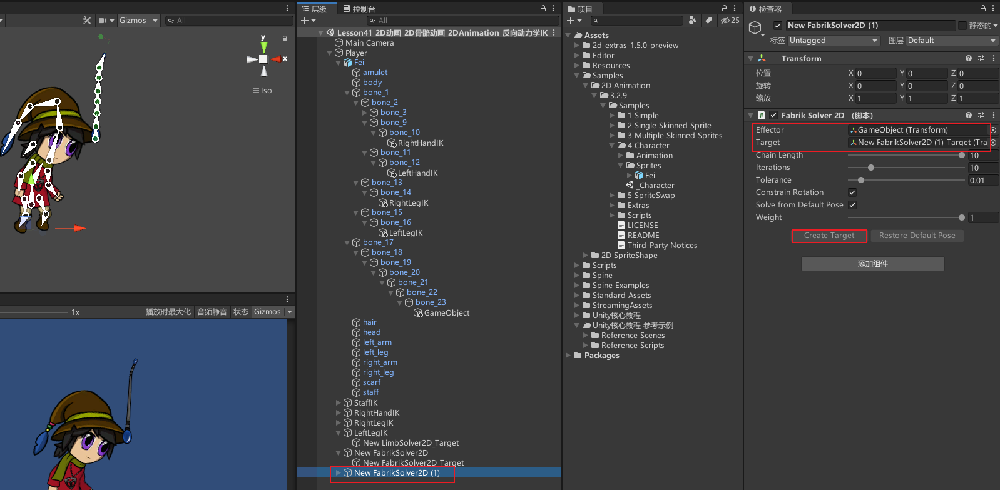


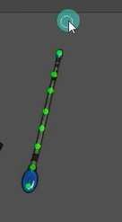


### LimbSolver2D脚本参数
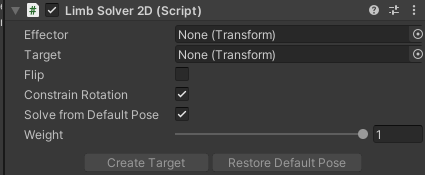

Effector：默认的IK点位置。
Target：会根据IK点位置生成真正的IK点对象。
Flip：反向。
Constrain Rotation：约束旋转程度。
Solve from Default Pose：从默认姿势进行求解计算。
Weight：权重。
Create Target：创建IK节点。
Restore Default Pose：重置默认形状。

为人物四肢创建IK
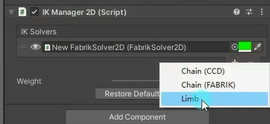

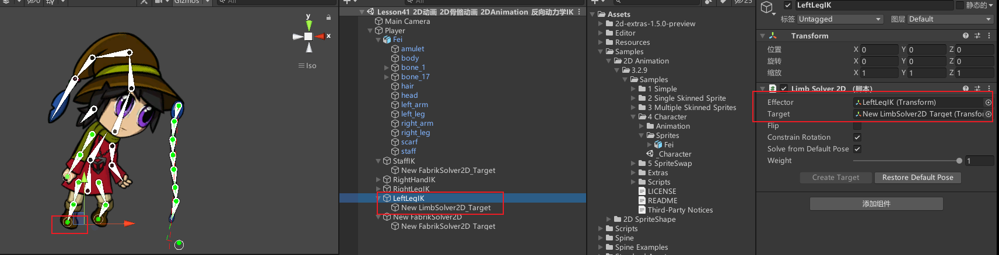

其实四肢也可以往上控制多个点的
先把左手这个删掉，重新选一个IK解算器
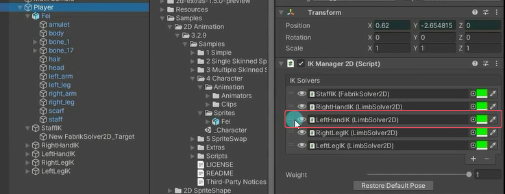
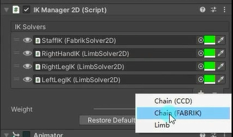

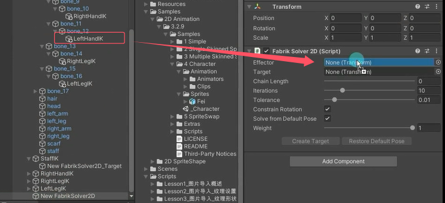

还可以改受IK点影响的到的骨骼颜色
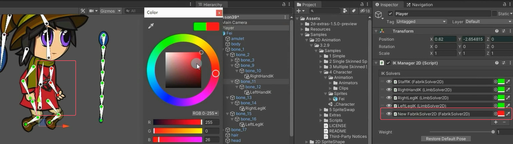
下面的效果是一拳带动全身
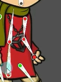

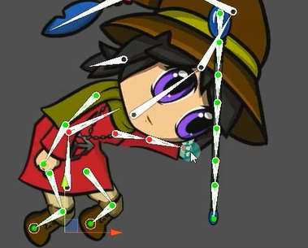

现在IK点不会跟着人物的根骨骼动，而是锁死在原地如下。想要一起动的话把各个IK点放到根骨骼下就行
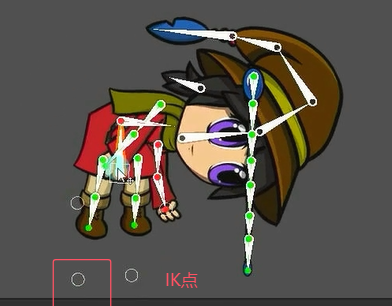

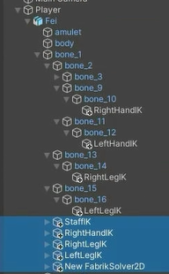


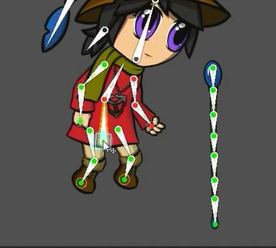


# IK对于我们的意义
瞄准功能。
头部朝向功能。
拾取物品功能等等有指向性的功能时，我们都可以通过IK来达到目的。
最大的作用，可以方便我们进行动画制作。


# 练习
请制作一个鼠标指向哪，2D人物的手臂就指向哪里的功能

创建空物体，拖psb文件图片进来，在左手添加一个空物体
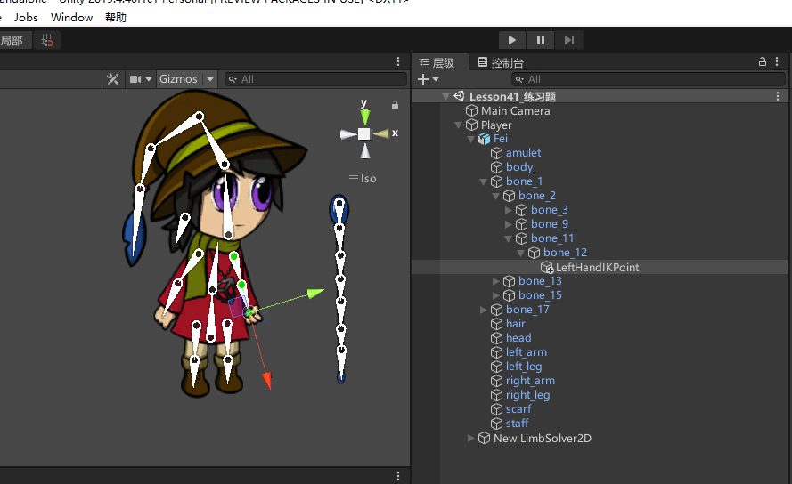


选择空对象，添加IKManager2D脚本，添加一个IK，选择四肢用的Limb。会创建一个IK位置节点
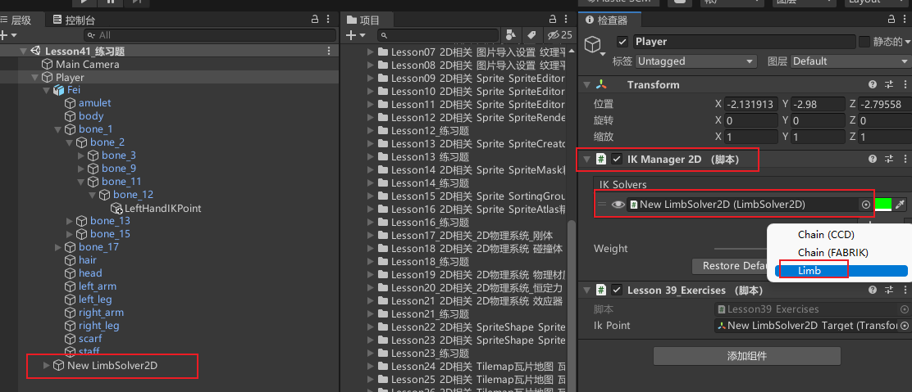


在IK位置节点关联左手空物体，点击创建目标按钮，生成IK目标对象
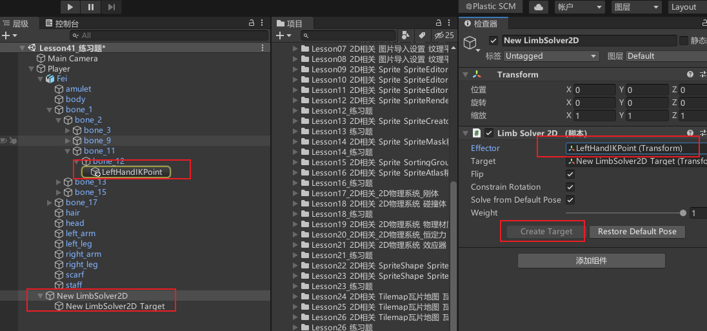


制作思路：我们可以控制IK目标对象的位置移动手臂，那么只要用鼠标控制IK目标对象就行了
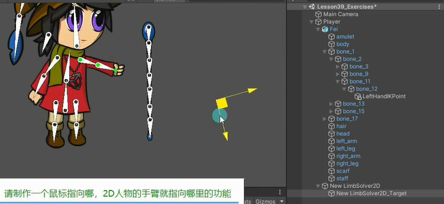


```cs
public Transform ikPoint; //IK点的位置
private float z; //2D游戏所在平面的z轴坐标
private Vector3 mousePos;

void Start()
{
    z = Camera.main.WorldToScreenPoint(ikPoint.position).z; 
}

void Update()
{
    if (Input.GetMouseButton(0))
    {
        mousePos = Input.mousePosition;
        mousePos.z = z;
        ikPoint.position = Camera.main.ScreenToWorldPoint(mousePos);
    }
}
```

