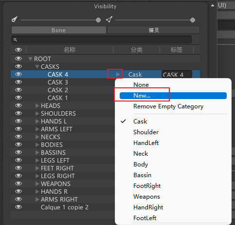

# 如何在同一个psb文件中制作换装资源
在ps中制作美术资源时，将一个游戏对象的所有换装资源都摆放好位置
当我们导入该资源时，要注意是否导入隐藏的图层
在ps软件制作图片时，是有很多图层的。可以设置图层显示隐藏控制当前用到是哪个图。比如控制各个武器图层的显示隐藏。想换装的话可以勾选导入隐藏图层的选项并应用。

每一类替换装备都需要单独的PSB，为了防止替换装备时产生的坐标错位，建议每一件装备都在图层内对齐。
例：所有衣袖需要向上对齐，所有鞋子需要向下对齐，不同武器需要手持位置对齐。


# 编辑换装资源的骨骼信息以及分组类别
打开精灵编辑器把模式调成SkinningEditor。因为导入了所有图片看起来比较乱，可以在右侧点击精灵选项，让同类型的图就显示一个。


创建骨骼，创建时假如发现原来的地方有骨骼挡着了可以切换到右边骨骼标签把挡着的骨骼想隐藏，创建好在显示刚刚隐藏的骨骼。创建好之后生成蒙皮。


打开Bone influence调整各个骨骼控制的部位


可以点击上方的SpriteSheet按钮，切换成图集模式，一个一个图查看关联的骨骼时候正确


我们可以看到右边面板上有Category分类和Label标签选项，这是Unity提供给我们换装用的。
每一个同类型的图片，比如不同的头盔，都可以放到同一组。点击三角形创建新的分组，输入分组名字，后面Label标签相当于当前图片在这个分组里的名字是啥，自动是图片名可以不用改，也可以改。





# 如何换装
**两个关键组件：**
SpriteLibrary（精灵资料库）：它确定了精灵的类别分组信息。
SpriteResolver（精灵解算器）：用于确定精灵的部位类别以及使用的图片。
**一个数据文件：**
SpriteLibraryAsset（精灵资料库资源）：这是一个具体记录了类别分组信息的文件。


创建空物体，把psb文件拖进来，可以看到由于设置了换装信息和分组，**PSB图片对象**上添加了**SpriteLibrary精灵资料库**组件并关联一个数据文件**SpriteLibraryAsset精灵资料库资源**，这个数据文件具体记录类别分组信息。


点击**SpriteLibraryAsset精灵资料库资源**如下图


不但生成了骨骼相关Sprite Skin的组件，发现有的自动添加了SpriteResolver（精灵解算器）脚本


# 代码换装
获取各部位的SpriteResolver（需要引用命名空间），比如获得头盔的SpriteResolver，创建SpriteResolver变量并在外面拖拽关联
使用SpriteResolver的API进行装备切换

```cs
public SpriteResolver caskSpriteResolver;

//GetCategory() 获取当前部位默认的类别名（分组名）
//SetCategoryAndLabel 设置当前部位想要切换的图片信息

//相当于没有设置分组，直接传入要切换的图片名进行设置
caskSpriteResolver.SetCategoryAndLabel(caskSpriteResolver.GetCategory(), "CASK 1");

```

如果你不想一个一个的拖
```cs
public SpriteResolver caskSpriteResolver;

private Dictionary<string, SpriteResolver> equipDic = new Dictionary<string, SpriteResolver>();

// 封装一下直接用分类+Label名
public void ChangeEquip(string category, string equipName)
{
    if (equipDic.ContainsKey(category))
    {
        equipDic[category].SetCategoryAndLabel(category, equipName);
    }
}


void Start()
{
    SpriteResolver[] srs = this.GetComponentsInChildren<SpriteResolver>();

    for (int i = 0; i < srs.Length; i++)
    {
        equipDic.Add(srs[i].GetCategory(), srs[i]);
    }

    ChangeEquip("Cask", "CASK 1");
}
```