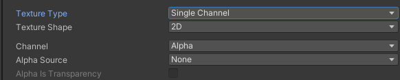

# 纹理类型主要是设置什么？
设置纹理类型主要是为了让纹理图片有不同的主要用途
指明其是用于哪项工作的纹理

# Texture Type：纹理类型参数

[纹理类型.svg](4.纹理类型设置/Texture%20Type：纹理类型.svg)

## Default 默认纹理
大部分导入的模型贴图都是该类型

- sRGB(Color Texture)* ：启用可以将纹理存储在伽马空间中（对每一个像素做一次幂函数运算）
  
    
- Alpha Source：指定如何生成纹理的Alpha通道
    
    - None：无论输入纹理是否有Alpha通道，导入的纹理都没有Alpha通道
        
    - Input Texture Alpha：输入纹理中的Alpha
        
    - From Gray Scale：从输入纹理RGB值的平均值生成Alpha
        
- Alpha Is Transparency：启用可以避免边缘上的过滤瑕疵

## Normal map 法线贴图格式

- [法线贴图（凹凸贴图）-Unity 手册](https://docs.unity3d.com/cn/2022.3/Manual/StandardShaderMaterialParameterNormalMap.html)就是在原物体的凹凸表面的每个点上均作法线 法线就是垂直于某个点的切线的方向向量
    
- Create From Grayscale： 启用此属性可以从灰度高度贴图创建法线贴图
    
- Bumpiness： 控制凹凸程度，值越大凹凸感越强
    
- Filtering： 如何计算凹凸值
  
    
    - Smooth：使用标准算法生成法线贴图 
    - Sharp：生成比标准模式更锐利的法线贴图

## Editor GUI and Legacy GUI 一般在编辑器中或者GUI上使用的纹理

## Sprite（2D and UI）
2D游戏或者UGUI中使用的格式

- Sprite Mode： 图像中提取精灵图形的方式
    
    - Single：按原样使用精灵图像
      
        
    - Multiple：瓦片模式，如果是图集，使用该选项，可以在Sprite Editor编辑窗口自定义图片
      
        
    - Polygon：网格精灵模式
        
- Pixels Per Unit：世界空间中的一个距离单位对应多少像素
    
    
    
- MeshType：网格类型[Unity Sprites: Full-Rect or Tight? | TheGamedev.Guru](https://thegamedev.guru/unity-gpu-performance/sprites-full-rect-or-tight/)；只有Single和Multiple模式才支持
  
    
    - Full Rect：创建四边形，将精灵显示在四边形上
      先说 Full Rect 模式的优点，对于 CPU 和 GPU 来说，**矩形的计算很容易。**
      对于 Full Rect 模式有一个最大的弊端是，**Sprite 的内容可能并不是一个矩形，也就说生成的矩形网格中，可能会有很大一部分透明区域，也被渲染了。如果这样的 Sprite 很多，那最终会有很大一部分的性能浪费，直接影响了帧率，特别是在移动设备上。**
      
        
    - Tight：基于像素Alpha值来生成网格，更加贴合精灵图片的形状 任何小于32 * 32的精灵都使用FullRect模式，即使设置成Tight模式也是
      
        
- Extrude Edges：使用滑动条确定生成的网格中精灵周围流出的区域大小
    
- Pivot：精灵图片的轴心点，Single模式才有此选项 对应九宫格布局的九个点，还可以自定义 或者在Sprite Editor中也可以定义
  
    
- Generate Physics Shape：启用此选项，Unity会自动根据精灵轮廓生成默认物理形状 只有Single 和Multiple模式才可使用
    
- Sprite Editor：编辑Sprite，需要安装2D Sprite包，之后单独讲解
    

## Cursor 自定义光标
设置鼠标图

## Cookie 光源剪影格式

- Light Type：应用的光源类型 一般点光源的剪影需要设置为立方体纹理 方向光和聚光灯的剪影设置为2D纹理
  
    
    - Spotlight：聚光灯类型，需要边缘纯黑色纹理
        
    - Directional：方向光，平铺纹理
        
    - Point：点光源，需要设置为立方体形状
        

## Lightmap 光照贴图格式

## Single Channel 纹理只需要单通道的格式

- Channel：希望将纹理处理为Alpha还是Red通道
- Alpha：使用Alpha通道，不允许进行压缩 Red：使用红色通道