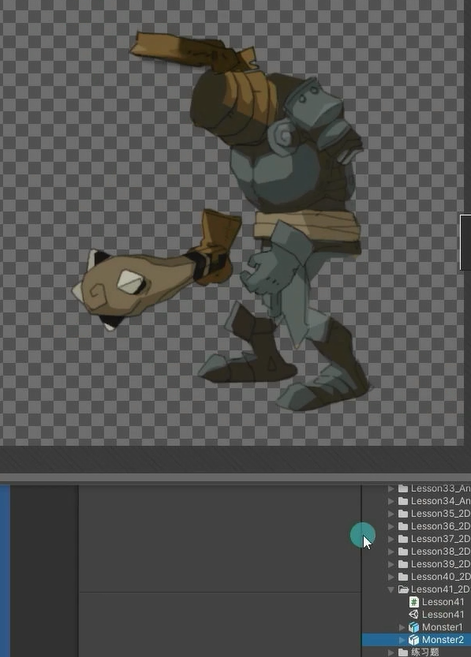

# 如何在不同psb文件中制作换装资源
**保证个部位在PS文件中的统一，比如不同资源的头盔位置都要在同一位置**
比如下面就不统一，使用就会出问题

**基础部位可选择性隐藏**，比如第一副图有的身体头四肢，下张图只有各个装备就行了

# 编辑换装资源的骨骼信息
注意事项：不同文件的骨骼信息必须统一,所以我们直接使用复制的方式

首先按选择psb图片，不勾选导入隐藏模式。进入精灵编辑器。按套路先创建骨骼，创建后生成蒙皮，生成蒙皮后会有些不该影响的骨骼，按套路在且到BoneInfluence和右边的精灵图片，一个一个删除或添加骨骼。有些情况下添加了骨骼要点击AutoWeights按钮选中添加的骨骼点击右下角Generate按钮生成权重

编辑好骨骼蒙皮权重

现在来编辑新的psb图片，如果重新编辑骨骼的话那咋保证骨骼的统一？

打开另一张图片（这张图也不用打开import Hidden），点击粘贴，右下角只选中粘贴骨骼，不粘贴蒙皮。粘贴完点击应用。应用完继续按套路生成蒙皮，调整蒙皮骨骼和权重。

# 手动添加关键组件和数据文件
1. 首先创建SpriteLibraryAsset数据文件
2. 为根对象添加SpriteLibrary并关联数据文件
3. 为换装部位关联SpriteResolver

创建空物体根对象，把psb图片放到他下面。

在Project窗口创建SpriteLibraryAsset数据文件

自己创建的SpriteLibraryAsset数据文件可以手动设置分组并关联图片。同一组关联的图片是两个psb文件下的相同类型的，比如不同的头盔。

为根对象添加SpriteLibrary并关联数据文件

为换装部位关联SpriteResolver

# 总结 
如何选择 同一文件和 不同文件 制作换装资源两种方案？

换装较少的游戏 比如只有面部表情更换 可以使用同一psb文件方案
换装较多的游戏 比如各部位有n种装备 可以使用不同psb文件方案
不同psb文件 拓展性更强
一切根据需求而定

