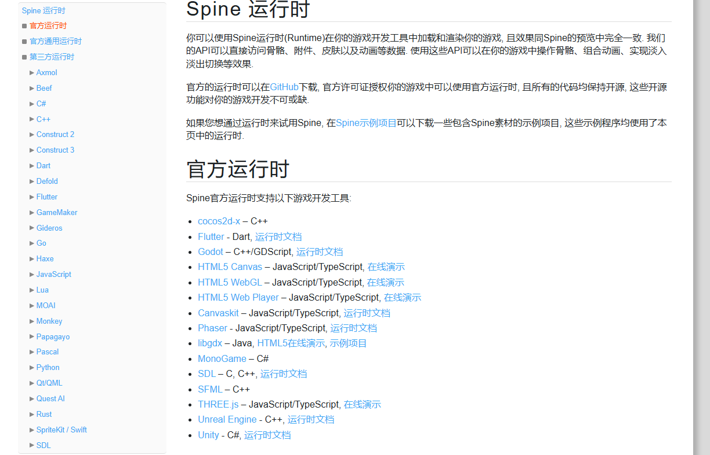
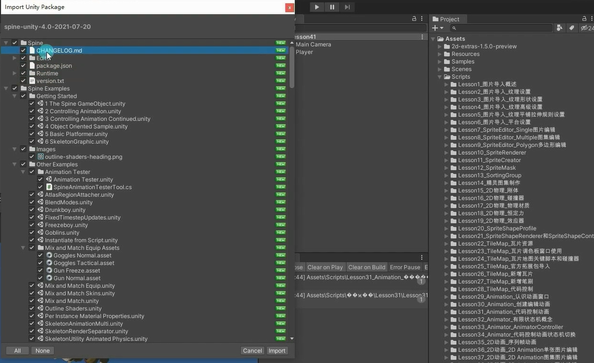

# Spine是什么
Spine是一个收费的跨平台的2D骨骼动画制作工具。
它支持Unity，UE，Cocos2D，Cocos2D-x等等游戏引擎。
相对Unity2018才推出的 2D Animation。
Spine是目前商业游戏中较为常用的骨骼动画制作方案，稳定且高效。
官方地址：http://zh.esotericsoftware.com/

# 如何学习Spine
制作骨骼动画时美术人员的工作。
除非你是要做独立游戏，美术程序一人包。
那么我们没有必要去学习如何通过Spine制作骨骼动画。

我们只需要学习如何在Unity中通过程序使用Spine制作的资源。
如果想要学习如何制作Spine骨骼动画，可以根据官网提供的教学内容进行学习。

# 导入Unity使用的Spine运行库
有了Spine提供的支持Unity开发的运行库。
我们才能在Unity中使用Spine制作的骨骼动画。
你可以简单理解其实就是官方写好的识别文件处理文件呈现效果的代码。
我们只需要学习如何使用它提供的API即可。

下载完直接导入就行了

