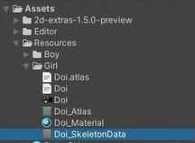
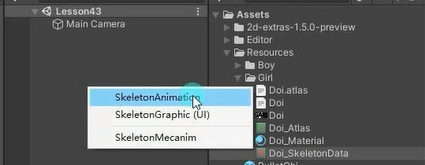
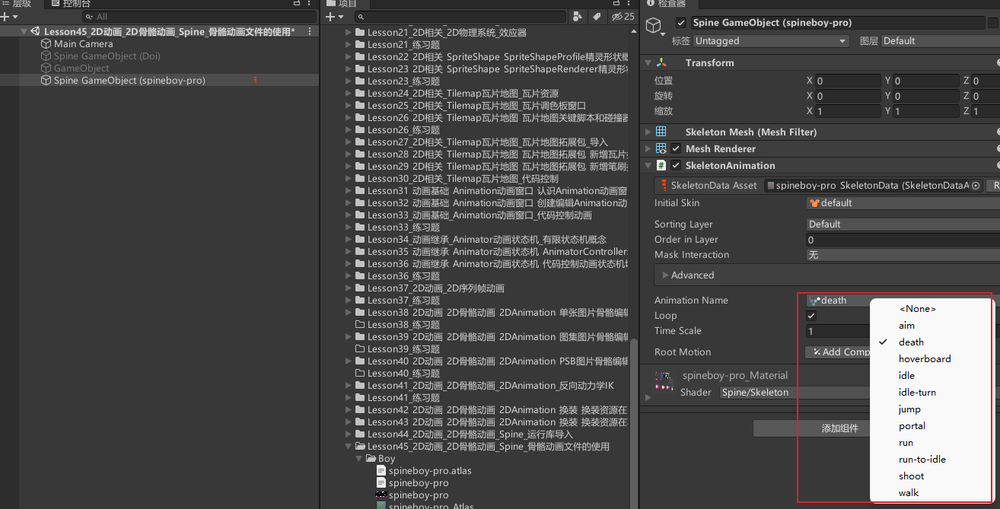
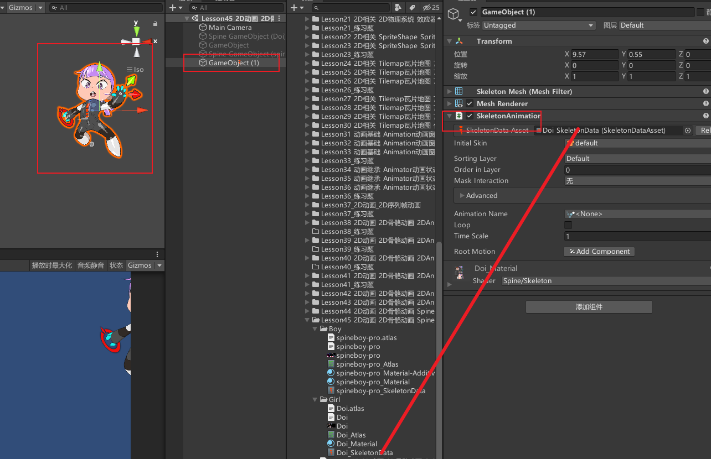

# Spine导出的unity资源
Spine导出的资源有3个文件
.json：存储了骨骼信息
.png：使用的图片图集
.atlas.txt：图片在图集中的位置信息

当我们把这三个资源文件夹导入到已经引入了Spine运行库的Unity工程后，会自动为我们生成
_Atlas：材质和.atlas.txt文件（位置）的引用配置文件
_Material：材质文件
_SkeletonData：json（骨骼）和_Atlas资源的引用配置文件

# 使用Spine导出的骨骼动画
最关键的是_SkeletonData：json和_Atlas资源的引用配置文件

直接将_SkeletonData文件拖入到场景中，选择创建 SkeletonAnimation对象

可以点击SkeletonAnimation对象在右边Inspector窗口切换动画运行查看

或者创建空对象，然后手动添加SkeletonAnimation脚本对_SkeletonData文件进行关联

