_Atlas：材质和.atlas.txt文件（位置）的引用配置文件
_Material：材质文件
_SkeletonData：json（骨骼）和_Atlas资源的引用配置文件

# Spine骨骼动画参数相关

[点击放大思维导图](43.Spine骨骼动画参数/Spine骨骼动画参数相关.svg)

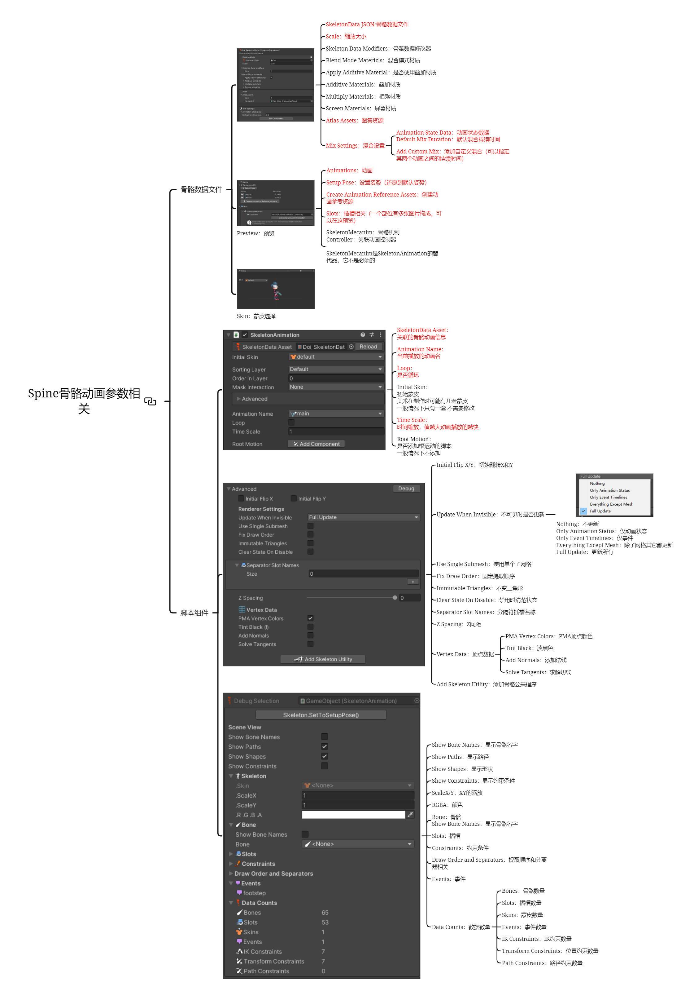

## _SkeletonData骨骼数据文件
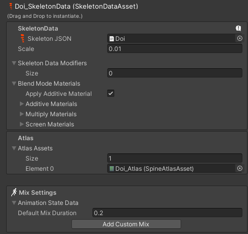

- SkeletonData JSON:骨骼数据文件 （导入进Unity时会自动关联未导入前的json文件）
- Scale：缩放大小 （Spine里的100是unity中的1）
- Skeleton Data Modifiers*：骨骼数据修改器
- Blend Mode Materizls*：混合模式材质
- Apply Additive Material*：是否使用叠加材质
- Additive Materials*：叠加材质
- Multiply Materials*：相乘材质
- Screen Materials*：屏幕材质
- Atlas Assets：图集资源 （导入时会自动关联导入后生成的_Atalas文件）
- Mix Settings：混合设置
  怎么理解？当两个动画在切换的时候过渡会产生的效果就可以在这里设置相关的时间
  - Animation State Data：动画状态数据
    Default Mix Duration：默认混合持续时间
  - Add Custom Mix：添加自定义混合（可以指定某两个动画之间的持续时间）

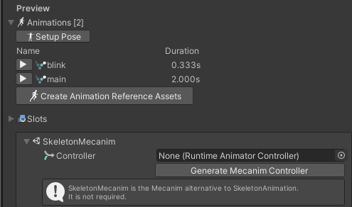
Preview：预览
- Animations：动画
- Setup Pose：设置姿势（还原到默认姿势）
- Create Animation Reference Assets：创建动画参考资源 （一般也没必要）
  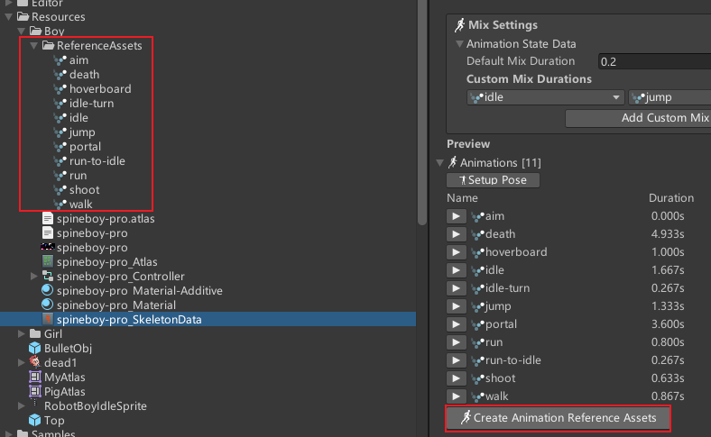
- Slots：插槽相关（一个部位有多张图片构成，可以在这预览）
- SkeletonMecanim：骨骼机制
  Controller：关联动画控制器
- SkeletonMecanim是SkeletonAnimation的替代品，它不是必须的
  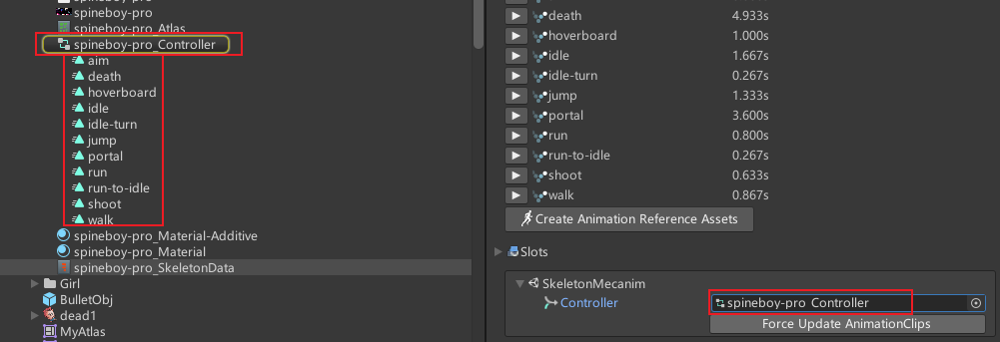
  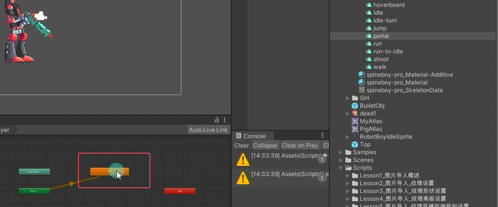

Skin：蒙皮选择
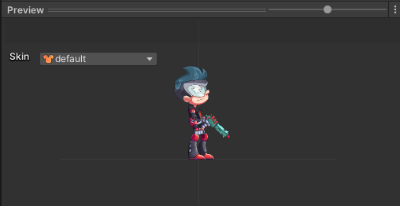
## SkeletonAnimation骨骼动画脚本参数
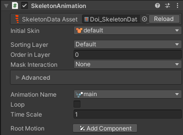

- SkeletonData Asset：关联的骨骼动画信息
- Animation Name：当前播放的动画名
- Loop：是否循环
- Initial Skin*：初始蒙皮
  美术在制作时可能有几套蒙皮
  一般情况下只有一套 不需要修改
- Time Scale：时间缩放，值越大动画播放的越快
- Root Motion*：是否添加根运动的脚本一般情况下不添加

**高级选项（一般用不着）**
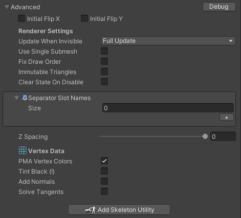

- Initial Flip X/Y：初始翻转X和Y
- Update When Invisible：不可见时是否更新

  - Nothing：不更新
    Only Animation Status：仅动画状态
    Only Event Timelines：仅事件
    Everything Except Mesh：除了网格其它都更新
    Full Update：更新所有

- Use Single Submesh：使用单个子网格
- Fix Draw Order：固定提取顺序
- Immutable Triangles：不变三角形
- Clear State On Disable：禁用时清楚状态
- Separator Slot Names：分隔符插槽名称
- Z Spacing：Z间距
- Vertex Data：顶点数据

  - PMA Vertex Colors：PMA顶点颜色
  - Tint Black：淡黑色
  - Add Normals：添加法线
  - Solve Tangents：求解切线

- Add Skeleton Utility：添加骨骼公共程序

**Debug窗口也不常用**
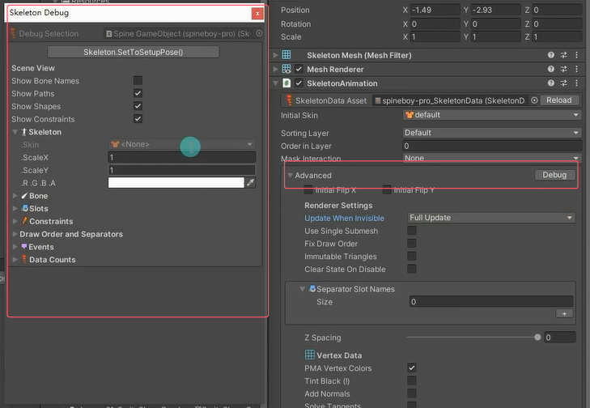

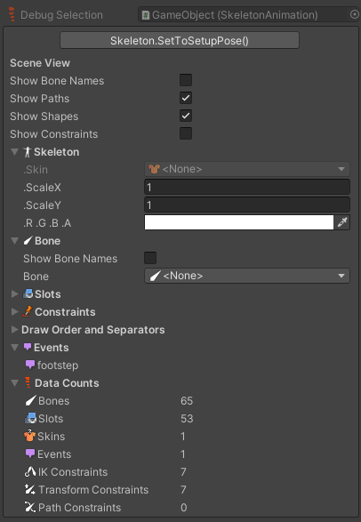

- Show Bone Names：显示骨骼名字
- Show Paths：显示路径
- Show Shapes：显示形状
- Show Constraints：显示约束条件
- ScaleX/Y：XY的缩放
- RGBA：颜色
- Bone：骨骼
  Show Bone Names：显示骨骼名字
- Slots：插槽
- Constraints：约束条件
- Draw Order and Separators：提取顺序和分离器相关
- Events：事件
- Data Counts：数据数量

  - Bones：骨骼数量
  - Slots：插槽数量
  - Skins：蒙皮数量
  - Events：事件数量
  - IK Constraints：IK约束数量
  - Transform Constraints：位置约束数量
  - Path Constraints：路径约束数量

