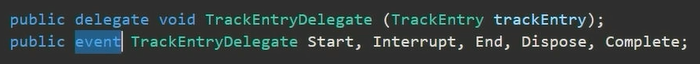
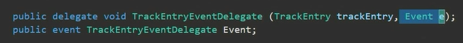
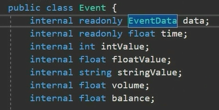
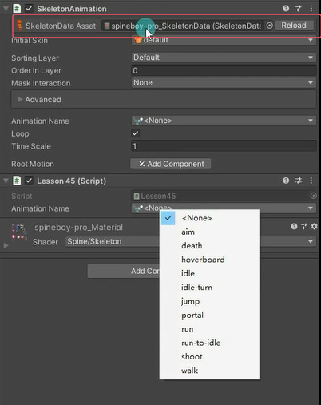
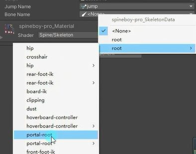
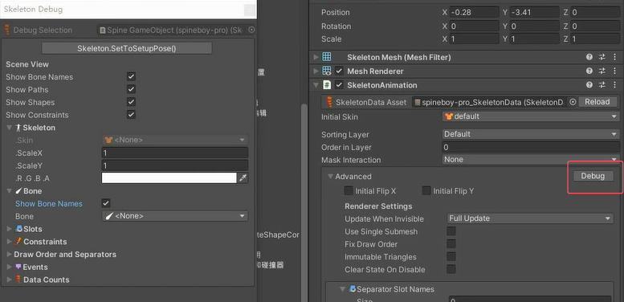
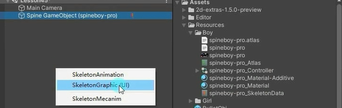
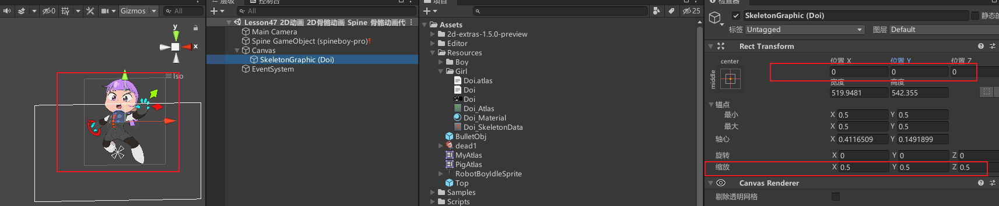

创建脚本挂载到spine对象上，声明一个SkeletonAnimation变量
```cs
skeletonAnimation = this.GetComponent<SkeletonAnimation>();
```

# 动画播放
**方法一：直接改变SkeletonAnimation中的参数**

SkeletonAnimation.AnimationName变量 设置动画名
SkeletonAnimation.loop变量 设置动画是否循环
```cs
skeletonAnimation.loop = false;
skeletonAnimation.AnimationName = "jump";
```

**方法二（建议）：使用SkeletonAnimation动画状态改变函数**

SkeletonAnimation.AnimationState.SetAnimation方法 设置动画立即播放
SkeletonAnimation.AnimationState.AddAnimation方法 设置动画排队播放

Spine 动画系统里，动画轨道能够让你同时播放多个动画，并且可以对它们的混合、叠加等效果进行控制。每个轨道都可以独立播放一个动画，并且轨道之间可以相互影响，从而实现复杂的动画效果。
动画轨道索引：第一个参数指定了要在哪个轨道上播放动画。轨道索引从 0 开始计数，也就是 0 代表第一个轨道，1 代表第二个轨道，依此类推。

```cs
//马上播放 立即切换 传入 0 动画字符串 是否循环 
skeletonAnimation.AnimationState.SetAnimation(0, "jump", false);
skeletonAnimation.AnimationState.SetAnimation(0, jumpName, false);
//排队播放 等待上个动画播完切换 传入 0 动画字符串 是否循环 延迟时间
skeletonAnimation.AnimationState.AddAnimation(0, "walk", true, 0);
```


# 转向
SkeletonAnimation.skeleton.ScaleX变量 x的翻转
```cs
// 翻转spine对象
skeletonAnimation.skeleton.ScaleX = -1;
```


# 动画事件


SkeletonAnimation.AnimationState.Start事件 动画开始播放时的事件
```cs
//动画开始播放事件
skeletonAnimation.AnimationState.Start += (t) =>
{
    print( skeletonAnimation.AnimationName +  "动画开始播放");
};
```


SkeletonAnimation.AnimationState.End事件 动画中断或者清除时的事件
```cs
//动画被中断或者清除事件
skeletonAnimation.AnimationState.End += (t) =>
{
    print(skeletonAnimation.AnimationName + "动画中断或者清除");
};
```


SkeletonAnimation.AnimationState.Complete事件 动画播放完成时的事件
```cs
//播放完成事件
skeletonAnimation.AnimationState.Complete += (t) =>
{
    print(skeletonAnimation.AnimationName + "动画播放完成");
};
```


SkeletonAnimation.AnimationState.Event事件 自定义事件


```cs
//做动画时添加的自定义事件事件 这里的事件是美术在spine软件做动画的时候假如添加了的话才会调用的
skeletonAnimation.AnimationState.Event += (t, e) =>
{
    print(skeletonAnimation.AnimationName + "自定义事件");
};

```


# 便捷特性
动画特性


```cs
[SpineAnimation]
public string jumpName;
// 动画特性
// 添加了这个特性之后外部可以下拉框选择动画 设置变量为动画名字 切换动画直接拿变量的值就行 就不用自己看动画什么名字了
skeletonAnimation.AnimationState.SetAnimation(0, jumpName, false);
```


骨骼特性
和上面动画特性差不多用法

不然就要去debug窗口找

```cs
[SpineBone]
public string boneName;
// 快捷得到骨骼的名字 就不用在其他组件或者Debug窗口里找了
```


插槽特性
```cs
[SpineSlot]
public string slotName;
// 快捷得到插槽名
```

附件特性
```cs
[SpineAttachment]
public string attachmentName;
// 快捷得到附件名
```


# 获取骨骼、设置插槽附件

SkeletonAnimation.skeleton.FindBone方法 获取骨骼
```cs
// 获取骨骼
Bone b = skeletonAnimation.skeleton.FindBone(boneName);
```


SkeletonAnimation.skeleton.SetAttachment方法 设置插槽附件
```cs
// 设置插槽附件 传入插槽名和附件名
skeletonAnimation.skeleton.SetAttachment(slotName, attachmentName);
```


# 在UI中使用
将_SkeletonData文件拖入场景中




