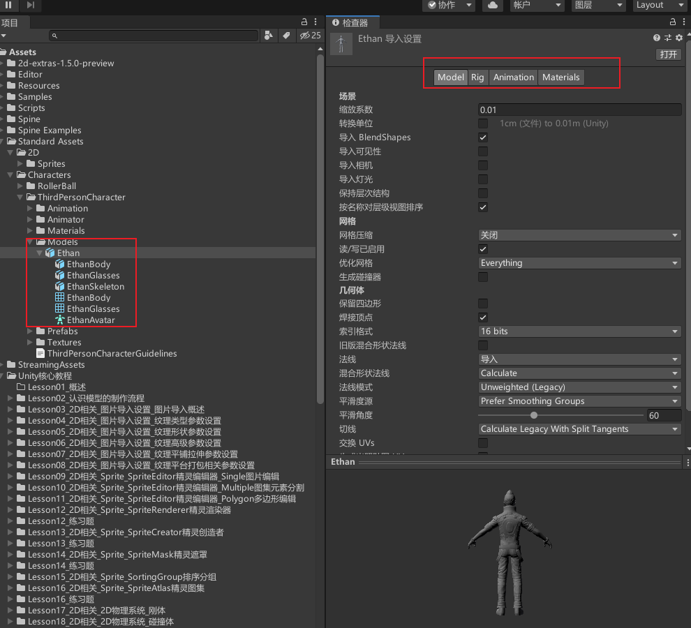

# Unity中使用的模型
Unity支持很多模型格式，例如：
.fbx
.dae
.3ds
.dxf
.obj 等等
99%的模型通常不是在Unity中制作的，而是美术人员在建模软件中制作，如 3DMax、Maya 等等。

美术人员制作完模型后，官方建议将模型导出为 **FBX** 格式再使用。
使用FBX模型格式的优势：
1. 减少不必要数据，提升导入效率。
2. 不需要在每台计算机上安装建模软件的授权副本。
3. 对Unity版本无要求，使用原始3D模型格式可能会因为版本不同导致错误或意外。

如果美术同学不知道如何导出FBX格式的模型和导出规范，可以参考Unity官网文档或者进行搜索。美术同学在导出模型时需要注意：
[在 Unity 外部创建资源 - Unity 手册](https://docs.unity.cn/cn/2019.4/Manual/CreatingDCCAssets.html)
坐标轴，人物面朝向为Z轴正方向，Y轴正方向为头顶方向，X轴正方向为人物右侧。

# 导入模型的基本流程
1. 美术同学用3D建模软件制作好模型导出FBX格式模型资源。
2. 程序将这些模型资源导入到Unity的资源文件夹中。
3. 在Unity内部对这些模型进行基础设置——模型、骨骼、动作、材质。

# 如何在Unity中设置模型相关内容
在Project窗口选中导入的模型。

在Inspector窗口进行相关设置，有4个页签分别是：
Model 模型页签
Rig 操纵（骨骼）页签
Animation 动画页签
Materials 材质纹理页签。

通过这4个页签对模型动作相关信息设置完成后，之后我们才能在场景中更好的使用这些模型资源。

