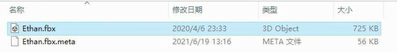
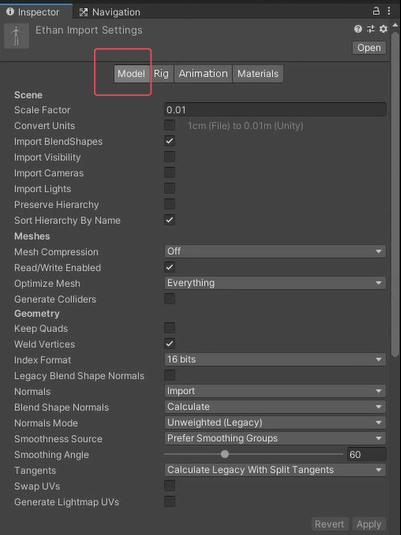
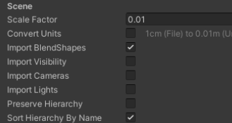
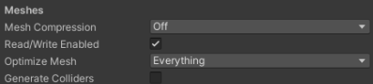
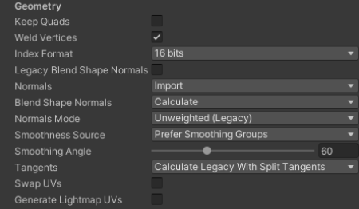

# Model模型页签是设置什么的
该页签主要是用于设置模型的各种属性，例如模型比例、是否导入模型中的摄像机和光源、网格压缩方式等等相关信息。
修改模型中存储的各种元素和属性最终会影响在Unity中使用模型时的一些表现。

# Model 模型页签

点击查看下图svg

## Scene 场景相关设置

### Scale Factor 缩放系数
当模型中的比例不符合项目中的预期比例时
可以修改此值来改变该模型的全局比例
Unity的物理系统希望游戏世界中的1米在导入模型文件中为1个单位

### Convert Units 转换单位
启用可将模型文件中定义的模型比例转换为Unity的比例
不同的格式的比例如下
.fbx .max .jas = 0.01
.3ds = 0.1
.mb .ma .lxo .dxf .blend .dae = 1

### Import BlendShapes* 导入BlendShapes
是否允许Unity随网格一起导入混合形状
当导入包含混合形状的网格时，将使用Skinned MeshRenderer组件
注意：
1.导入混合形状发现需要在FBX文件中具有平滑组
2.如果想要导入具有法线的混合形状
	把下方的Blend Shape Normals属性设置为Import，将使用FBX文件的发现
	或者
	把下方的Blend Shape Normals属性设置为Calculate，Unity使用相同的逻辑来计算网格和混合形状上的法线

### Import Visibility* 导入可见性
是否导入可见性
开启后可以从FBX文件中读取可见性属性。
比如模型动作里 有些动作是要隐藏模型形象的，开启后才会生效

一些3D建模软件对可见性属性不支持或者有限制
比如Maya和Blender就对可见性有限制
所以一般这个选项要根据你使用的建模软件决定
一般可以不勾选

### Import Cameras* 导入相机
是否导入摄像机
是否把FBX文件中的摄像机也导入，但是Unity支持FBX中摄像机的部分属性，比如正交或透视，是否支持动画，物理属性，远近裁剪面等等
一般不勾选

### Import Lights* 导入灯光
是否导入光源
支持的光源类型
全局光、聚光灯、方向光、面光源
支持的光源属性
范围、颜色、强度、角度
一般不使用

### Preserve Hierarchy 保持层次结构
始终创建一个显示预制体根
通常在导入的时候，FBX会将模型中的空根节点进行优化去掉它
但是如果多个FBX文件中包含同一层级的空跟对象，可以勾选它来保留他们

主要作用是：
比如有两个fbx文件，1包含骨骼和网格，2只包含骨骼动画。
如果不启用它导入2，那么Unity将剥离根节点，会让层级不匹配让动画不能正常播放

### Sort Hierarchy By Name* 按名称对层级视图排序
在层级窗口中根据名字排序子物体
如果不启用，会保留FBX文件中定义的层级顺序

## Meshes 网格相关设置

### Mesh Compression 网格压缩
设置压缩比级减小网格的文件大小
提高压缩比会降低网格的精度

调整该参数可以优化游戏包的大小
- Off：不使用压缩
- Low：低压缩比
- Medium：中等压缩比
- High：高压缩比

### Read/Write Enabled 是否开启读写网格信息
如果开启，Unity将网格数据传给GPU后，在CPU中还会保留可寻址内存，意味着我们可以通过代码访问网格数据进行处理
如果不开启，Unity将网格数据传个GPU后，会将CPU中的可寻址内存中网格数据删除，我们无法再得到网格数据

开启时，会增加内存占用，关闭时，可以节约运行时内存使用量
何时开启？
1.需要在代码中读取或写入网格数据
2.需要运行时合并网格
3.需要使用网格碰撞器时
4.需要运行时使用NavMesh构建组件来烘焙NavMesh时
等等

### Optimize Mesh* 优化网格
确定三角形在网格中列出的顺序以提高GPU性能
- Nothing：无优化
- Everything：对顶点以及多边形顶点索引进行重新排序
- Polygon Order：仅对多边形重新排序
- Vertex Order：仅对顶点重新排序

### Generate Colliders* 生成碰撞器
启用后会自动附加网格碰撞器的情况下导入你的网格
建议不移动的环境几何体可以开启它，但是需要移动的几何体建议不要开启它

## Geometry 几何体相关设置

### Keep Quads* 保留四边形
启用后，Unity不会将4个顶点的多边形转为三角形
当使用曲面细分着色器时可能需要启用此选项，因为四边形的曲面周色漆比多边形的效率更高

Unity 可以导入任意类型的多边形（三角形到 N 边形）。顶点数量超过四个的多边形将始终转换为三角形，无论此设置如何。
如果一个网格有四边形和三角形（或者转换为三角形的 N 边形），那么 Unity 会创建两个子网格来分离四边形和三角形。每个子网格要么只包含三角形，要么只包含四边形。

### Weld Vertices 焊接顶点
合并在空间中共享相同位置的顶点，前提是这些顶点总体上共享相同的属性（UV，法线，切线等等）
开启后相当于会通过减少网格的总数量来优化网格的顶点计数

一般都开启，除非你想有意保留这些重复顶点，之后想通过代码去获取他们来进行处理

### Index Format

网格索引缓冲区的大小

- 一般都选择16bits，Auto可以会默认选择16bits
  只有在必要时使用32bit
  16bits即通用又节约内存

### Legacy Blend Shape Normals

启用后会基于Smoothing Angle值来计算法线

### Normals

定义如何计算法线

- Import：从文件中导入法线，如果文件中不包含发现信息，将使用Calculate模式计算法线
- Calculate：根据Normals Mode、Smoothness Source和Smoothing Angle属性来计算发现
- None：不计算法线

### Blend Shape Normals

定义如何为混合形状计算法线
只有当Legacy Blend Shape Normals禁用时出现

### Normals Mode

计算法线的模式，只有当上方的Normals设置为Import和Calculate才会出现

- Unweighted Legacy：2017.1版本之前计算法线的方式，如果是在该版本之前导入的所有FBX模型，默认设置为该模式
- Unweighted：法线不加权重
- Area Weighted：法线按照图面面积加权重
- Angle Weighted：法线按照每个图面上的顶角加权重
- Area And Angle Weighted：法线按照每个图面上的图面面积和顶角加权重，这是默认选项

### Smoothness Source

如何确定平滑，哪些边应该平滑，哪些应该粗糙
只有当Legacy Blend Shape Normals 禁用时出现

- Prefer Smoothing Groups：尽可能使用模型文件中的平滑组
- From Smoothing Groups：仅使用模型文件中的平滑组
- From Angle：使用Smoothing Angle值来确定哪些边应该是平滑的
- None：不拆分硬边的任何顶点

### Smoothing Angle

控制是否为硬边拆分顶点
通常，值越大，产生的顶点越少
仅当Normals设置为Calculate时才可用
注意：此设置仅用于非常光滑的或者非常复杂的模型，否则，最好在3D建模软件中手动平滑然后导入，始终建议建模的时候就做好，更加准确

### Tangents

定义如何导入或计算顶点切线
仅当Normals设置为Calculate或Import时，此属性才可用

- Import：如果Normals设置为Import，则从FBX文件中导入顶点切线，如果网格没有切线，那么将无法使用法线贴图着色器
- Calculate Legacy：使用旧版算法计算切线
- Calculate Legacy With Split Tangents：使用旧版算法计算切线，并在UV图表上进行拆分。如果网格上的接缝碰坏了法线贴图光照，请使用此属性
- Calculate Mikktspace：使用米克特空间计算切线
- None：不导入顶点切线，网格没有切线，则无法使用法线贴图着色器

### Swap UVs：在网格中交换UV通道。如果漫反射纹理使用光照贴图中的UV，请使用此选项

### Generate Lightmap UVs：为光照贴图创建第二个UV通道

