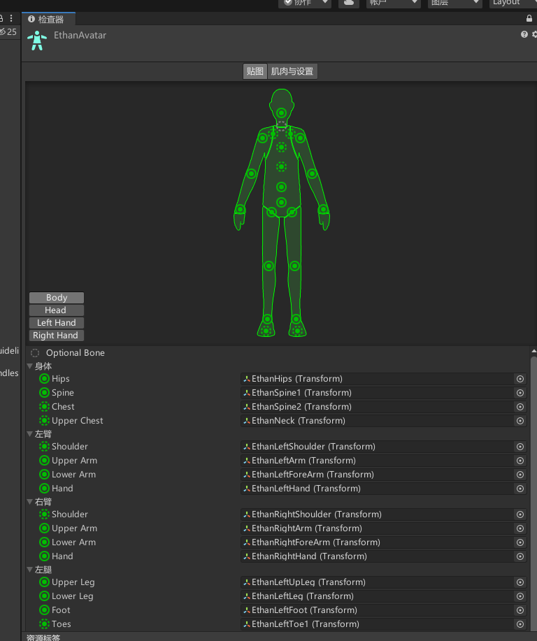

# Rig操纵（骨骼）页签是用来干啥的
该页签主要是用于设置如何将骨骼映射到导入模型中的网格，以便能够将其动画化
对于人形角色模型，需要分配或创建Avatar（替身信息）
对于非人形角色模型，需要在骨骼中确定根骨骼
简单来说Rig页签主要是设置骨骼和替身系统相关信息的，设置了他们，动画才能正常的播放

# Rig 操纵（骨骼）页签
**面板基础信息**
## Animation Type 动画类型

### None 不存在动画 

主要用于一些环境静态模型
比如一块石头，或者一栋建筑
 
### Humanoid 人形模型

一般情况下，有头和四肢（一个头两条腿两只手）为人形 
人形模型需要使用Avatar化身系统 绑定人主要关节的映射关系

- Avatar Definition：选择获取Avatar定义的位置
    - No Avatar：没有化身系统信息 
    - Create From This Model：根据此模型创建Avatar化身信息 
    - Copy from Other Avatar：指向另一个模型上设置的Avatar化身信息 

Source：复制另一个具有相同骨架的Avatar化身信息以导入其动画剪辑 使用Copy From Other Avatar时才有 

Configure...：打开Avatar化身配置 使用Create From This Model时才有 

- Skin Weights*：设置影响单个顶点的最大骨骼数量
    - Standard（4 Bones）：使用最多4个骨骼来产生影响。默认值，处于对性能考虑，建议使用此设置
    - Custom：设置自定义的最大骨骼数，选择后会出现下方的两个选项
Max Bones/Vertex*：定义每个顶点的最大估个数，值越大性能消耗越大 
Max Bone Weight*：设置考虑骨骼权重的最低阈值，权重计算时将忽略小于此值的内容 

Optimize Game Objects*：在Avatar化身系统和Animator动画组件中删除和存储所导入角色的游戏对象骨骼层级信息。如果启用会出现下方的Extra Transforms to Expose选项。角色将使用Unity动画系统的内部骨架，可以提高动画角色的性能 。一般不勾选

Extra Transforms to Expose：要公开的骨骼层级，在下方打钩将公开该骨骼层级信息 放大镜：通过名称搜索对应骨骼信息 
Toggle All：全选或者反选 
Collapse All：全部折叠 
Expand All：全部展开

### Generic 通用模型（泛型）

非人形模型 不是标准的人形模型，可以是任意形状，可能有8只腿两个头等等 
这种模型主要需要设置骨骼根节点

Root Node：选择用于此Avatar的根节点的骨骼（仅当选择Create From This Model才会出现）

### Legacy 旧版动画类型（旧型）
与Unity3.x及更早版本导入和使用动画 一般不使用

- Generation：动画导入方法
    - Don't Import：不导入动画 
    - 第2~4个选项：已禁用，勿使用 
    - Store in Root（New）：导入动画将其存储在模型的根节点中

## Avatar化身系统是什么
理解化身系统首先要知道骨骼动画是什么，通过我们之前基础知识的讲解和2D骨骼动画的讲解，相信大家已经了解骨骼动画是什么
3D动画的本质也是骨骼动画，为制作好的模型绑定骨骼制作动画是模型动画的制作流程

形象的理解，对于人来说，人的整体结构都是一致的，另一个人能做的动作理论上来说我们是完全可以模仿出来的。
而化身系统的本质，就是动作的模仿（复用），我们可以把一个标准人形动作通过化身系统复用到其它人形模型上，只要保证他们的关节点对应关系是一致的，而要学习的就是如何设置人形模型在化身系统中关节的对应关系

## Avatar化身信息设置
Animation Type 动画类型选择人型模式，点击Configure... 配置按钮进入.Avatar化身信息设置面板

### Mapping：贴图
我们需要在这个页签对模型关节进行映射设置 
因为人物动画无非就是改变这些关节的角度

**部位选择**

身体
头部
左右手
关节映射信息设置部位选择

**关节点映射关系**

**Mapping 贴图**

Clear：清空映射
AutoMap：自动映射
Load：从文件中读取
Save：保存映射信息

**Pose 动作**

Reset：重置姿势
Sample Bind-Pose：绑定姿势示例
Enforce T-Pose：强制T姿势 建议选择这个

注意编辑完，要应用一下

### Muscles&Settings：肌肉和设置

**Muscle Group Preview 肌肉群预览**

可以在这里预览在不同姿势的旋转变化，用来观察之前的关联映射关系是否合理

**Per-Muscle Settings 肌肉设置**

用于设置各骨骼在旋转时的范围限制，因为如果不设置限制，在一些极限角度时会非常奇怪，我们可以在这里单独设置限制范围

**Additional Settings：高级设置**

可以设置手脚的扭转和伸展值
一般不会修改他们

其中Translation DoF 平移DoF 比较重要
想要做一个骨头带动，另一个骨头拉长就启用
如果启用，将启用人形角色的移动动画
如果禁用，Unity仅使用旋转对骨骼进行动画化
但是启用后，会提升性能消耗，因为动画需要执行额外步骤来重定向人形动画，除非动画包含角色某些骨骼的动画式移动才会启用

一般情况下禁用即可

**重置所有设置**

