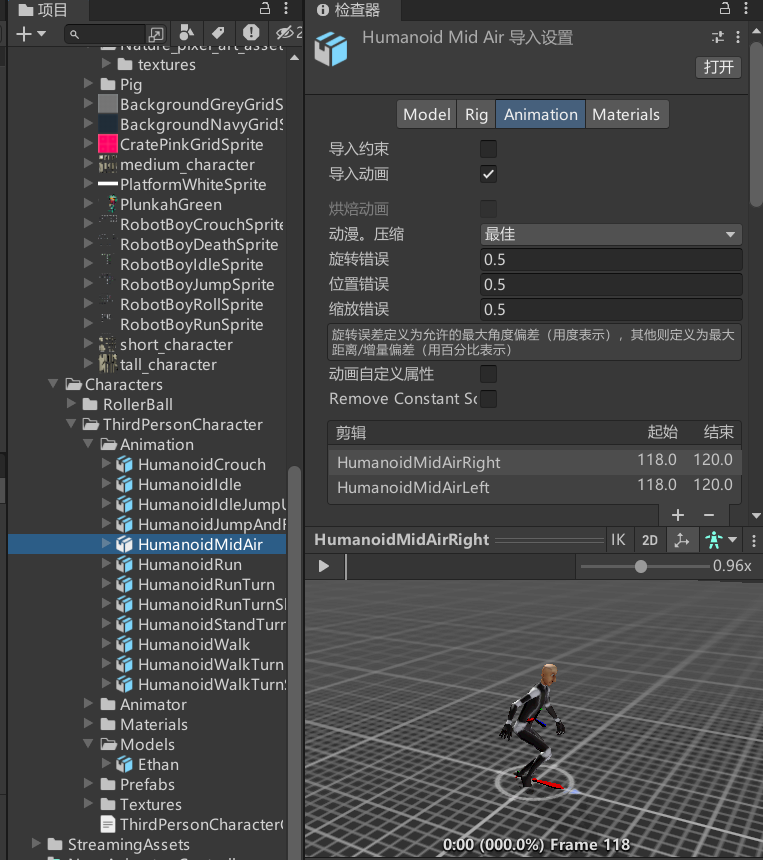
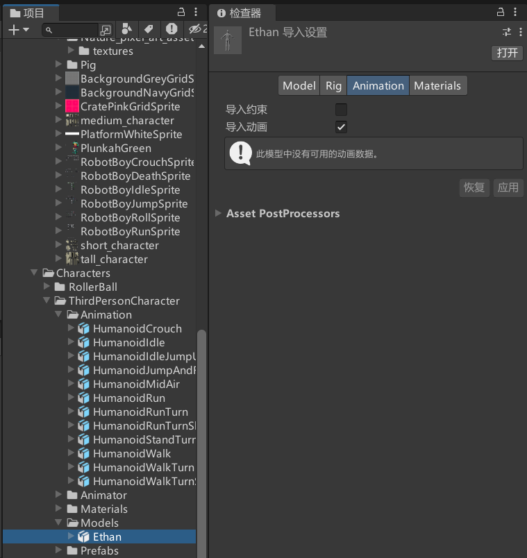

# Animation动画页签是用来干啥的
当我们选中包含动画剪辑的的模型时，该页签将显示动画设置相关的内容。

动画剪辑是Unity动画的最小构成元素，代表一个单独的动作。

当美术同学做好动画导出时建议将模型和动画文件分别导出：
1. 导出包含网格信息不包含动作信息模型。
2. 导出不包含网格信息包含动作信息的动作（模型）文件。
这两个都是fbx文件

具体的导出规则可以参考：
如何导入外部创建的模型资源：[在 Unity 外部创建资源 - Unity 手册](https://docs.unity.cn/cn/2019.4/Manual/CreatingDCCAssets.html)
使用多个模型文件来导入动画：[提取动画剪辑 - Unity 手册](https://docs.unity.cn/cn/2019.4/Manual/Splittinganimations.html)

动画文件

模型文件

# Animation动画页签的4大部分
基础信息设置
动画剪辑属性基本设置
动画剪辑属性其它设置
预览窗口