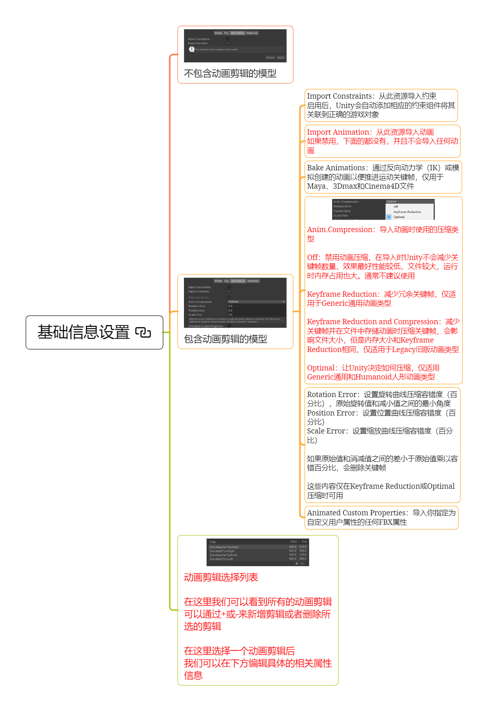
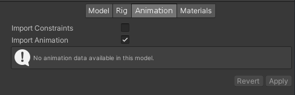
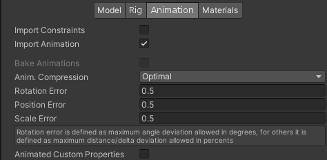
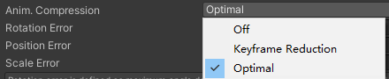
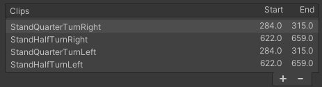
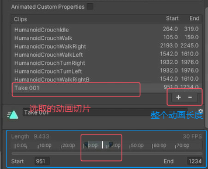

# 基础信息设置

## 不包含动画剪辑的模型

## 包含动画剪辑的模型

### Import Constraints* 导入约束
从此资源导入约束
启用后，Unity会自动添加相应的约束组件将其关联到正确的游戏对象

### Import Animation：导入动画
从此资源导入动画
如果禁用，下面的都没有，并且不会导入任何动画

### Bake Animations* 烘焙动画
通过反向动力学（IK）或模拟创建的动画以便推进运动关键帧，仅用于Maya、3Dmax和Cinema4D文件

### Anim.Compression 动画压缩类型
导入动画时使用的压缩类型

Off：禁用动画压缩，在导入时Unity不会减少关键帧数量，效果最好性能较低，文件较大，运行时内存占用也大。通常不建议使用

Keyframe Reduction：减少冗余关键帧，仅适用于Generic通用动画类型

Keyframe Reduction and Compression：减少关键帧并在文件中存储动画时压缩关键帧，会影响文件大小，但是内存大小和Keyframe Reduction相同，仅适用于Legacy旧版动画类型

Optimal：让Unity决定如何压缩，仅适用Generic通用和Humanoid人形动画类型（要压缩一般选这）

### Rotation Error*  旋转错误
设置旋转曲线压缩容错度（百分比），原始旋转值和减小值之间的最小角度

### Position Error* 位置错误
设置位置曲线压缩容错度（百分比） 

### Scale Error* 缩放错误
设置缩放曲线压缩容错度（百分比）

如果原始值和消减值之间的差小于原始值乘以容错百分比，会删除关键帧

这些内容仅在Keyframe Reduction或Optimal等压缩动画时可用

### Animated Custom Properties* 动画自定义属性
导入你指定为自定义用户属性的任何FBX属性

## 动画剪辑选择列表

在这里我们可以看到所有的动画剪辑 可以通过+或-来新增剪辑或者删除所选的剪辑

在这里选择一个动画剪辑后 我们可以在下方编辑具体的相关属性信息