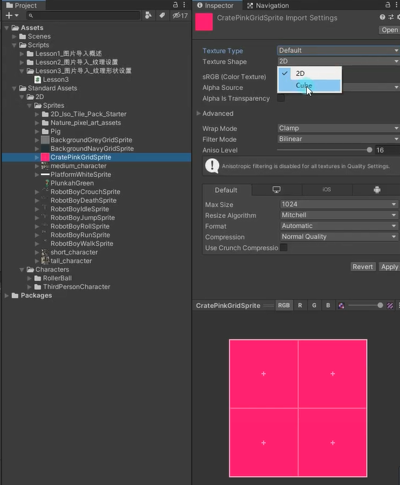
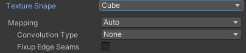
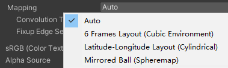
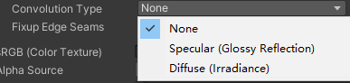

# 纹理形状主要是设置什么
纹理不仅可以用于模型贴图
还可以用于制作天空盒和反射探针
纹理形状设置主要就是用于在2D模式和立方体模式这两种模式之间进行切换

# Texture Shape：纹理形状 参数

## 2D：2D纹理，最常用设置，这些纹理将使用到模型和GUI元素上

## Cube：立方体贴图，主要用于天空盒和反射探针

### Mapping：如何将纹理投影到游戏对象上

- Auto：根据纹理信息创建布局 
- 6 Frames Layout：纹理包含标准立方体贴图布局之一排列的六个图像 
- Latitude-Longitude Layout：将纹理映射到2D维度/经度 
- Mirrored Ball：将纹理映射到类似球体的立方体贴图上

### Convolution Type：纹理的过滤类型

- None：无过滤 
- Specular：将立方体作为反射探针 
- Diffuse：将纹理进行过滤表示辐照度，可作为光照探针

### Fixup Edge Seams
Convolution Type 为None 和 Diffuse下才有用。解决低端设备上面之间立方体贴图过滤错误