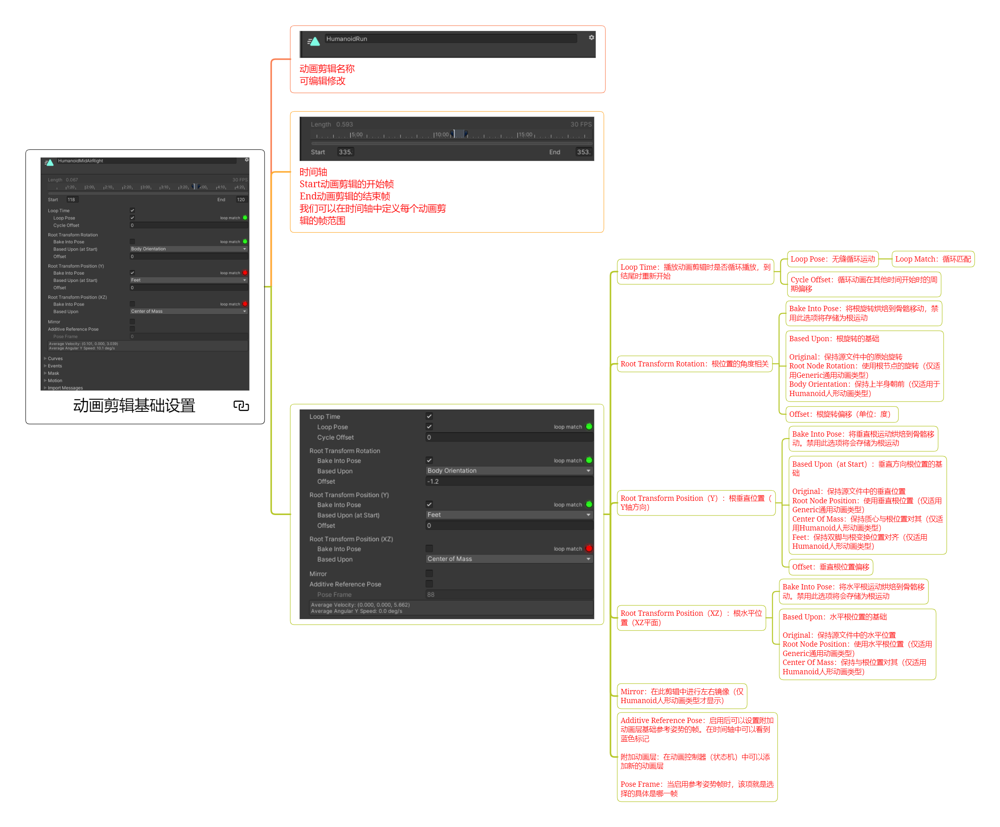
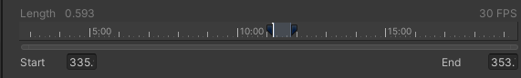
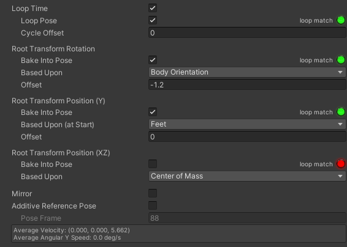
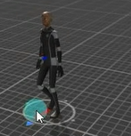
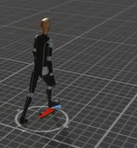

# 动画剪辑基础设置

## 动画剪辑名称

可编辑修改

## 时间轴

Start动画剪辑的开始帧 End动画剪辑的结束帧 我们可以在时间轴中定义每个动画剪辑的帧范围

---

## 下方参数

### Loop Time 循环时间
播放动画剪辑时是否循环播放，到结尾时重新开始
- Loop Pose：无缝循环运动 Loop Match：循环匹配（绿灯就是开始和结尾可以无缝连在一起）
- Cycle Offset：循环动画在其他时间开始时的周期偏移

### Root Transform Rotation 根变换旋转 根位置的角度相关
- Bake Into Pose 烘焙成动作：将根旋转烘焙到骨骼移动，禁用此选项将存储为根运动
  动作是不是会带动骨骼来旋转
  
  
- Based Upon 依据：根旋转的基础
    - Original：保持源文件中的原始旋转 
    - Root Node Rotation：使用根节点的旋转（仅适用Generic通用动画类型） 
    - Body Orientation：保持上半身朝前（仅适用于Humanoid人形动画类型）

- Offset：根旋转偏移（单位：度）

### Root Transform Position（Y）：根垂直位置（Y轴方向）
- Bake Into Pose 烘焙成动作：将垂直根运动烘焙到骨骼移动。禁用此选项将会存储为根运动 
- Based Upon（at Start）：垂直方向根位置的基础
    - Original：保持源文件中的垂直位置 
    - Root Node Position：使用垂直根位置（仅适用Generic通用动画类型） 
    - Center Of Mass：保持质心与根位置对其（仅适用Humanoid人形动画类型） 
    - Feet：保持双脚与根变换位置对齐（仅适用Humanoid人形动画类型）
- Offset：垂直根位置偏移

### Root Transform Position（XZ）：根水平位置（XZ平面）
- Bake Into Pose：将水平根运动烘焙到骨骼移动。禁用此选项将会存储为根运动 （勾选原地踏步）
- Based Upon：水平根位置的基础
    - Original：保持源文件中的水平位置 
    - Root Node Position：使用水平根位置（仅适用Generic通用动画类型） 
    - Center Of Mass：保持与根位置对其（仅适用Humanoid人形动画类型）

### Mirror 镜像
在此剪辑中进行左右镜像（仅Humanoid人形动画类型才显示）

### Additive Reference Pose 叠加型参考动作
启用后可以设置附加动画层基础参考姿势的帧。在时间轴中可以看到蓝色标记
附加动画层：在动画控制器（状态机）中可以添加新的动画层

Pose Frame：当启用参考姿势帧时，该项就是选择的具体是哪一帧

可以理解为没有播放的时候的默认姿势