# 动画剪辑属性其它设置
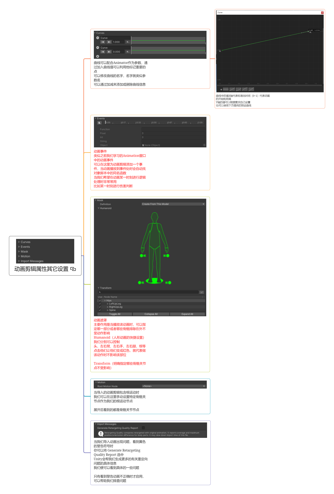

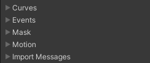

## Curves* 曲线
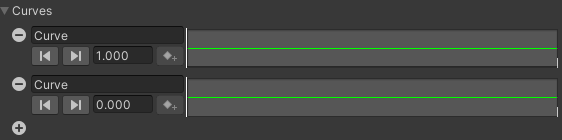

曲线可以配合Animator作为参数，通过加入曲线值可以利用他标记重要的点
可以修改曲线的名字，名字就类似参数名 可以通过加减来添加或删除曲线信息

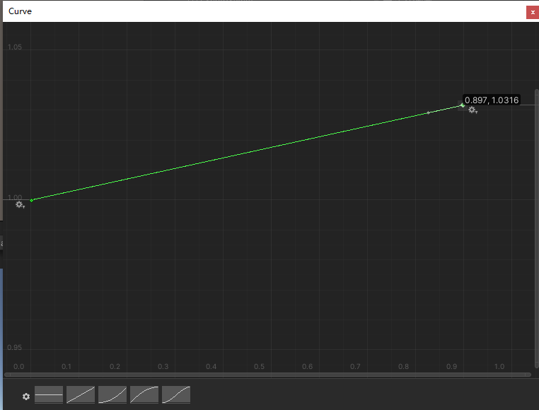
曲线中的值X轴代表标准化时间（0~1）代表动画的开始和结尾

Y轴的值可以是自己设置的值，自己设置的值可以用来做Animator的状态机的转换条件
也可以使用下方提供的预设曲线
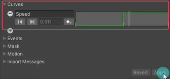

创建一个Animator文件，拖设置了曲线的动画到Animator的状态机中，加一个Float动画间转换条件的参数（名字和加的曲线名一样），把模型文件拖到场景中，赋值Animator文件。运行时自动播放走路动画，Speed动画参数的值会根据曲线自动设置。
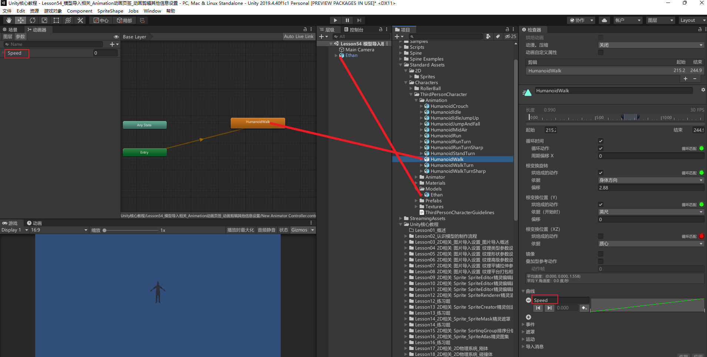

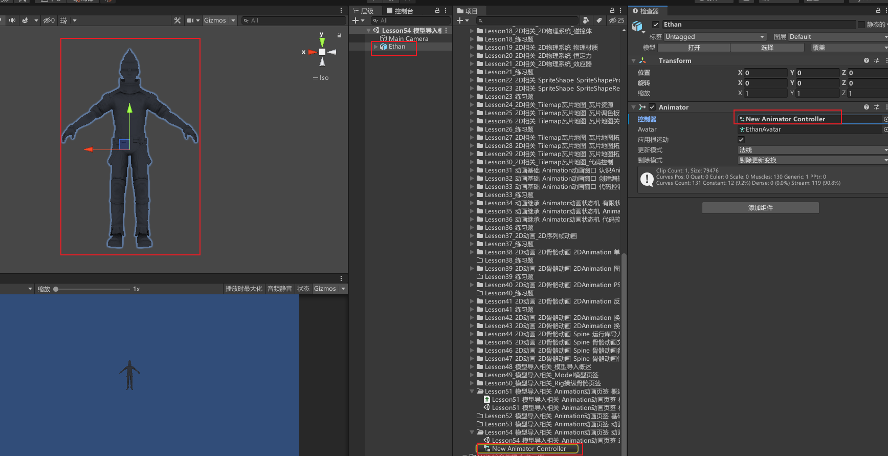

观察动画不同帧之间的值变化
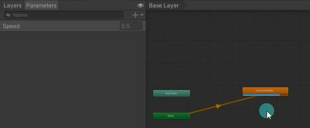

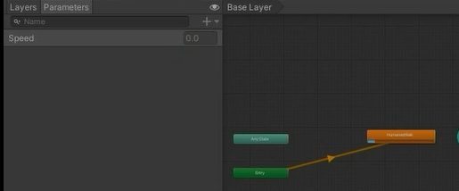

## 动画事件
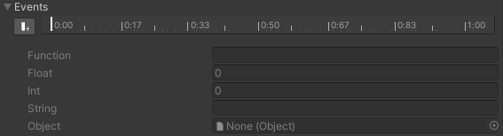

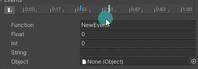

类似之前我们学习的Animation窗口中的动画事件 
可以在这里为动画剪辑添加一个事件，当动画播放到事件处时会自动找对象脚本中的同名函数 
当我们希望在动画某一时刻进行逻辑处理时非常常用 比如某一时刻进行伤害判断

## 动画遮罩
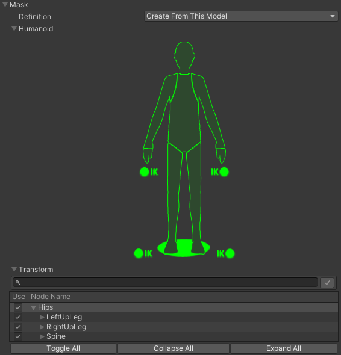

主要作用是当播放该动画时，可以指定哪一部分或者哪些骨骼排除在外不受动作影响 

Humanoid（人形动画的快捷设置） 我们分别可以控制 头、左右臂、左右手、左右腿、根等 点击他们让他们变成红色，就代表做该动作时不影响该部位

Transform（明确指定哪些骨骼关节点不受影响）

## Motion* 运动
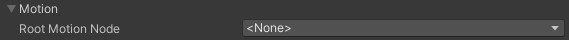

当导入的动画剪辑包含根运动时
我们可以在这里手动设置特定骨骼关节点作为我们的根运动节点
展开后看到的都是骨骼关节节点

## Import Messages*
当我们导入动画出现问题，看到黄色的警告符号时
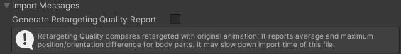

你可以将 Generate Retargeting Quality Report 选中 Unity会帮我们生成更多的有关重定向问题的具体信息 我们便可以看到具体的一些问题
只有看到警告动画不正确时才启用，可以帮助我们排查问题

# 动画预览
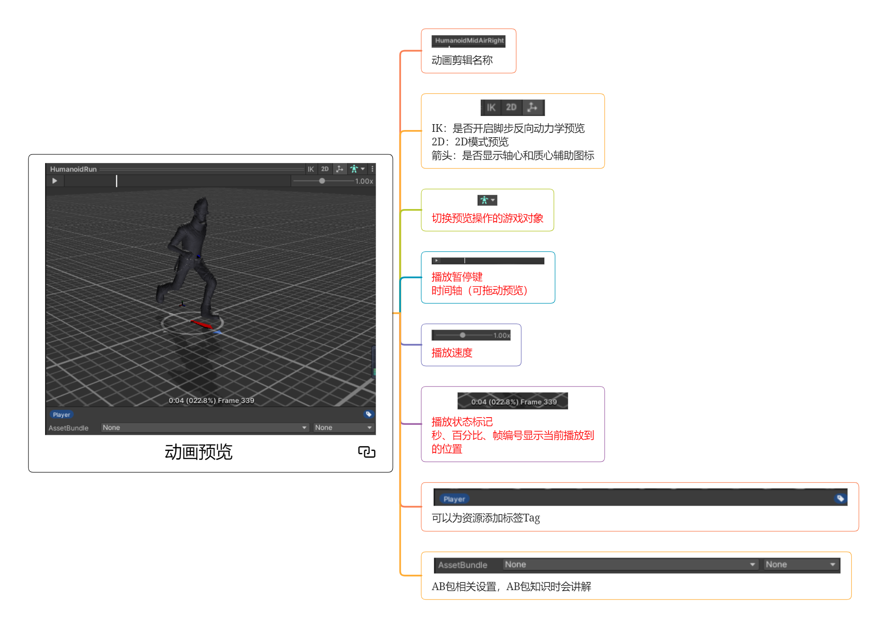
