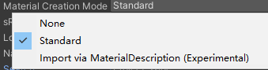
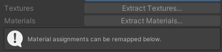
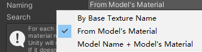
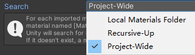
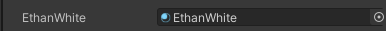
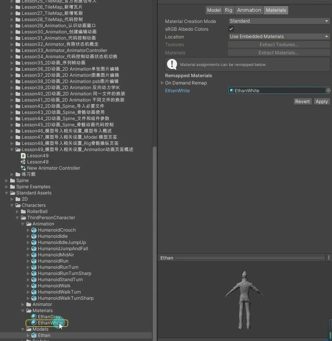
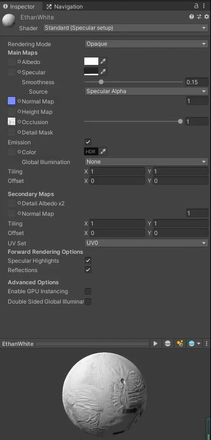

# Materials 材质纹理页签

## Material Creation Mode 材质创建模式
定义希望Unity如何为模型生成或导入材质

**None：**
不使用此模型中嵌入的任何材质，改用Unity的默认漫反射材质

**Standard：**
导入时，Unity使用默认规则来生成材质

**Import via MaterialDescription（Experimental）：**
导入时，Unity使用FBX文件中嵌入的材质描述来生成材质。
与Standard相比，该方法结果更准确，并且支持更广泛的材质类型。

## sRGB Albedo Colors 反照率颜色
是否在伽马空间中使用反射率颜色
对于使用线性颜色控件的项目，禁用此选项 如果上面的选项选择的是 Import via MaterialDescription（Experimental）该属性不可用

## Location 位置
定义如何访问材质和纹理

**Use Embedded Materials**：将导入的材质保持在导入的资源中

**Use External Materials（Legacy）**：将导入的材质提取为外部资源。旧版材质处理方式，适用于2017.1或更早的Unity版本创建的项目

## Extract Textures/Materials 纹理/材料

当选择Use Embedded Materials后会出现的内容。这两个按钮可以**提取导入的资源中嵌入的所有材质和纹理**。
如果没有需要提取的子资源，这两个按钮会显示为灰色

## Naming 正在命名
定义材质的命名规则

By Base Texture Name：使用导入材质的漫反射纹理名称来命名材质。如果未将漫反射纹理分配给材质，Unity将使用导入材质的名称

From Model's Material：使用导入材质的名称来命名材质

Model Name + Model's Material：使用模型文件的名称与导入材质的名称相结合来命名材质

## Search 搜索
定义在使用Naming选项定义的名称时查找现有材质的位置规则

Local Materials Folder：在本地Materials材质子文件夹（模型文件所在的同一文件夹）中查找现有材质

Recursive-Up：在所有父文件夹（一直向上追溯到Assets文件夹）中所有Materials子文件夹中查找现有材质

Project-Wide：在所有Unity项目文件夹中查找现有材质

## 重新映射的材质
只有在上面**Use Embedded Materials**：将导入的材质保持在导入的资源中选中后才会出现下面

如果找到了，Unity会自动关联 如果没有找到，我们可以手动进行关联