# 使用导入的3D动画
## 将模型拖入场景中
直接拖模型文件
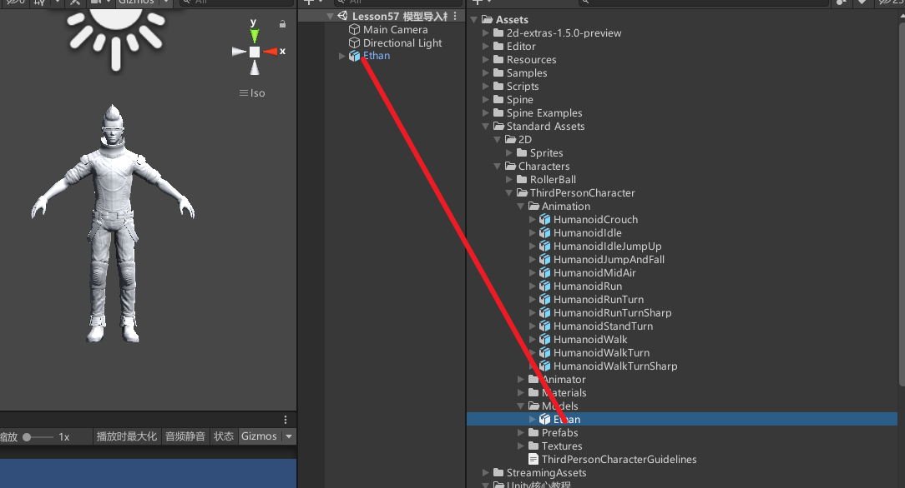

## 为模型对象添加Animator脚本

## 为其创建Animator Controller动画控制器（状态机）

## 拖入相关的动画文件到状态机窗口
将想要使用的相关动作Animation文件拖入Animator Controller动画控制器（状态机）窗口
注意不要直接拖大的，可以展开来拖下面三角形形状的文件
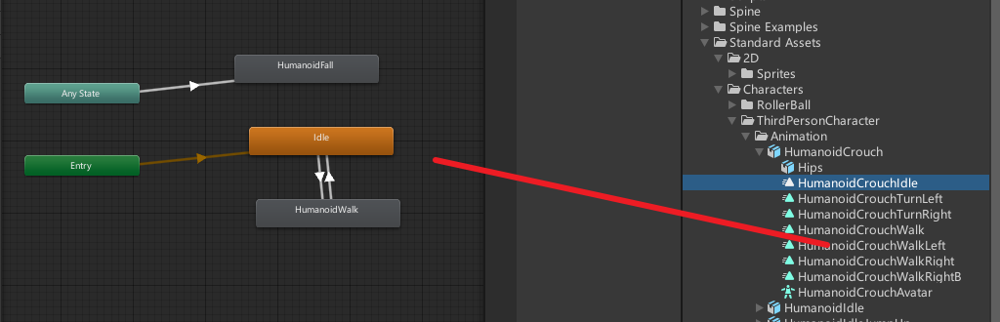


## 状态机窗口编辑动画关系
Animator Controller动画控制器（状态机）窗口编辑动画关系（使用之前学习的状态机相关知识）

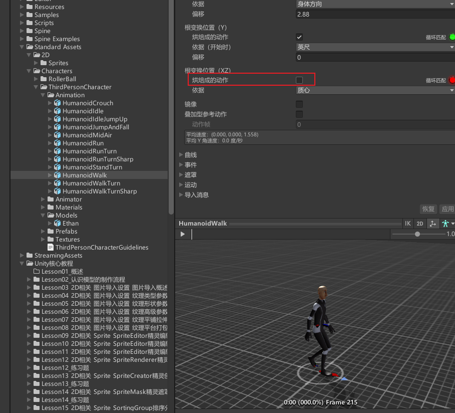

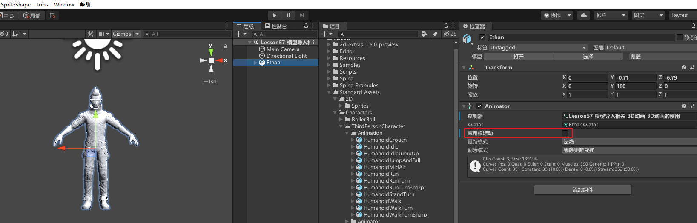


# 状态设置相关参数
我们可以选中状态机窗口中的某一个状态为其设置相关参数
我们可以称之为动画状态设置
主要设置的是当前状态的播放速度等等细节

**总结注意点**
Has Exit Time是否启用 如果希望瞬间切换动画不需过多等待，取消该选项
Can Transition To self是否启用 如果希望自己不要打断自己，取消该选项


点击状态机中的一个状态
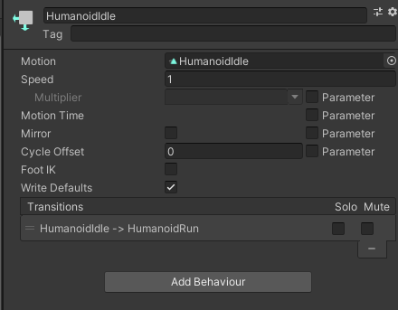

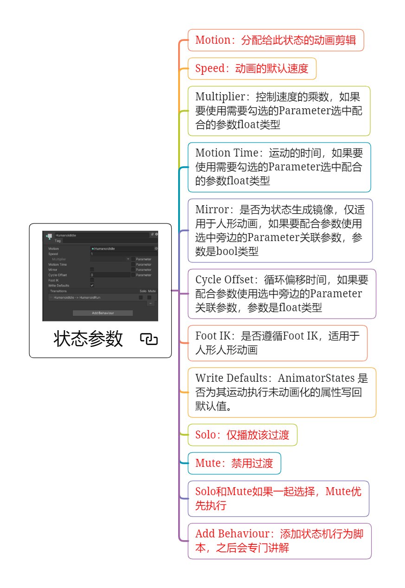

## Motion：分配给此状态的动画剪辑

## Speed：动画的默认速度

## Multiplier*：乘数
控制速度的乘数，如果要使用需要勾选的Parameter选中配合的参数float类型
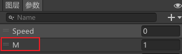
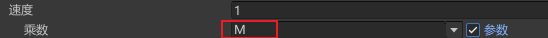

## Motion Time*：运动的时间
如果要使用需要勾选的Parameter选中配合的参数float类型

## Mirror* 镜像：
是否为状态生成镜像，仅适用于人形动画，如果要配合参数使用选中旁边的Parameter关联参数，参数是bool类型

## Cycle Offset* 周期偏移：
循环偏移时间
如果要配合参数使用选中旁边的Parameter关联参数，参数是float类型

## Foot IK*：是否遵循Foot IK，适用于人形人形动画

## Write Defaults* ：
AnimatorStates 是否为其运动执行未动画化的属性写回默认值。
默认勾选就行

## Solo：仅播放该过渡
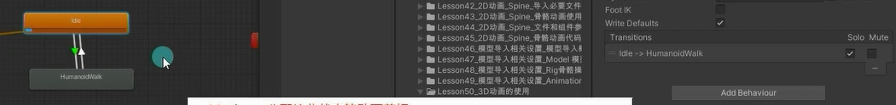

## Mute：禁用过渡
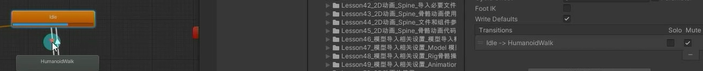

Solo和Mute如果一起选择，Mute优先执行

## Add Behaviour：添加状态机行为脚本
添加状态机行为脚本，之后会专门讲解


# 连线设置相关参数
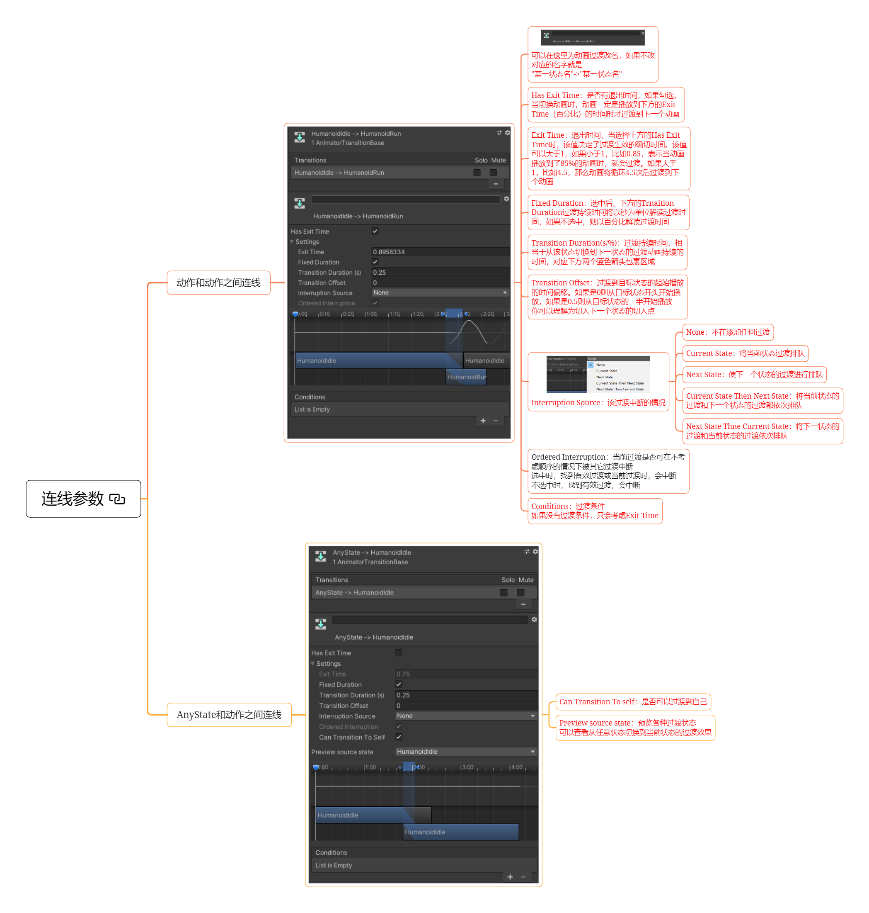


## 动作和动作之间连线
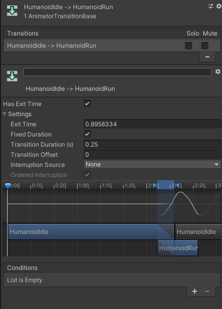


### 动画过渡改名
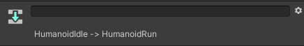
可以在这里为动画过渡改名，如果不改 对应的名字就是 "某一状态名"->"某一状态名"

### Has Exit Time 有退出时间：
如果勾选，当切换动画时，动画一定是播放到下方的Exit Time（百分比）的时间时才过渡到下一个动画

### Exit Time 退出时间：
当选择上方的Has Exit Time时，该值决定了过渡生效的确切时间。该值可以大于1，如果小于1，比如0.85，表示当动画播放到了85%的动画时，就会过渡。如果大于1，比如4.5，那么动画将循环4.5次后过渡到下一个动画


### Fixed Duration 固定持续时间：
选中后，下方的Trnaition Duration过渡持续时间将以秒为单位解读过渡时间，如果不选中，则以百分比解读过渡时间

### Transition Duration(s/%) 过渡持续时间：
两状态之间切换有过渡效果不会特别生硬的切
相当于从该状态切换到下一状态的过渡动画持续的时间，对应下方两个蓝色箭头包裹区域
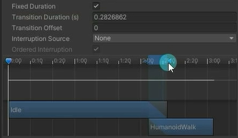


### Transition Offset 过渡偏移：
过渡到目标状态的起始播放的时间偏移。
如果是0则从目标状态开头开始播放，如果是0.5则从目标状态的一半开始播放 你可以理解为切入下一个状态的切入点
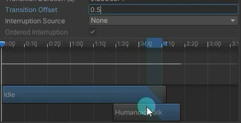


### Interruption Source 中断源：该过渡中断的情况

 None：不在添加任何过渡

 Current State：将当前状态过渡排队

 Next State：使下一个状态的过渡进行排队

 Current State Then Next State：将当前状态的过渡和下一个状态的过渡都依次排队

 Next State Thne Current State：将下一状态的过渡和当前状态的过渡依次排队

### Ordered Interruption* 有序中断：
当前过渡是否可在不考虑顺序的情况下被其它过渡中断 
选中时，找到有效过渡或当前过渡时，会中断 
不选中时，找到有效过渡，会中断


### Conditions：过渡条件 
如果没有过渡条件，只会考虑Exit Time


## AnyState和动作之间连线
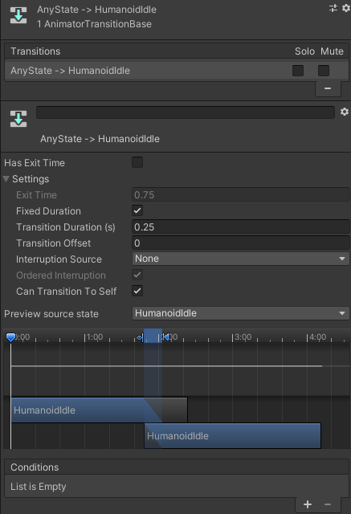

### Can Transition To self：是否可以过渡到自己
一般取消勾选


### Preview source state：预览各种过渡状态 
可以查看从任意状态切换到当前状态的过渡效果


# 练习
请使用资料区的模型，设置它的状态机，我们可以通过W键控制其前进，S键控制其后退，空格键控制其跳跃，AD键可以控制其转向

把模型文件拖拽到场景，创建一个Animator文件和他关联
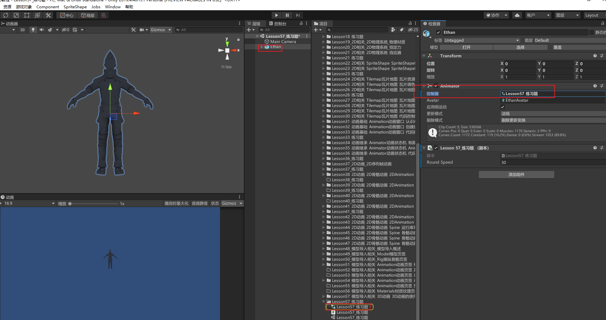

反向播放可以拖拽同一个文件进来，改名字后，把播放速度改成-1，就反向播放了。
添加参数，设置连线条件。
拖入Animation文件，设置连线，注意因为是AnyState的连线，要取消切换到自己的勾选。
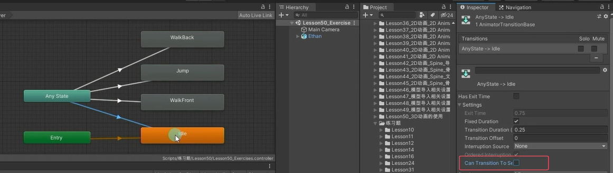

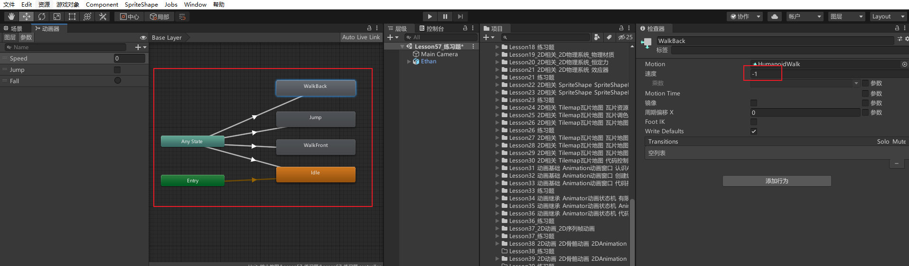


在动画添加一个关键帧，准备进行函数的绑定
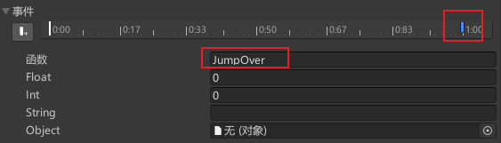


```cs
private Animator animator;

public float roundSpeed = 30;

void Start()
{
    animator = this.GetComponent<Animator>();
}

void Update()
{
    // 前进后退动画
    animator.SetInteger("Speed", (int)Input.GetAxisRaw("Vertical"));

    // 跳跃
    if (Input.GetKeyDown(KeyCode.Space))
        animator.SetBool("Jump", true);

    // 旋转
    this.transform.Rotate(Vector3.up, Input.GetAxisRaw("Horizontal") * roundSpeed * Time.deltaTime);
}

// 跳跃完成后触发的事件函数
public void JumpOver()
{
    animator.SetBool("Jump", false);
}
```