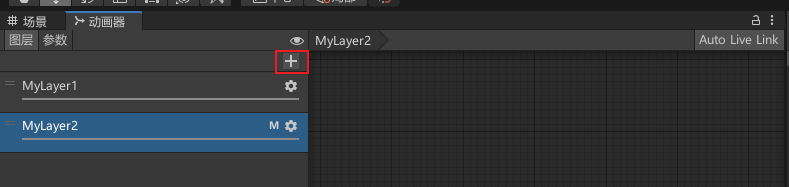
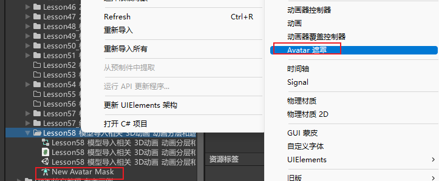
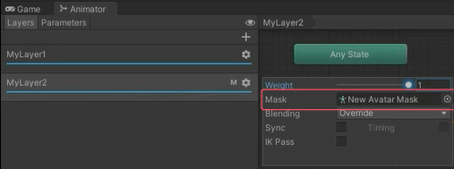
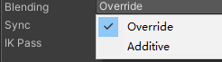
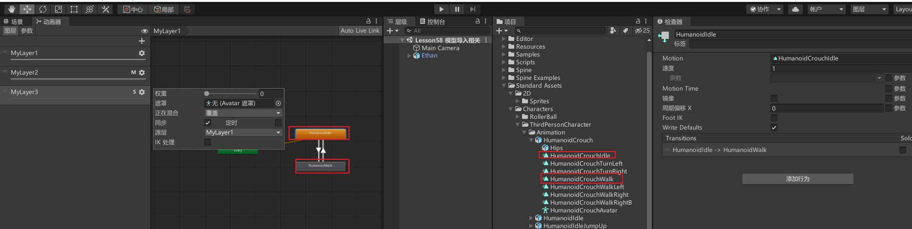
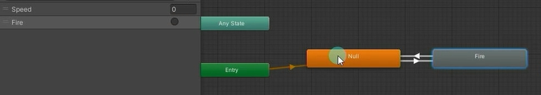
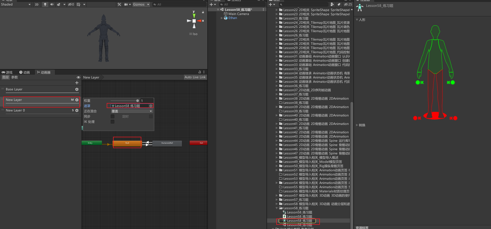
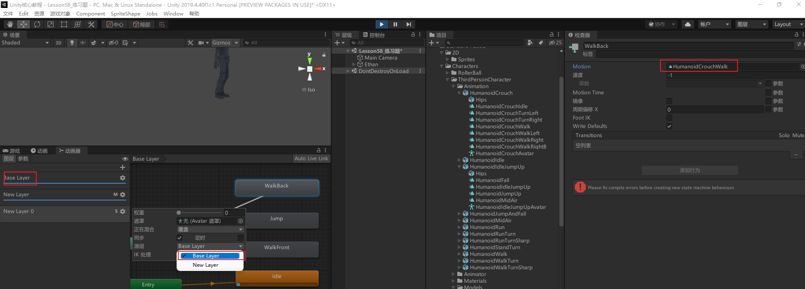

# 动画分层的主要目的
游戏中会有这样的需求
人物健康状态时播放正常动画
人物非健康状态时播放特殊动画
比如血量低于一定界限，人物的大部分动作将表现为虚弱状态
我们可以利用动画分层来快速实现这样的功能


**动画分层和动画遮罩结合使用**
3D游戏中我们常常会面对这样的需求
人物站立时会有开枪动作
人物跑动时会有开枪动作
人物蹲下时会有开枪动作
从表现上来看光是开枪动作可能就有3种
如果要让美术同学做3种开枪动作费时又费资源

我们是否可以这样做？
比如开枪动画只影响上半身
下半身根据实际情况播放站立，跑动，蹲下动作
通过上下半身播放不同的动画就可以达到动画的组合播放


**动画分层的两个目的**
两套不同层动作的切换
结合动画遮罩让两个动画叠加在一起播放
提升动画多样性，节约资源


# 如何使用动画分层

## 新建一个动画层



## 设置分层参数

### Weight：权重
当动画同时播放时，如果选择的是叠加状态，会根据权重决定叠加的比例

### Mask：动画遮罩
可以右键Project来创建文件

赋值给Mask，该层动画全部都会受该遮罩的影响
 和类似的功能
 不过这里的下半身可以保持上面待机动画的下半身

### Blending：混合方式

Override：覆盖方式，播放该层动画时忽略其他层信息 
Additive：叠加方式，会和其它层动画叠加播放

### Sync：是否同步其它层
主要用于直接从另一个层复制状态过来，在该层中进行修改 
适用于比如正常状态下有待机走路跑步等等动作，但是受伤状态下动作会改变，可以利用同步层方便我们进行编辑


选择后会多一个Source Layer表示你要复制哪一层的状态

比如直接复制普通层1，修改上面的动画选项为蹲下的待机和走路，这样调大这一层的权重就会播放蹲下的待机和走路



### Timing：
当选中Sync同步其它层时，该参数激活
选中，会采用折中方案调整同步层上的动画时长（基于权重计算） 
不选中，动画时长将使用原始层做为母版

### IK Pass：反向动力学
之后讲解IK的时候再讲解

## 在该层设置状态机
**注意：结合遮罩使用时默认状态一般为Null状态，空动画不会关联任何动画剪辑**

创建新的空状态作为一层的默认播放动画，这样就算该层有权重也不会有任何影响上一层的默认状态



## 根据需求创建动画遮罩

**Animator.SetLayerWeight方法 设置动画层权重**
```cs
//Animator中的设置动画层权重GetLayerIndex方法
animator.SetLayerWeight(animator.GetLayerIndex("MyLayer2"), 1);
```


总结 
利用动画分层我们可以做到
上下半身播放两个动画进行组合，比如上半身扔炸弹，下半身待机移动蹲下
快速制作正常状态和受伤状态的动作切换


# 练习
## 上半身动画切换
在之前练习题的基础上，按J键可以让人物上半身播放一个其他动画

创建新的一层动画，权重设置为1。创建动画遮罩设置屏蔽的下半身并关联。在这一层添加一个空动画设置成默认播放


相应控制代码
```cs
if (Input.GetKeyDown(KeyCode.J))
    animator.SetTrigger("Fall");
```

## 角色受伤时的所有动画改变
创建新的层，源层关联第一层
更改相应的动画剪辑，设置为受伤时的相关动画




```cs
if (Input.GetKeyDown(KeyCode.K))
    animator.SetLayerWeight(animator.GetLayerIndex("New Layer 0"), 1);
if (Input.GetKeyDown(KeyCode.L))
    animator.SetLayerWeight(animator.GetLayerIndex("New Layer 0"), 0);
```