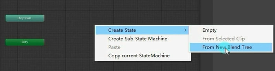
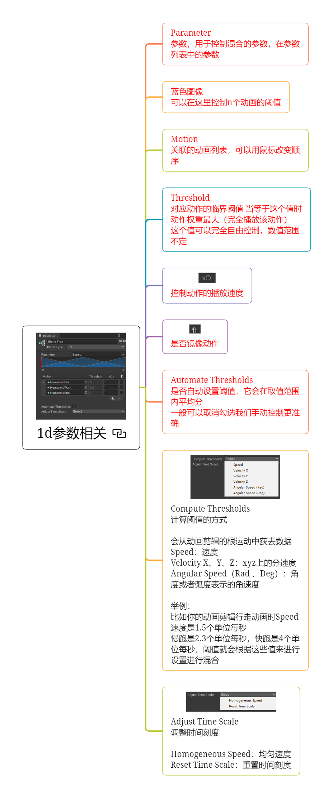
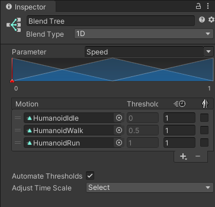
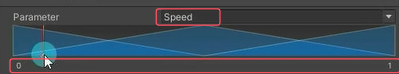
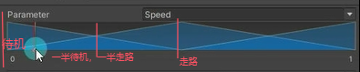
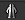
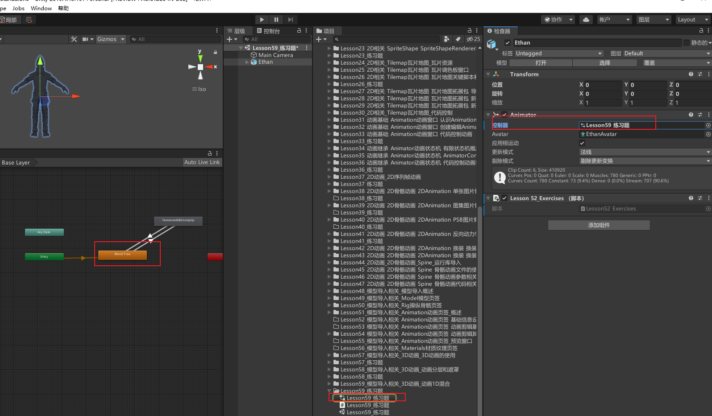
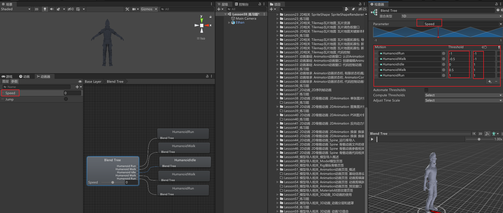

# 什么是动画混合
游戏动画中常见的功能就是在两个或者多个相似运动之间进行混合，比如：
根据角色的速度来混合行走和奔跑动画
根据角色的转向来混合向左或向右倾斜的动作
你可以理解是高级版的动画过渡。

之前我们学习的动画过渡是处理两个不同类型动作之间切换的过渡效果，而动画混合是允许合并多个动画来使动画平滑混合。
1d混合就是通过一个参数控制这些动画过渡的
# 如何在状态机窗口创建动画混合状态
在 Animator Controller 窗口右键->Create State->From New Blend Tree



双击新创建出来的状态进入混合树

# 参数相关







## Parameter 参数

用于控制混合的参数，在参数列表中的参数
下方的0~1就是上面Parameter的值


## 蓝色图像
可以在这里控制n个动画的阈值

## Motion 关联的动画列表
可以用鼠标改变顺序

## Threshold

对应动作的临界阈值 当等于这个值时动作权重最大（完全播放该动作） 这个值可以完全自由控制，数值范围不定

## 控制动作的播放速度
默认1


## 是否镜像动作



## Automate Thresholds 自动设置阈值
是否自动设置阈值，它会在取值范围内平均分 一般可以取消勾选我们手动控制更准确

## Compute Thresholds* 计算阈值的方式
会从动画剪辑的根运动中获去数据 
Speed：速度 
Velocity X、Y、Z：xyz上的分速度 
Angular Speed（Rad 、Deg）：角度或者弧度表示的角速度

举例： 比如你的动画剪辑行走动画时Speed速度是1.5个单位每秒 慢跑是2.3个单位每秒，快跑是4个单位每秒，阈值就会根据这些值来进行设置进行混合

## Adjust Time Scale* 调整时间刻度
Homogeneous Speed：均匀速度 
Reset Time Scale：重置时间刻度


# 1d混合的使用
1D混合就是通过一个参数来混合子运动。
注意：往混合树里面加入动作时需要找到动画文件进行关联。


# 练习

创建animator文件并关联模型，添加一个默认混合树状态


编辑混合树，关联五个动画剪辑文件。
向后跑和向后走改成倒着播放


添加跳跃动作，添加跳跃动作参数并且添加混合树和跳跃动作的切换连线

```cs
private Animator animator;

// 设置机器人前进后退的速度倍数
private float dValue = 0.5f;

void Start()
{
    animator = this.GetComponent<Animator>();
}

void Update()
{
    // 根据垂直方向的上下键，切换机器人的奔跑和后退动画
    animator.SetFloat("Speed", Input.GetAxis("Vertical") * dValue);

    // 按下左 Shift 键时，将机器人的前进后退速度倍数设置为1
    if (Input.GetKeyDown(KeyCode.LeftShift))
        dValue = 1;

    // 松开左 Shift 键时，将机器人的前进后退速度倍数恢复为0.5
    if (Input.GetKeyUp(KeyCode.LeftShift))
        dValue = 0.5f;

    // 按下空格键，控制机器人跳跃
    if (Input.GetKeyDown(KeyCode.Space))
        animator.SetTrigger("Jump");
}
```
