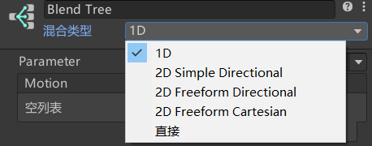
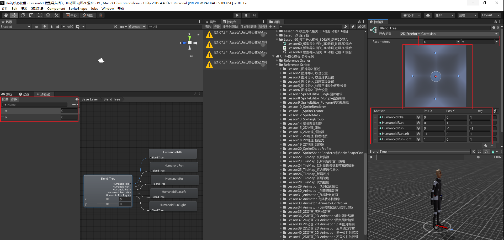

# 1D混合和2D混合
1D混合是用一个参数控制动画的混合，之所以叫1D是因为一个参数可以看做是1维线性的
2D混合你可以简单理解是用两个参数控制动画的混合，之所以叫2D是因为两个参数可以看做是2维平面xy轴的感觉

# 2D混合的种类

2D Simple Directional（2D简单定向模式）: 运动表示不同方向时使用，比如向前、后、左、右走。如果只有一个动作用这个。
2D Freeform Directional（2D自由形式定向模式）: 同上，运动表示不同方向时使用，但是可以在同一方向上有多个运动，比如向前跑和走。如果一个方向上有走路和跑步用这个。
2D Freeform Cartesian（2D自由形式笛卡尔坐标模式）: 运动不表示不同方向时使用，比如向前走不拐弯、向前跑不拐弯、向前走右转、向前跑右转。
Direct（直接模式）: 自由控制每个节点权重，一般做表情动作等。

# 2D混合的使用
大体上和1D混合相似，只是多关联了一个参数。关联的动画也多设置了一个预制。拖动蓝色框上的红点就类似与1D混合的红色指针，就是修改参数值查看效果的。也可以拖混合树的进度条查看效果。

# 总结
前三种方式只是针对动作的不同采用不同的算法来进行混合的。
第四种可以用多个参数进行融合。
混合树中还可以再嵌入混合树，使用上是一致的，根据实际情况选择性使用。