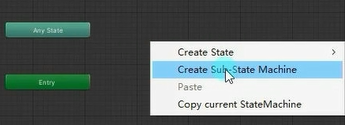
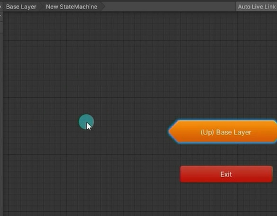
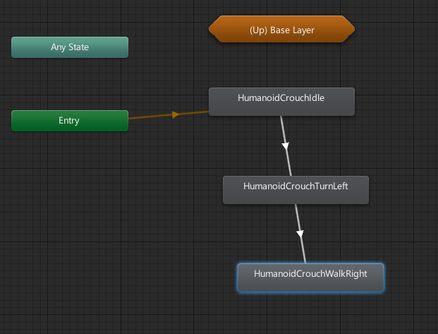
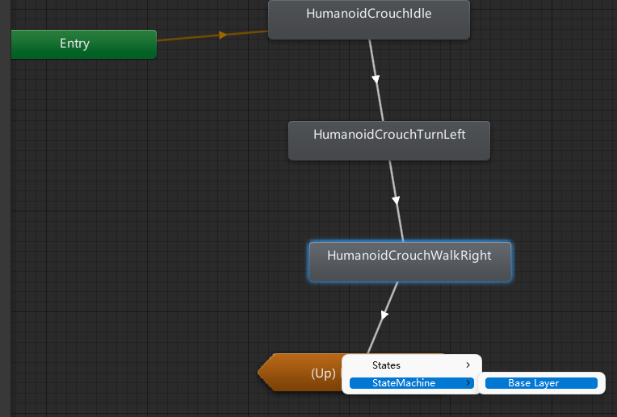
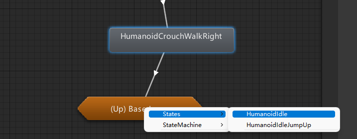
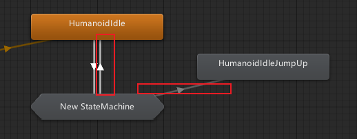
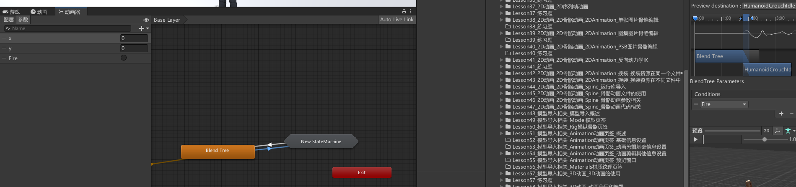
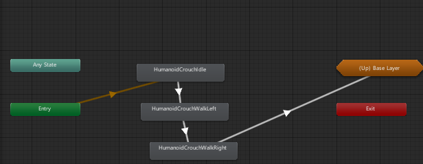

# 什么是子状态机
子状态机顾名思义就是在状态机里还有一个状态机。
它的主要作用就是某一个状态是由多个动作状态组合而成的复杂状态，比如某一个技能它是由3段动作组合而成的，跳起、攻击、落下。
当我们释放这个技能时会连续播放这3个动作，那么我们完全可以把它们放到一个子状态机中。


# 创建子状态机
在Animator Controller窗口中右键->Create Sub-State Machine




双击状态进去




# 编辑子状态机

假如没有创建子状态机和上一层状态的连接的话，就会一直重复播放最后一个状态或着停到最后一帧



如果连线选择的是状态机的BaseLayer的话，播完子状态机的动画回到上一层的默认动画。



连线时也可以手动选择切换到上一层的哪个动画，连线完回到上一层也会自动添加连线，灰色代表着切换不过去的状态。






# 练习
在之前练习题的基础上，按K键可以触发一个动画子状态机状态







```cs
if (Input.GetKeyDown(KeyCode.K))
    animator.SetTrigger("Fire");
```

